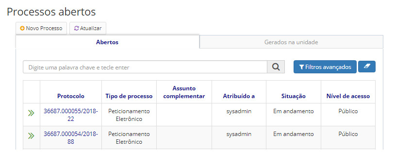

title: Pesquisando processos abertos/gerados na unidade
Description: Esta funcionalidade tem como objetivo exibir os processos abertos na unidade do usuário.
# Pesquisando processos abertos/gerados na unidade

Esta funcionalidade tem como objetivo exibir os processos abertos na unidade do usuário. É importante ressaltar que só serão 
exibidos processos cujo usuário possui permissão ou credencial de acesso.

Como acessar
--------------

1. Acesse a funcionalidade através do menu **Docs > Área de trabalho > Processos abertos**.

Filtros
----------

1. O seguinte filtro possibilita ao usuário restringir a participação de itens na listagem padrão da funcionalidade, facilitando
a localização dos itens desejados:

- Palavra chave ou tecle enter

**Figura 1 - Tela de pesquisa de processos abertos**

Listagem de itens
--------------------

1. Os seguintes campos cadastrais estão disponíveis ao usuário para facilitar a identificação dos itens desejados na listagem 
padrão da funcionalidade: **Protocolo, Tipo de processo, Assunto complementar, Atribuído a, Situação** e **Nível de acesso**.

    
    
    **Figura 2 - Tela de listagem de processos abertos**
    
2. Os processos são agrupados em duas abas:

    - **Abertos**: todos os processos abertos na unidade de trabalho do usuário. São exibidos tanto os processos gerados pela
    unidade, quanto os processos que foram tramitados para aquela unidade.
    - **Gerados na unidade**: processos gerados pela unidade do usuário autenticado. Só serão exibidos os processos gerados 
    na unidade de trabalho do usuário, visto que o usuário poderá pertencer a várias unidades. É possível visualizar a 
    unidade de trabalho do usuário no menu superior da aplicação.
    
3. Para acessar um processo da lista, clique sobre o número do protocolo.

!!! tip "About"

    <b>Product/Version:</b> CITSmart | 7.00 &nbsp;&nbsp;
    <b>Updated:</b>08/21/2019 – Larissa Lourenço

