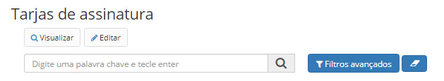
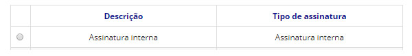
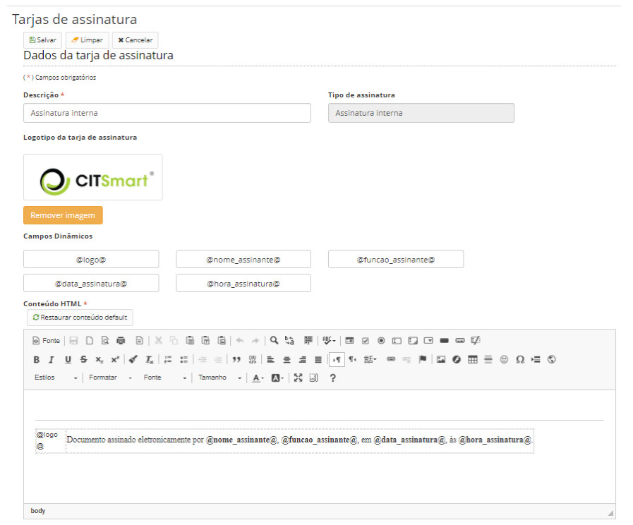

title: Editando tarjas de assinatura
Description: As tarjas de assinatura são os textos que serão exibidos nos documentos quando estes forem assinados.
# Editando tarjas de assinatura

As tarjas de assinatura são os textos que serão exibidos nos documentos quando estes forem assinados. As tarjas são criadas no
formato HTML.

Como acessar
---------------

1. Acesse a funcionalidade através do menu **Docs > Administração Docs > Tarjas de assinatura**.

Pré-condições
---------------

1. Não se aplica.

Filtros
----------

1. O seguinte filtro possibilita ao usuário restringir a participação de itens na listagem padrão da funcionalidade, facilitando
a localização dos itens desejados:

- Palavra chave ou enter.

**Figura 1 - Tela de pesquisa de tarjas de assinatura**

Listagem de itens
-------------------

1. Os seguintes campos cadastrais estão disponíveis ao usuário para facilitar a identificação dos itens desejados na listagem
padrão da funcionalidade: **Descrição** e **Tipo de assinatura**.

**Figura 2 - Tela de listagem de tarjas de assinatura**

Preenchimento dos campos cadastrais
--------------------------------------

1. As tarjas são vinculadas ao tipo de assinatura, sendo uma tarja para cada um desses tipos:

    - **Assinatura interna**: assinatura realizada internamente pelo próprio sistema através de login e senha;
    - **Assinatura com certificado digital**: assinatura realizada por meio de certificado digital, podendo ser A2, S2, A3, 
    S3, A4, S4;
    - **Tarja de validação de documentos**: tarja inserida após a assinatura do documento para que o mesmo possa ser validado 
    no respectivo portal validador de documentos.
    
2. As tarjas de assinatura serão compostas por texto e campos dinâmicos.O sistema permite a utilização desses campos
dinâmicos como variáveis pré-formatadas.

3. É possível inseri-las no conteúdo da tarja da assinatura, da forma que preferir:

    - Para assinaturas internas:
        - Logotipo da assinatura (@logo@);
        - Nome do assinante (@nome_assinante@);
        - Função do assinante (@funcao_assinante@);
        - Data da assinatura (@data_assinatura@);
        - Hora da assinatura (@hora_assinatura@);
    - Para assinaturas com certificado digital:
        - Logotipo da assinatura (@logo@);
        - Nome do assinante (@nome_assinante@);
        - Data da assinatura (@data_assinatura@);
        - Hora da assinatura (@hora_assinatura@);
        - Número de série do certificado (@serie_certificado@);
    - Para tarjas de validação de documentos:
        - QR Code (@qr_code@);
        - Código verificador (@codigo_verificador@);
        - Código CRC (@crc@);
        - Link do portal verificador de documentos (@link_validador@).
        
    !!! info "IMPORTANTE"
    
        O QR Code que é gerado na tarja de validação de documentos, redireciona o usuário a um link já com o resultado da
        validação. Para isso, esse link deve ser cadastrado previamente no arquivo cit-app.properties, através do parâmetro
        “portalecm.url”.
        
4. Selecione uma assinatura e clique no botão *Editar*, será aberta a tela abaixo:

    
    
    **Figura 3 - Tela de cadastro/edição de tarjas de assinatura**
    
5. Depois de realizar as modificações clique em *Salvar*.

!!! tip "About"

    <b>Product/Version:</b> CITSmart | 7.00 &nbsp;&nbsp;
    <b>Updated:</b>08/20/2019 – Larissa Lourenço

    

