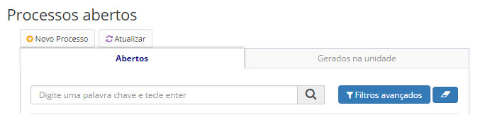
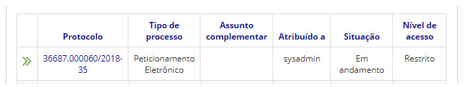
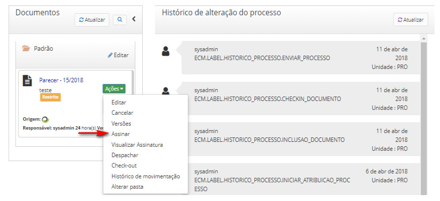
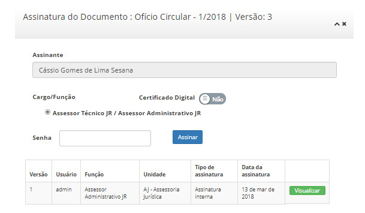

title: Assinando documentos
Description: O sistema permite a assinatura eletrônica de documentos anexos e online.
# Assinando documentos

O sistema permite a assinatura eletrônica de documentos anexos e online. A assinatura de documentos pode ser feita de forma
interna pelo próprio sistema, e também por meio de certificados digitais (A2, S2, A3, S3, A4, S4).

!!! warning "ATENÇÃO"

    Documentos podem ser assinados por vários usuários, porém, a partir da primeira assinatura, um documento não poderá mais ser
    excluído, editado, tampouco novas versões do mesmo poderão ser criadas. Os documentos assinados somente poderão ser 
    cancelados.
    
Como acessar
----------------

1. A Assinatura de documentos pode ser acessada através do menu **Docs > Área de trabalho > Processos abertos**.

Pré-condições
-----------------

1. Para assinar documentos, é imprescindível que exista uma pessoa no cadastro de pessoas vinculada ao usuário, sendo este
usuário com papel “Servidor” ou “Terceirizado” e com o campo “Função” obrigatoriamente preenchido.

Filtros
----------

1. O seguinte filtro possibilita ao usuário restringir a participação de itens na listagem padrão da funcionalidade, facilitando
a localização dos itens desejados:

- Palavra chave.

**Figura 1 - Tela de pesquisa de processos abertos**

Listagem de itens
---------------------

1. Os seguintes campos cadastrais estão disponíveis ao usuário para facilitar a identificação dos itens desejados na listagem 
padrão da funcionalidade: **Protocolo, Tipo de processo, Assunto complementar, Atribuído a, Situação** e **Nível de acesso**.

**Figura 2 - Tela de listagem de processos abertos**

Preenchimento dos campos cadastrais
--------------------------------------

1. Não se aplica.

Assinando documentos
------------------------

1. É apresentado então uma tela com as listagens dos processos abertos. Clique no número de protocolo do processo aberto 
desejado. Logo após, será aberto uma tela com as informações do processo. Na seção de Documentos, clique em **Ações > 
Assinar**, conforme a figura abaixo:

    
    
    **Figura 3 - Ações do processo - assinar**
    
2. Será apresentado a tela de assinatura do documento, conforme ilustrado na figura abaixo:

    
    
    **Figura 4 - Tela de assinatura de documento**
    
3. Preencha o Cargo/Função, escolha se é um Certificado Digital ou não, digite a senha e clique no botão *Assinar*;

4. Caso o usuário possua mais de uma função, o sistema assume como padrão:

    - Para usuário servidor e terceirizado – função de servidor;
    - Para usuário servidor – função de servidor;
    - Para usuário terceirizado – função de terceirizado.
    
5. Quando a assinatura é efetuada, o sistema gera um código verificador e um código CRC respectivo à assinatura, que pode 
ser utilizado para validá-la posteriormente no Portal Validador de Documentos
([Validando processos e documentos sigilosos](/pt-br/citsmart-docs/user-guide/operate/validate.html)). Esses códigos podem 
ser consultados a partir da própria assinatura (dentro do documento, ou através do menu “Visualizar assinaturas”).

    !!! warning "ATENÇÃO"

        Assinaturas de documentos não podem ser canceladas ou removidas.
        
6. Após assinado, o estado do documento online é alterado para “Original”, independente do status anterior.

!!! tip "About"

    <b>Product/Version:</b> CITSmart | 7.00 &nbsp;&nbsp;
    <b>Updated:</b>08/20/2019 – Larissa Lourenço

