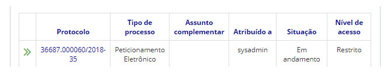

title: Enviar processos
Description: Processos podem ser enviados/tramitados para várias unidades simultaneamente.
# Enviar processos

Processos podem ser enviados/tramitados para várias unidades simultaneamente.

Quando isso acontece, o processo poderá ser continuar aberto ou ser concluído na unidade atual.

O usuário poderá optar por alertar por e-mail os usuários da(s) unidade(s) a(s) qual(is) o processo está sendo enviado sobre a
tramitação.

É importante ressaltar que um processo poderá estar aberto em uma unidade e concluído em outra unidade.

Os processos enviados para outras unidades ficam sem usuário atribuído, até alguém da unidade de destino capture ou atribua a 
outro usuário.

Como acessar
---------------

1. Acesse a funcionalidade através da navegação no menu **Docs > Área de trabalho > Processos abertos**.

Pré-condições
----------------

1. Para enviar o processo é necessário incluir documento ao mesmo.

Filtros
-----------

1. O seguinte filtro possibilita ao usuário restringir a participação de itens na listagem padrão da funcionalidade, facilitando
a localização dos itens desejados:

- Palavra chave.

**Figura 1 - Tela de pesquisa de processos abertos**

Listagem de itens
---------------------

1. Os seguintes campos cadastrais estão disponíveis ao usuário para facilitar a identificação dos itens desejados na listagem
padrão da funcionalidade: **Protocolo, Tipo de processo, Assunto complementar, Atribuído a, Situação** e **Nível de acesso**.

**Figura 2 - Tela de listagem de processos abertos**

Preenchimento dos campos cadastrais
--------------------------------------

1. Não se aplica.

Enviando processos
----------------------

1. Clique no número do protocolo a ser enviado;

2. Clique no botão **Ações de Processo > Enviar processo**, conforme ilustrado na figura abaixo:

**Figura 3 - Ações do processo - enviar processo**

3. Será apresentado a seguinte tela:

    
    
    **Figura 4 - Tela de envio de processos**
    
4. Realize a operação e clique em *Enviar*.

!!! tip "About"

    <b>Product/Version:</b> CITSmart | 7.00 &nbsp;&nbsp;
    <b>Updated:</b>08/20/2019 – Larissa Lourenço

