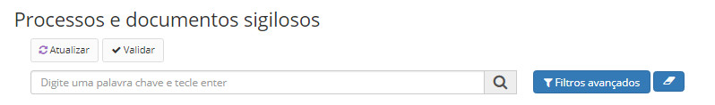
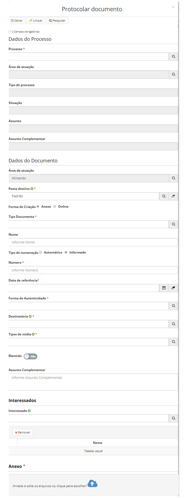

title: Validando processos e documentos sigilosos
Description: Tem o intuito de averiguar se os processos e documentos foram classificados no nível de sigilo correto.
# Validando processos e documentos sigilosos

Essa validação tem o intuito de averiguar se os processos e documentos foram classificados no nível de sigilo correto. Pode 
ocorrer também o cenário em que um processo que deveria ser classificado como público tenha sido classificado como sigiloso 
equivocadamente. Com isso, o grupo poderá alterar o nível de acesso em questão.

Até que a validação aconteça, o documento/processo ficará oculto para os demais usuários, até sua posterior 
reclassificação/validação pelos grupos citados.

Quando há reclassificação, o sistema atualiza os grupos que os acessam, de acordo com as definições de grupos apresentadas 
anteriormente. Os grupos com permissão menor perderão acesso, e os grupos com permissão maior manterão acesso.

Como acessar
---------------

1. Acesse a funcionalidade através do menu **Docs > Área de trabalho > Processos e documentos sigilosos**.

Filtros
---------

1. O seguinte filtro possibilita ao usuário restringir a participação de itens na listagem padrão da funcionalidade, facilitando
a localização dos itens desejados:

- Palavra chave ou enter.

**Figura 1 - Tela de pesquisa de processos e documentos sigilosos**

Listagem de itens
---------------------

1. Os seguintes campos cadastrais estão disponíveis ao usuário para facilitar a identificação dos itens desejados na listagem
padrão da funcionalidade: **Protocolo, Proposta, Nível final** e **Prazo sigilo**.

**Figura 2 - Tela de listagem de processos e documentos sigilosos**

Validando processos e documentos sigilosos
---------------------------------------------

1. Todos os processos e documentos classificados como sigilosos (criados ou alterados), em qualquer nível, devem passar pela
validação de um grupo de usuários com o perfil de acesso correspondente. Exemplo:

    - Usuários que possuam permissão de acesso “Reservado” poderão validar documentos e processos reservados;
    - Usuários que possuam permissão de acesso “Secreto” poderão validar documentos e processos reservados e secretos;
    - Usuários que possuam permissão de acesso “Ultrassecreto” poderão validar documentos e processos reservados, secretos e
    ultrassecretos.
    
2. Selecione o processo e clique no botão *Validar*, preencha os campos abaixo e clique em *Incluir Documento*:

    
    
    **Figura 3 - Validação dos processos e documentos classificados como sigilosos**
    
3. Preencha os campos e clique em Salvar;

!!! tip "About"

    <b>Product/Version:</b> CITSmart | 7.00 &nbsp;&nbsp;
    <b>Updated:</b>08/21/2019 – Larissa Lourenço

