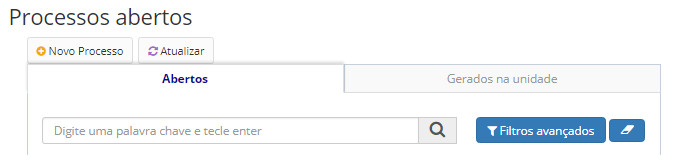
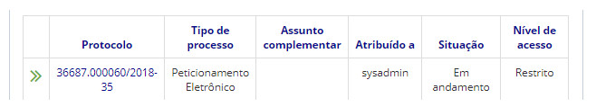
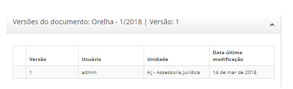

title: Versões do documento
Description: Ao editar e salvar um documento, o usuário escolhe por salvá-lo em uma nova versão, ou versão intermediária.
# Versões do documento

Como acessar
----------------

1. Essa visualização é possível através do menu **Docs > Área de trabalho > Processos Abertos**.

Pré-condições
-----------------

1. Não se aplica.

Filtros
---------

1. O seguinte filtro possibilita ao usuário restringir a participação de itens na listagem padrão da funcionalidade, facilitando
a localização dos itens desejados:

- Palava chave ou enter.

**Figura 1 - Tela de pesquisa de processos abertos**

Listagem de itens
---------------------

1. Os seguintes campos cadastrais estão disponíveis ao usuário para facilitar a identificação dos itens desejados na listagem
padrão da funcionalidade: **Protocolo, Tipo de processo, Assunto complementar, Atribuído a, Situação** e **Nível de acesso**.

    
    
    **Figura 2 - Tela de listagem de processos abertos**
    
2. É apresentado então uma tela com as listagens dos processos abertos. Clique no número de protocolo do processo aberto 
desejado. Logo após, será aberto uma aba com as informações do processo.

Preenchimento dos campos cadastrais
-------------------------------------

1. Não se aplica.

Visualizando versões
-------------------------

1. Na seção de Documentos, clique em **Ações > Versões**;

2. Através desta opção é possível visualizar o histórico de versões do documento.

!!! warning "ATENÇÃO"

    Não é possível visualizar ou restaurar uma versão anterior.
    

**Figura 3 - Tela de versões de documento**
    
!!! tip "About"

    <b>Product/Version:</b> CITSmart | 7.00 &nbsp;&nbsp;
    <b>Updated:</b>08/21/2019 – Larissa Lourenço

    

