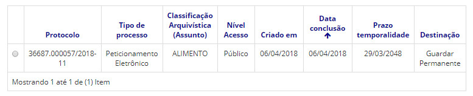

title: Visualizando todos os processos arquivados
Description: Processos arquivados são processos que estão concluídos em todas as unidades nas quais foi tramitado.
# Visualizando todos os processos arquivados

Processos arquivados são processos que estão concluídos em todas as unidades nas quais foi tramitado.

Quando isso ocorre, significa que a contagem do prazo de temporalidade foi iniciada para a destinação final. Saiba mais no 
conhecimento Mantendo um plano de classificação, temporalidade e destinação.

Como acessar 
---------------

1. Acesse a funcionalidade através do menu **Docs > Arquivo/Protocolo > Processos arquivados**.

Pré-condições
----------------

1. Não se aplica.

Filtros
----------

1. O seguinte filtro possibilita ao usuário restringir a participação de itens na listagem padrão da funcionalidade, facilitando
a localização dos itens desejados:

- Palavra chave ou enter.

**Figura 1 - Tela de pesquisa de processos arquivados**

Listagem de itens
---------------------

1. Os seguintes campos cadastrais estão disponíveis ao usuário para facilitar a identificação dos itens desejados na listagem 
padrão da funcionalidade: **Protocolo, Tipo de processo, Classificação Arquivística (Assunto), Nível Acesso, Criado em, Data
conclusão, Prazo temporalidade** e **Destinação**.

**Figura 2 - Tela de listagem de processos arquivados**

!!! tip "About"

    <b>Product/Version:</b> CITSmart | 7.00 &nbsp;&nbsp;
    <b>Updated:</b>08/21/2019 – Larissa Lourenço

