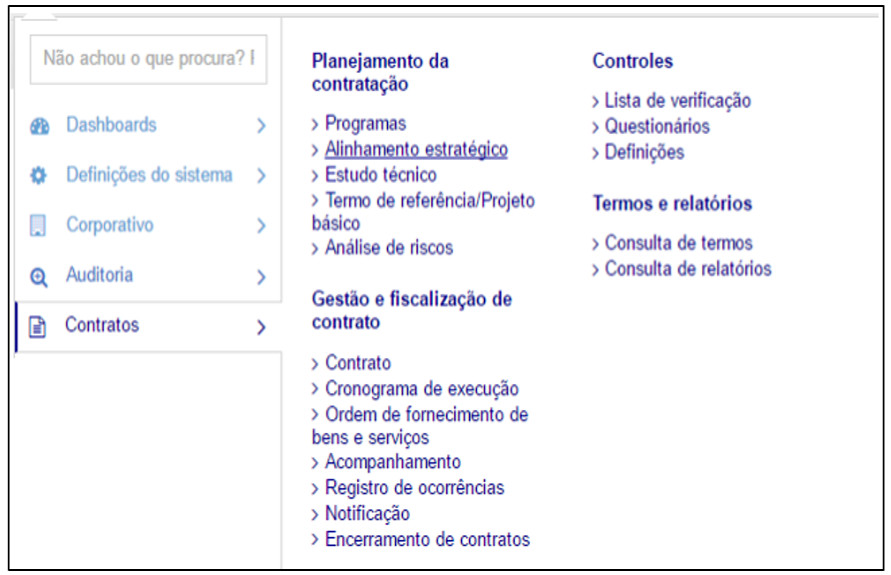

title:  Módulo Contratos
Description: Provê a gestão proativa do processo de controle e gerenciamento de todo o ciclo de vida dos contratos. 
# Módulo Contratos

Trata-se do sistema que provê a gestão proativa do processo de controle e gerenciamento de todo o ciclo de vida dos contratos. O
processo permeia a fase de Planejamento da Contratação até a fase de Gestão e Fiscalização, que contempla o Encerramento do
Contrato.

Com o módulo é possível planejar antecipadamente as contratações de acordo com os objetivos e metas institucionais da 
Administração Pública e gerir de forma prática.

Para acessá-lo basta que o usuário clique em Menu e em seguida em Corporativo, conforme demonstrado a seguir:

**Figura 1 - Menu Contratos**

!!! tip "About"

    <b>Product/Version:</b> CITSmart | 7.00 &nbsp;&nbsp;
    <b>Updated:</b>08/16/2019 - Larissa Lourenço

