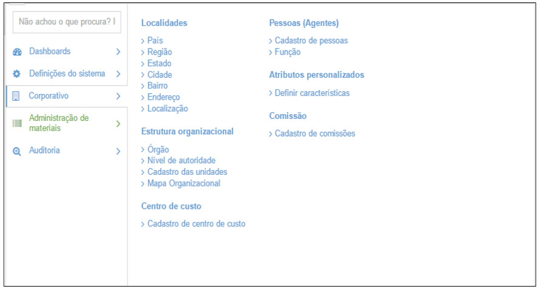

title:  Módulo Corporativo
Description: Permite efetuar todas as configurações de cadastro de Localidades, Estruturas Organizacionai. 
# Módulo Corporativo

O Menu Corporativo, permite efetuar todas as configurações de cadastro de Localidades, Estruturas Organizacionais, Pessoas, 
Centro de Custo, Características e Comissões. Para acessá-lo basta que o usuário clique em Menu e em seguida em Corporativo,
conforme demonstrado a seguir:

**Figura 1 - Opções do Menu Corporativo**

No submenu **Localidades** é possível cadastrar informações detalhadas e individuais de localidades que serão utilizadas nas 
configurações das Estruturas Organizacionais.

No submenu **Estrutura Organizacional**, são apresentadas as opções para cadastro de informações relevantes do órgão utilizador
da solução e das unidades existentes dentro dele.

No submenu **Centro de Custo**, é disponibilizada a opção de cadastrar centros de custos utilizados nas unidades existentes no
Órgão.

No submenu **Pessoas (Agentes)**, é disponibilizada a opção de cadastrar pessoas, tanto física ou jurídica, que serão utilizados
em diversas funcionalidades dentro da solução.

No submenu **Atributos Personalizados**, é possível definir as características e unidades de medida de um material. Essas 
definições serão utilizadas no CITSmart Enterprise GRP Administração de Materiais apenas.

No submenu **Comissão**, é possível cadastrar diversas comissões. As comissões são utilizadas para compor equipes de decisões.

!!! tip "About"

    <b>Product/Version:</b> CITSmart | 7.00 &nbsp;&nbsp;
    <b>Updated:</b>08/16/2019 - Larissa Lourenço

