title:  Módulo Dashboards
Description: No Menu Dashboards são apresentados os gráficos e a configuração de painéis e widgets. 
# Módulo Dashboards

No **Menu Dashboards** são apresentados os gráficos e a configuração de painéis e *widgets*. Os gráficos podem ser configurados
de acordo com a visão que o Órgão desejar obter para acompanhamento. Clique em *Dashboards* para visualizar as opções, como: 
Gráficos e Configuração.

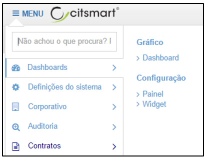

**Figura 1 - Opções do Menu Dashboards**

Gráficos
----------

Os gráficos constituem uma forma clara e objetiva de apresentar dados ou volumes numéricos, de maneiras diferentes, facilitando
a compreensão da gestão.

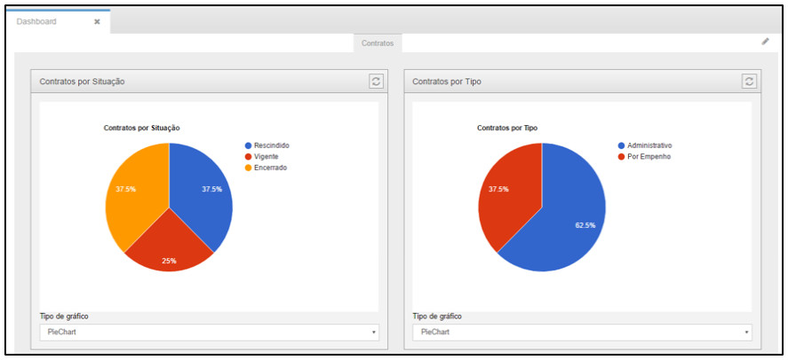

**Figura 2 - Gráficos**

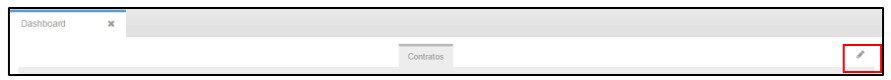

**Figura 3 - Habilitando a edição de gráficos**

Para editar um gráfico, clique no ícone **Editar**, localizado no canto direito da página do *Dashboard*, o sistema habilitará 
as opções para edição dos widgets.

A seguinte tela será mostrada com as opções para edição:

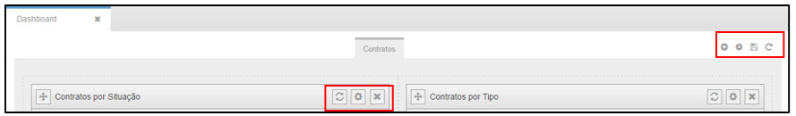

**Figura 4 - Editando um widget**

Os ícones   apresentados em cada gráfico indicam respectivamente: **Atualizar Widget, 
Configurar Widget** e **Remover Widget**.

Para atualizar um gráfico, clique no ícone **atualizar** e o gráfico será atualizado.

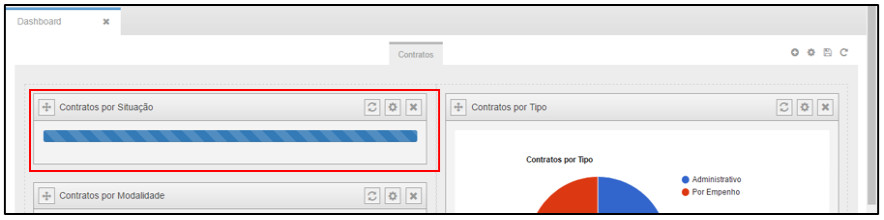

**Figura 5 - Atualizando um widget**

Para configurar um *widget*, clique no ícone **ferramenta** e a tela seguinte será mostrada:

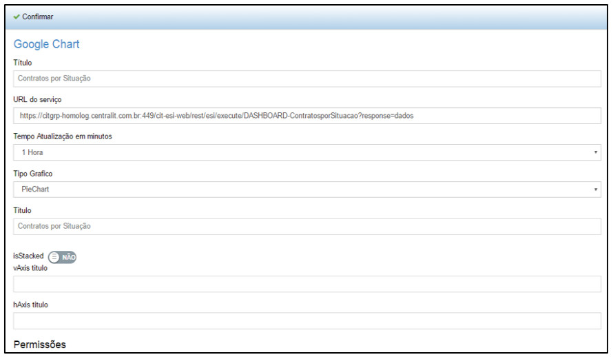

**Figura 6 - Configurando um widget**

Após configurar os campos necessários, clique em “**Confirmar**” para atualizar o *widget* com as informações.

Os ícones 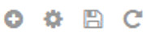 apresentados acima dos gráficos indicam respectivamente: **Adicionar Novo Widget, 
Configurar Dashboard, Salvar Alterações** e **Desfazer Alterações**.

Para adicionar um novo *widget*, clique **Adicionar Novo Widget**, e o sistema abrirá a seguinte tela:

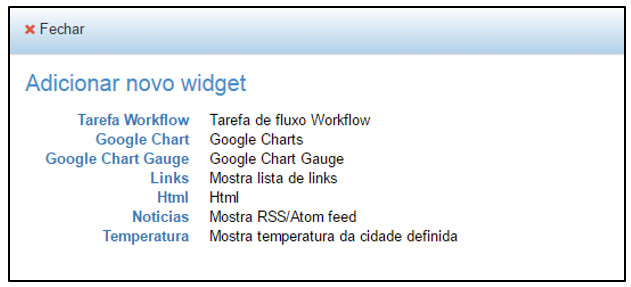

**Figura 7 - Adicionando widget**

Para configurar um dashboard, clique em **Configurar Dashboard**, e o sistema abrirá a seguinte tela:

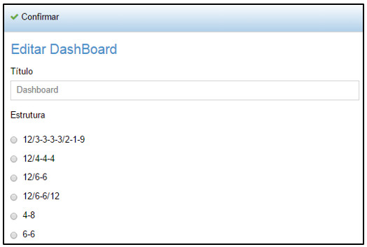

**Figura 8 - Configurando o Dashboard**

Após a configuração, clique em “**Confirmar**” para que a edição seja salva.

Ao clicar em **Salvar Alterações**, o sistema salvará a alteração das informações e visualizará os gráficos.

Ao clicar em **Desfazer Alterações**, o sistema cancelará as alterações realizadas e visualizará os gráficos.

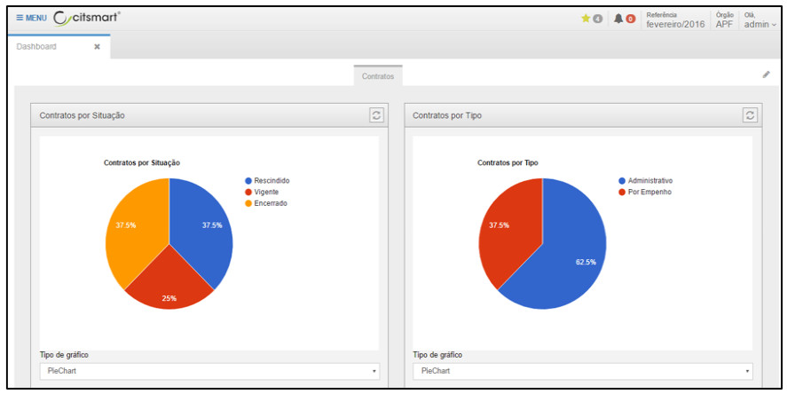

**Figura 9 - Exibição dos gráficos**

Alguns gráficos foram configurados como padrão no produto, são eles:

- Contratos por situação;
- Contratos por tipo;
- Contratos por modalidade;
- Contratos por aquisição.

Os tipos de gráficos utilizados são: pizza, coluna, linha, tabela e barra. Como padrão, o gráfico é apresentado em forma de
pizza. Para escolher outro tipo de gráfico, basta clicar na caixa abaixo do gráfico, como mostra a figura a seguir:

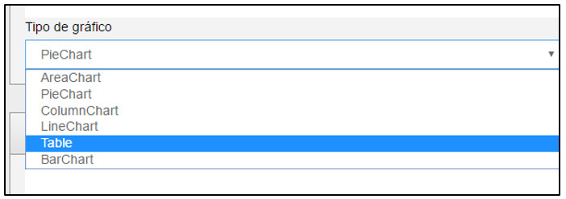

**Figura 10 - Configurando tipo default de gráfico**

Configuração
--------------

Esta funcionalidade permite cadastrar painéis e *widgets* para a visualização de *dashboards* para os módulos separadamente e 
conceder permissão de acesso a eles.

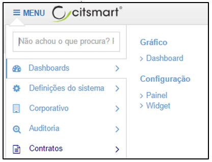

**Figura 11 - Opções do Dashboards**

Ao clicar em “**Painel**”, o sistema direcionará para a tela de pesquisa dos painéis cadastrados:

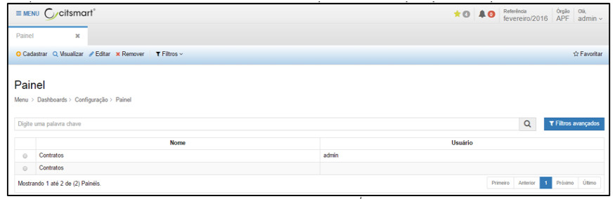

**Figura 12 - Pesquisa de Painéis Cadastrados**

Na tela de pesquisa é possível, **Cadastrar** um novo Painel, **Visualizar** as informações de um Painel cadastrado, **Editar**
as informações de um Painel cadastrado, **Remover** um cadastro de Painel e ainda criar **Filtros** específicos de busca de 
informações dos painéis.

Para cadastrar um novo Painel, basta clicar em “**Cadastrar**” para que o sistema direcione para a tela de cadastro, conforme
abaixo:

