title:  Sistema
Description: Disponibiliza acesso ao sistema. 
# Sistema

Acessando o sistema
----------------------

Ao clicar no endereço (URL) do produto, a página será redirecionada para a tela de login e senha, conforme imagem abaixo

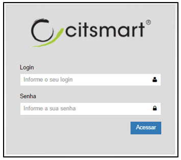

**Figura 1 - Tela de Login**

Após informar o login e senha, clique em “**Acessar**” para iniciar a sessão no sistema e visualizar as opções de navegabilidade
dentro da plataforma, conforme tela abaixo:

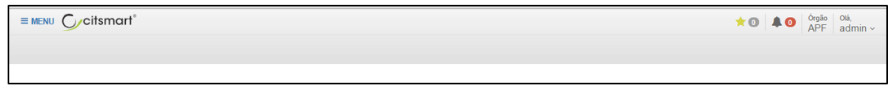

**Figura 2 - Tela de Login**

!!! note "NOTA"

    Este produto pode ser integrado ao sistema de autenticação utilizado na organização do cliente, neste caso, o usuário e
    senha seriam os mesmos utilizados para acessar a rede de dados corporativa.
    
Usando o sistema
--------------------

Assim que o sistema aceita as credenciais do usuário, surge a tela inicial do contendo uma barra de ferramentas, o menu
principal, a opção de favoritos, a opção de alertas, a referência atual do sistema, a identificação do órgão e a identificação
do usuário identificado.

Menu principal
-----------------

O Menu Principal exibe as funcionalidades do sistema de acordo com o seu perfil pré-definido, que basicamente inclui as
seguintes opções: **Dashboards, Definições do Sistema, Corporativo, Auditoria** e **Contratos**.

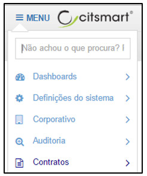

**Figura 3 - Menu**

Menu busca
------------

O Menu Busca possibilita que o usuário pesquise por uma funcionalidade específica mais rapidamente sem precisar navegar por 
todo o Menu para encontrá-la.

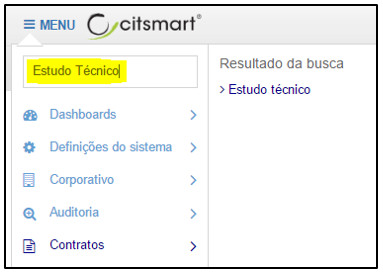

**Figura 4 - Menu Busca**

Favoritos
------------

Clique no ícone  e a lista de páginas **favoritas** será exibida, apresentando a tela 
abaixo:

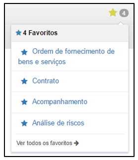

**Figura 5 - Favoritos**

Para que uma página seja incluída na lista de **Favoritos**, basta abrir a página desejada e clicar no ícone “**Favoritar**”, 
localizado no canto esquerdo de qualquer página, conforme abaixo:

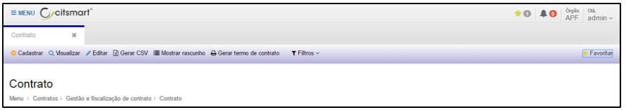

**Figura 6 - Favoritando uma página**

Olá
-----

Espaço onde são exibidas as seguintes informações:

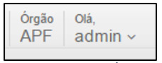

**Figura 5 - Exemplo de informações do órgão e do usuário identificado**

Clique na seta abaixo do nome de usuário para visualizar as opções **Idioma, Redefinição de Senha, Sair** e **Sobre**
serão mostradas:

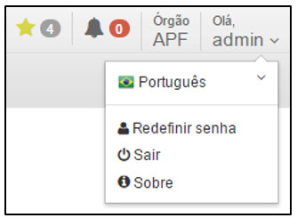

**Figura 8 - Detalhamento do Olá**

Ao clicar em “**Português**” é possível visualizar as opções de idiomas.

Ao clicar em “**Redefinir Senha**” o sistema possibilitará cadastrar uma nova senha de acesso ao sistema.

Ao clicar em “**Sair**”, o sistema finalizará a sessão.

Na opção “**Sobre**”, o sistema apresentará a versão dos componentes instalados e em uso:

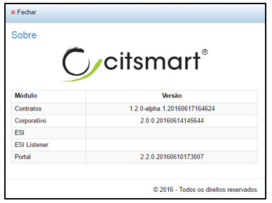

**Figura 9 - Sobre do produto**

!!! info "IMPORTANTE"

    A numeração da versão de cada componente é uma informação crucial na investigação de algum tipo de problema, pois a 
    solução pode estar disponível numa versão posterior.
    
Alerta/notificações
----------------------

Os Alertas/Notificações configurados para um tipo específico de comportamento são exibidos no ícone de 
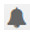 na barra superior do sistema, conforme imagem abaixo:

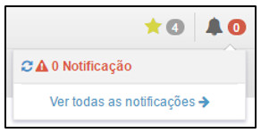

**Figura 8 - Alertas**

!!! tip "About"

    <b>Product/Version:</b> CITSmart | 7.00 &nbsp;&nbsp;
    <b>Updated:</b>08/16/2019 - Larissa Lourenço

