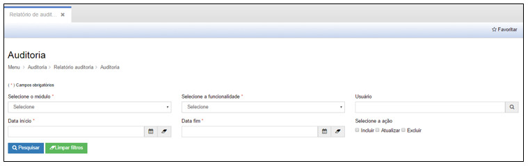
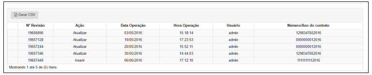

title:  Emissão dos Relatórios de Auditoria
Description: Disponibiliza a emissão dos relatórios de auditoria. 
# Emissão dos Relatórios de Auditoria

Como acessar
--------------

No submenu Relatório de Auditoria é possível visualizar as ações realizadas dentro da plataforma CITSmart como forma de evidenciar as
alterações feitas.

Ao clicar na opção “**Auditoria**” no submenu “**Relatório de Auditoria**”, o sistema apresentará a tela seguinte, com todos os Países 
cadastrados no sistema:

**Figura 1 - Gerando relatório de auditoria**

Auditoria
------------

Nesta tela, o usuário deverá preencher os seguintes campos:

- **Selecione o módulo**: escolher o módulo para auditoria.
- **Selecione a funcionalidade**: escolher a funcionalidade dentro do módulo escolhido para realizar a auditoria.
- **Usuário**: escolher o usuário que realizou as ações dentro do módulo e da funcionalidade.
- **Data início**: data de início da ação.
- **Data fim**: data fim da ação.
- **Selecione a ação**: escolher entre as opções: Incluir, Atualizar, Excluir.

Após informar os dados da pesquisa, clique em “**Pesquisar**”, para gerar o relatório da auditoria. Ou clique em “**Limpar 
filtros**” para cancelar a pesquisa.

Os dados da pesquisa serão apresentados conforme a seguir:

**Figura 2 - Visualizando o relatório de auditoria**

!!! tip "About"

    <b>Product/Version:</b> CITSmart | 7.00 &nbsp;&nbsp;
    <b>Updated:</b>08/14/2019 - Larissa Lourenço
