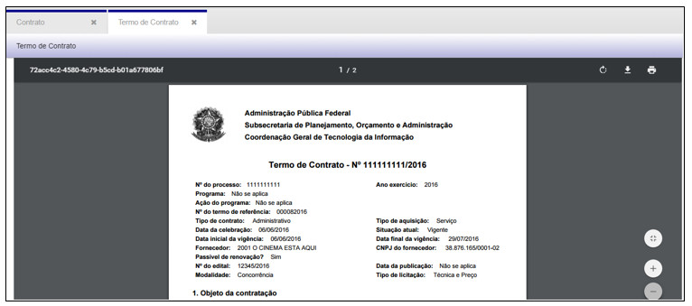

title:  Gestão e Fiscalização do Contrato
Description:  Permite gerenciar os contratos de forma clara e objetiva. 
# Gestão e Fiscalização do Contrato

A fase de **Gestão e Fiscalização de Contrato** permite gerenciar os contratos de forma clara e objetiva, vinculando o cadastro ao 
**Cronograma de Execução**, a **Ordem de Fornecimento de Bens e Serviços**, ao **Registro de Ocorrências**, ao **Encerramento de 
Contratos** e também possibilita **Acompanhar** a vida útil dos Contratos, conforme veremos a seguir.

Como acessar
--------------

Ao clicar na opção “**Contrato**” no submenu “**Gestão e Fiscalização de Contrato**”, o sistema apresentará a tela de 
consulta/pesquisa dos Contratos cadastrados.

Cadastro de contratos
----------------------

**Figura 1 - Consultando contratos**

Nesta tela é possível realizar ações como: **Cadastrar** um novo Contrato, **Visualizar** o cadastro de um Contrato, **Editar**
informações do cadastro de um Contrato, **Gerar CSV, Mostrar Rascunho, Gerar Termo de Contrato** e ainda criar **Filtros**
específicos de busca.

Note que o cadastro do Contrato é dividido em etapas. Navegue pelas etapas para preencher os campos.

Etapa 1: informações gerais
------------------------------

Para cadastrar um novo Contrato, basta clicar em “**Cadastrar**” e o sistema exibirá a tela seguinte:

**Figura 2 - Cadastrando um contrato - Etapa 1**

- **Programa**: número de identificação do programa já cadastrado que pode ser vinculado ao Contrato
- **Ação do Programa**: número de identificação da ação referente ao programa selecionado
- **Termo de Referência**: número de identificação do termo de referência já cadastrado relacionado ao Contrato
- **Nº do Processo**: número de identificação do processo que se refere ao Contrato
- **Exercício**: ano de exercício

Etapa 2: informações do contrato
-----------------------------------

**Figura 3 - Cadastrando um contrato - Etapa 2**

- **Número/Ano Contrato**: número de identificação do Contrato que deverá ser informado pelo usuário
- **Tipo de Contrato**: o tipo do Contrato pode ser Administrativo, Inexigibilidade, Por Empenho, Por Modalidade
- **Tipo de Aquisição**: o tipo da aquisição da contratação pode ser Material, Material e Serviço ou Serviço
- **Data da Celebração**: data da celebração do Contrato
- **Data da Vigência Inicial**: data de iniciação do Contrato
- **Data da Vigência Final**: data de término do Contrato
- **Fornecedor**: nome do fornecedor contratado
- **Contrato Pode ser Renovado?**: previsão de renovação do Contrato

!!! note "NOTA"

    Os campos em cinza serão preenchidos pelo sistema.

- **Objeto de Contratação**: descrição do objeto do Contrato
- **Valor do Contrato**: valor de custo do Contrato
- **Forma de Pagamento do Contrato**: forma como será pago o contrato, que pode ser Parcelado, Sob Demanda ou Único

Etapa 3: informações do empenho e licitação
---------------------------------------------

**Figura 4 - Cadastrando um contrato - Etapa 3**

Clique em “**Adicionar**”, para inserir as informações das notas de empenho e a tela seguinte será exibida.

**Figura 5 - Adicionando notas de empenho**

- **Nº da Nota de Empenho**: número de identificação da nota de empenho
- **Data da Nota de Empenho**: data em que a nota de empenho foi gerada
- **Data de Registro da Nota de Empenho**: data em que a nota de empenho foi registrada no sistema
- **Valor da Nota de Empenho**: valor de custo da nota de empenho
- **Categoria Econômica**: a categoria diz respeito ao tipo de gasto, que pode ser Despesa de Capital ou Despesa Corrente
- **Classificação da Despesa**: a categoria da despesa é classificada conforme ordem numérica (X.0.00.00.00)
- **Finalidade da Nota de Empenho**: a nota de empenho tem uma finalidade que pode ser de Anulação, Despesa de Contrato ou Reforço

Clique em “**Adicionar**” para incluir um empenho ao Contrato ou

Clique em “**Adicionar e continuar**” para incluir outro Empenho ao Contrato ou

Clique em “**Cancelar**”.

!!! info "IMPORTANTE"

    Pelo menos um empenho deverá ser adicionado no cadastro do Contrato.
    
Informações de Licitação:

- **Número/Ano do Edital**: número e ano de identificação do edital publicado
- **Data da Publicação no D.O.U.**: data em que o edital foi publicado no Diário Oficial da União
- **Modalidade**: a licitação possui modalidades que pode ser Concorrência, Concurso, Convite, Leilão, Pregão ou Tomada de Preço
- **Tipo de Licitação**: o tipo de licitação depende do tipo de modalidade escolhida, que pode ser Maior Lance ou Oferta, Melhor 
Técnica, Menor Preço, Técnica e Preço. As modalidades Concurso e Pregão não tem especificação de tipo de licitação

Etapa 4: informações de garantia e itens de contrato
------------------------------------------------------

**Figura 6 - Cadastrando um contrato - Etapa 4**

- **Modalidade da Garantia**: a garantia pode ser Caução em Dinheiro, Fiança Bancária ou Seguro Fiança
- **Data da Vigência da Garantia**: data em que inicia a garantia
- **Valor da Garantia**: preço da garantia

!!! note "NOTA"

    O campo em cinza será preenchido pelo sistema.
    
Clique em “**Adicionar**”, para inserir as informações dos itens do Contrato e a tela seguinte será exibida.

**Figura 7 - Adicionando itens do contrato**

- **Estudo Técnico**: número de identificação vinculado ao Contrato
- **Nome do Item**: nome do item cadastrado no Estudo Técnico que será adicionado ao Contrato
- **Quantidade**: quantitativo do item para o Contrato
- **Valor Unitário**: preço unitário do item

!!! note "NOTA"

    O campo em cinza será preenchido pelo sistema.
    
Clique em “**Adicionar**” para incluir um item ao contrato ou

Clique em “**Adicionar e continuar**” para incluir outro item ao contrato ou

Clique em “**Cancelar**”.

!!! info "IMPORTANTE"

    Pelo menos um item deverá ser adicionado no cadastro do Contrato.

Etapa 5: informações de envolvidos no contrato
-------------------------------------------------

**Figura 8 - Cadastrando um contrato - Etapa 5**

Clique em “**Adicionar**”, para inserir os envolvidos no contrato e a tela seguinte será exibida.

**Figura 9 - Adicionando envolvidos no contrato**

- **Nome do Envolvido**: nome da pessoa (servidor) que está diretamente envolvido no contrato e na sua execução
- **Papel**: tipo de papel que a pessoa (servidor) exercerá sobre o contrato

Clique em “**Adicionar**” para incluir um envolvido no contrato ou

Clique em “**Adicionar e continuar**” para incluir outro envolvido no contrato ou

Clique em “**Fechar**”.

!!! info "IMPORTANTE"

    Pelo menos um envolvido deverá ser adicionado no cadastro do Contrato.
    
Após o preenchimento dos campos, clique em “**Próximo**” ou clique na etapa 6 – “**Anexos e Observações**”, para seguir com o 
preenchimento do cadastro.

Etapa 6: anexos e observações
----------------------------------

**Figura 10 - Cadastrando um contrato - Etapa 6**

Clique em “**Adicionar**”, para anexar documentos no cadastro e a tela seguinte será exibida.

**Figura 11 - Anexando documentos**

- **Tipo de Documento**: tipo de documento (exemplo: ata, ofício, nota de empenho...)
- **Data da Emissão**: data em que o documento foi emitido
- **Nº do Documento**: número do documento emitido
- **Emissor**: nome do emissor do documento
- **Arquivo**: abra o explorer e arraste o documento para a área indicada ou clique na área indicada para selecionar o documento

Clique em “**Adicionar**” para incluir um documento ao contrato ou

Clique em “**Adicionar e continuar**” para incluir outro documento ao contrato ou

Clique em “**Cancelar**”.

!!! note "NOTA"

    A  associação de documentos não é obrigatória.
    
- **Observação**: descrição de informação que seja relevante para o cadastro. Ao adicionar uma observação, o nome do usuário, data
e horário serão gravados na tela.

**Figura 12 - Adicionando uma observação**

Após o preenchimento dos campos, clique em “**Salvar**”, para que o sistema armazene as informações no banco de dados.

Nesta tela as seguintes ações também poderão ser realizadas:

- **Limpar**: limpa todos os campos preenchidos antes de salvar o cadastro.
- **Pesquisar**: retorna à tela de pesquisa.

Para visualizar as informações de um cadastro, selecione um Contrato e clique em “**Visualizar**”, conforme demonstrado a seguir.

**Figura 13 - Selecionando um contrato**

**Figura 14 - Visualizando um contrato**

Na tela de visualização é possível realizar as seguintes ações:

- **Gerar Termo de Contrato**: gerar o documento com as informações do cadastro
- **Pesquisar**: retornar à tela de pesquisa de cadastro

!!! warning "ATENÇÃO"

    Um Contrato não poderá ser excluído do sistema.
    
Para editar as informações de um cadastro, selecione um Contrato e clique em “**Editar**”. A tela apresentada será a do cadastro do 
Contrato.

Para gerar a tabela de Contratos em um arquivo excel, clique em “**Gerar CSV**”.

Para criar filtros de busca, clique em “**Filtros**”. Esta ação permite a configuração de filtros específicos.

Para mostrar rascunho de cadastros, clique em “**Mostrar Rascunho**”. Os rascunhos são salvos automaticamente pelo sistema ao 
iniciar um cadastro.

**Figura 15 - Exibindo rascunhos de cadastros iniciados**

Na tela de rascunho é possível:

- **Carregar**: abre a tela de cadastro permite continuar de onde parou
- **Remover**: exclui um rascunho
- **Fechar**: fecha a tela de rascunho
- **Transferir**: transfere o documento para outro usuário finalizar o cadastro

**Figura 16 - Transferindo um rascunho**

Ao clicar em “**Salvar**”, o rascunho aparecerá na tela de rascunhos do usuário informado.

Ao clicar em “**Cancelar**”, a ação de transferir é cancelada e a tela retorna para a lista de rascunhos.

Ao clicar em “**Fechar**”, a tela de rascunhos é fechada completamente

Para gerar o documento com as informações do cadastro, selecione um Termo de Contrato e clique em “**Gerar Termo de Contrato**”.

**Figura 17 - Selecionando um termo de contrato**

O sistema exibirá uma mensagem e logo em seguida o documento será gerado em uma nova aba.

**Figura 18 - Mensagem de documento gerado**

**Figura 19 - Documento de termo de referência gerado**

Com o documento gerado é possível: **Aumentar o zoom, Diminuir o zoom, Fazer o download** (em .pdf) e **Imprimir**.

Cronograma de execução
------------------------

Ao clicar na opção “**Cronograma de Execução**” no submenu “**Gestão e Fiscalização de Contrato**”, o sistema apresentará a tela de 
consulta/pesquisa dos Cronogramas cadastrados:

**Figura 20 - Consultando cronogramas de execução**

Nesta tela é possível realizar ações como: **Cadastrar** um novo Cronograma, **Visualizar** o cadastro de um Cronograma, **Editar**
informações do cadastro de um Cronograma, **Remover** um cadastro, **Gerar CSV, Gerar Cronograma** e ainda criar **Filtros**
específicos de busca.

1. Para cadastrar um novo Cronograma de Execução, basta clicar em “**Cadastrar**” e o sistema exibirá a tela seguinte:

**Figura 21 - Cadastrando um cronograma de execução**

Preencha os campos a seguir.

Cronograma de Execução:

- **Número/Ano do Contrato**: número de identificação do Contrato vinculado ao cronograma

!!! note "NOTA"

    Os campos em cinza serão preenchidos pelo sistema ao informar o número do contrato.

Em seguida clique em “**Adicionar**” para inserir os itens do cronograma, e a tela seguinte será exibida:

**Figura 22 - Inserindo itens do cronograma**

- **Nome do Item**: itens cadastrados no contrato informado
- **Pagamento Parcelado**: opção prever o parcelamento do pagamento
- **Quantidade**: quantitativo do item previsto para o cronograma

Clique em “**Adicionar**” para incluir um item do contrato ao cronograma ou

Clique em “**Adicionar e continuar**” para incluir outro item do contrato ao cronograma ou

Clique em “**Cancelar**”.

!!! info "IMPORTANTE"

    Pelo menos um item do contrato deverá ser adicionado no Cronograma de Execução.
    
Anexos e observação
----------------------

