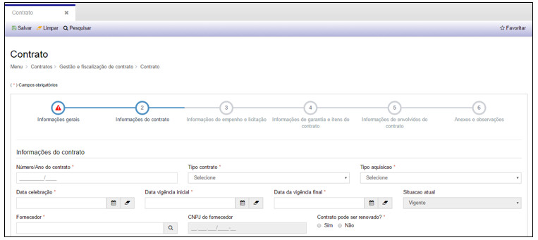
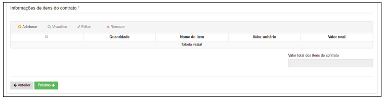
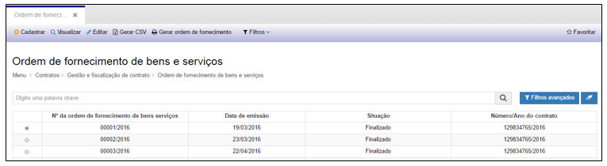
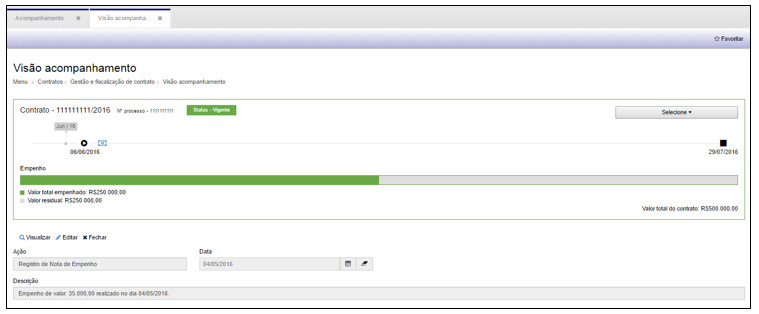
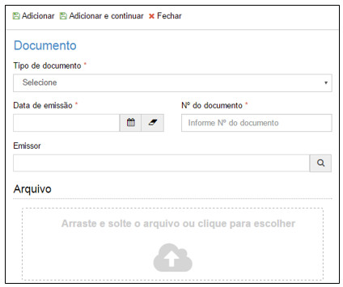
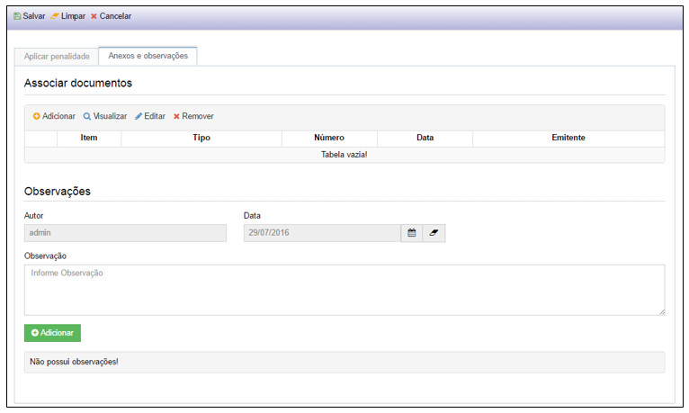
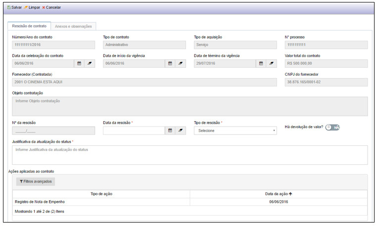
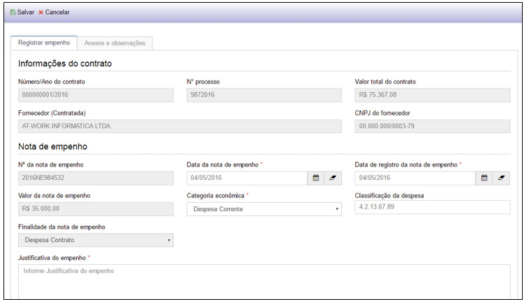
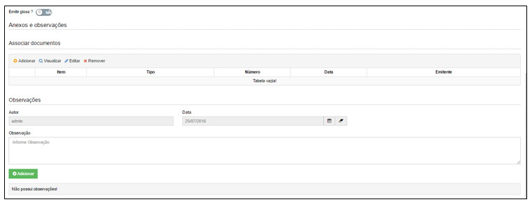

title:  Gestão e Fiscalização do Contrato
Description:  Permite gerenciar os contratos de forma clara e objetiva. 
# Gestão e Fiscalização do Contrato

A fase de **Gestão e Fiscalização de Contrato** permite gerenciar os contratos de forma clara e objetiva, vinculando o cadastro ao 
**Cronograma de Execução**, a **Ordem de Fornecimento de Bens e Serviços**, ao **Registro de Ocorrências**, ao **Encerramento de 
Contratos** e também possibilita **Acompanhar** a vida útil dos Contratos, conforme veremos a seguir.

Como acessar
--------------

Ao clicar na opção “**Contrato**” no submenu “**Gestão e Fiscalização de Contrato**”, o sistema apresentará a tela de 
consulta/pesquisa dos Contratos cadastrados.

Cadastro de contratos
----------------------

**Figura 1 - Consultando contratos**

Nesta tela é possível realizar ações como: **Cadastrar** um novo Contrato, **Visualizar** o cadastro de um Contrato, **Editar**
informações do cadastro de um Contrato, **Gerar CSV, Mostrar Rascunho, Gerar Termo de Contrato** e ainda criar **Filtros**
específicos de busca.

Note que o cadastro do Contrato é dividido em etapas. Navegue pelas etapas para preencher os campos.

Etapa 1: informações gerais
------------------------------

Para cadastrar um novo Contrato, basta clicar em “**Cadastrar**” e o sistema exibirá a tela seguinte:

**Figura 2 - Cadastrando um contrato - Etapa 1**

- **Programa**: número de identificação do programa já cadastrado que pode ser vinculado ao Contrato
- **Ação do Programa**: número de identificação da ação referente ao programa selecionado
- **Termo de Referência**: número de identificação do termo de referência já cadastrado relacionado ao Contrato
- **Nº do Processo**: número de identificação do processo que se refere ao Contrato
- **Exercício**: ano de exercício

Etapa 2: informações do contrato
-----------------------------------

**Figura 3 - Cadastrando um contrato - Etapa 2**

- **Número/Ano Contrato**: número de identificação do Contrato que deverá ser informado pelo usuário
- **Tipo de Contrato**: o tipo do Contrato pode ser Administrativo, Inexigibilidade, Por Empenho, Por Modalidade
- **Tipo de Aquisição**: o tipo da aquisição da contratação pode ser Material, Material e Serviço ou Serviço
- **Data da Celebração**: data da celebração do Contrato
- **Data da Vigência Inicial**: data de iniciação do Contrato
- **Data da Vigência Final**: data de término do Contrato
- **Fornecedor**: nome do fornecedor contratado
- **Contrato Pode ser Renovado?**: previsão de renovação do Contrato

!!! note "NOTA"

    Os campos em cinza serão preenchidos pelo sistema.

- **Objeto de Contratação**: descrição do objeto do Contrato
- **Valor do Contrato**: valor de custo do Contrato
- **Forma de Pagamento do Contrato**: forma como será pago o contrato, que pode ser Parcelado, Sob Demanda ou Único

Etapa 3: informações do empenho e licitação
---------------------------------------------

**Figura 4 - Cadastrando um contrato - Etapa 3**

Clique em “**Adicionar**”, para inserir as informações das notas de empenho e a tela seguinte será exibida.

**Figura 5 - Adicionando notas de empenho**

- **Nº da Nota de Empenho**: número de identificação da nota de empenho
- **Data da Nota de Empenho**: data em que a nota de empenho foi gerada
- **Data de Registro da Nota de Empenho**: data em que a nota de empenho foi registrada no sistema
- **Valor da Nota de Empenho**: valor de custo da nota de empenho
- **Categoria Econômica**: a categoria diz respeito ao tipo de gasto, que pode ser Despesa de Capital ou Despesa Corrente
- **Classificação da Despesa**: a categoria da despesa é classificada conforme ordem numérica (X.0.00.00.00)
- **Finalidade da Nota de Empenho**: a nota de empenho tem uma finalidade que pode ser de Anulação, Despesa de Contrato ou Reforço

Clique em “**Adicionar**” para incluir um empenho ao Contrato ou

Clique em “**Adicionar e continuar**” para incluir outro Empenho ao Contrato ou

Clique em “**Cancelar**”.

!!! info "IMPORTANTE"

    Pelo menos um empenho deverá ser adicionado no cadastro do Contrato.
    
Informações de Licitação:

- **Número/Ano do Edital**: número e ano de identificação do edital publicado
- **Data da Publicação no D.O.U.**: data em que o edital foi publicado no Diário Oficial da União
- **Modalidade**: a licitação possui modalidades que pode ser Concorrência, Concurso, Convite, Leilão, Pregão ou Tomada de Preço
- **Tipo de Licitação**: o tipo de licitação depende do tipo de modalidade escolhida, que pode ser Maior Lance ou Oferta, Melhor 
Técnica, Menor Preço, Técnica e Preço. As modalidades Concurso e Pregão não tem especificação de tipo de licitação

Etapa 4: informações de garantia e itens de contrato
------------------------------------------------------

**Figura 6 - Cadastrando um contrato - Etapa 4**

- **Modalidade da Garantia**: a garantia pode ser Caução em Dinheiro, Fiança Bancária ou Seguro Fiança
- **Data da Vigência da Garantia**: data em que inicia a garantia
- **Valor da Garantia**: preço da garantia

!!! note "NOTA"

    O campo em cinza será preenchido pelo sistema.
    
Clique em “**Adicionar**”, para inserir as informações dos itens do Contrato e a tela seguinte será exibida.

**Figura 7 - Adicionando itens do contrato**

- **Estudo Técnico**: número de identificação vinculado ao Contrato
- **Nome do Item**: nome do item cadastrado no Estudo Técnico que será adicionado ao Contrato
- **Quantidade**: quantitativo do item para o Contrato
- **Valor Unitário**: preço unitário do item

!!! note "NOTA"

    O campo em cinza será preenchido pelo sistema.
    
Clique em “**Adicionar**” para incluir um item ao contrato ou

Clique em “**Adicionar e continuar**” para incluir outro item ao contrato ou

Clique em “**Cancelar**”.

!!! info "IMPORTANTE"

    Pelo menos um item deverá ser adicionado no cadastro do Contrato.

Etapa 5: informações de envolvidos no contrato
-------------------------------------------------

**Figura 8 - Cadastrando um contrato - Etapa 5**

Clique em “**Adicionar**”, para inserir os envolvidos no contrato e a tela seguinte será exibida.

**Figura 9 - Adicionando envolvidos no contrato**

- **Nome do Envolvido**: nome da pessoa (servidor) que está diretamente envolvido no contrato e na sua execução
- **Papel**: tipo de papel que a pessoa (servidor) exercerá sobre o contrato

Clique em “**Adicionar**” para incluir um envolvido no contrato ou

Clique em “**Adicionar e continuar**” para incluir outro envolvido no contrato ou

Clique em “**Fechar**”.

!!! info "IMPORTANTE"

    Pelo menos um envolvido deverá ser adicionado no cadastro do Contrato.
    
Após o preenchimento dos campos, clique em “**Próximo**” ou clique na etapa 6 – “**Anexos e Observações**”, para seguir com o 
preenchimento do cadastro.

Etapa 6: anexos e observações
----------------------------------

**Figura 10 - Cadastrando um contrato - Etapa 6**

Clique em “**Adicionar**”, para anexar documentos no cadastro e a tela seguinte será exibida.

**Figura 11 - Anexando documentos**

- **Tipo de Documento**: tipo de documento (exemplo: ata, ofício, nota de empenho...)
- **Data da Emissão**: data em que o documento foi emitido
- **Nº do Documento**: número do documento emitido
- **Emissor**: nome do emissor do documento
- **Arquivo**: abra o explorer e arraste o documento para a área indicada ou clique na área indicada para selecionar o documento

Clique em “**Adicionar**” para incluir um documento ao contrato ou

Clique em “**Adicionar e continuar**” para incluir outro documento ao contrato ou

Clique em “**Cancelar**”.

!!! note "NOTA"

    A  associação de documentos não é obrigatória.
    
- **Observação**: descrição de informação que seja relevante para o cadastro. Ao adicionar uma observação, o nome do usuário, data
e horário serão gravados na tela.

**Figura 12 - Adicionando uma observação**

Após o preenchimento dos campos, clique em “**Salvar**”, para que o sistema armazene as informações no banco de dados.

Nesta tela as seguintes ações também poderão ser realizadas:

- **Limpar**: limpa todos os campos preenchidos antes de salvar o cadastro.
- **Pesquisar**: retorna à tela de pesquisa.

Para visualizar as informações de um cadastro, selecione um Contrato e clique em “**Visualizar**”, conforme demonstrado a seguir.

**Figura 13 - Selecionando um contrato**

**Figura 14 - Visualizando um contrato**

Na tela de visualização é possível realizar as seguintes ações:

- **Gerar Termo de Contrato**: gerar o documento com as informações do cadastro
- **Pesquisar**: retornar à tela de pesquisa de cadastro

!!! warning "ATENÇÃO"

    Um Contrato não poderá ser excluído do sistema.
    
Para editar as informações de um cadastro, selecione um Contrato e clique em “**Editar**”. A tela apresentada será a do cadastro do 
Contrato.

Para gerar a tabela de Contratos em um arquivo excel, clique em “**Gerar CSV**”.

Para criar filtros de busca, clique em “**Filtros**”. Esta ação permite a configuração de filtros específicos.

Para mostrar rascunho de cadastros, clique em “**Mostrar Rascunho**”. Os rascunhos são salvos automaticamente pelo sistema ao 
iniciar um cadastro.

**Figura 15 - Exibindo rascunhos de cadastros iniciados**

Na tela de rascunho é possível:

- **Carregar**: abre a tela de cadastro permite continuar de onde parou
- **Remover**: exclui um rascunho
- **Fechar**: fecha a tela de rascunho
- **Transferir**: transfere o documento para outro usuário finalizar o cadastro

**Figura 16 - Transferindo um rascunho**

Ao clicar em “**Salvar**”, o rascunho aparecerá na tela de rascunhos do usuário informado.

Ao clicar em “**Cancelar**”, a ação de transferir é cancelada e a tela retorna para a lista de rascunhos.

Ao clicar em “**Fechar**”, a tela de rascunhos é fechada completamente

Para gerar o documento com as informações do cadastro, selecione um Termo de Contrato e clique em “**Gerar Termo de Contrato**”.

**Figura 17 - Selecionando um termo de contrato**

O sistema exibirá uma mensagem e logo em seguida o documento será gerado em uma nova aba.

**Figura 18 - Mensagem de documento gerado**

**Figura 19 - Documento de termo de referência gerado**

Com o documento gerado é possível: **Aumentar o zoom, Diminuir o zoom, Fazer o download** (em .pdf) e **Imprimir**.

Cronograma de execução
------------------------

Ao clicar na opção “**Cronograma de Execução**” no submenu “**Gestão e Fiscalização de Contrato**”, o sistema apresentará a tela de 
consulta/pesquisa dos Cronogramas cadastrados:

**Figura 20 - Consultando cronogramas de execução**

Nesta tela é possível realizar ações como: **Cadastrar** um novo Cronograma, **Visualizar** o cadastro de um Cronograma, **Editar**
informações do cadastro de um Cronograma, **Remover** um cadastro, **Gerar CSV, Gerar Cronograma** e ainda criar **Filtros**
específicos de busca.

1. Para cadastrar um novo Cronograma de Execução, basta clicar em “**Cadastrar**” e o sistema exibirá a tela seguinte:

**Figura 21 - Cadastrando um cronograma de execução**

Preencha os campos a seguir.

Cronograma de Execução:

- **Número/Ano do Contrato**: número de identificação do Contrato vinculado ao cronograma

!!! note "NOTA"

    Os campos em cinza serão preenchidos pelo sistema ao informar o número do contrato.

Em seguida clique em “**Adicionar**” para inserir os itens do cronograma, e a tela seguinte será exibida:

**Figura 22 - Inserindo itens do cronograma**

- **Nome do Item**: itens cadastrados no contrato informado
- **Pagamento Parcelado**: opção prever o parcelamento do pagamento
- **Quantidade**: quantitativo do item previsto para o cronograma

Clique em “**Adicionar**” para incluir um item do contrato ao cronograma ou

Clique em “**Adicionar e continuar**” para incluir outro item do contrato ao cronograma ou

Clique em “**Cancelar**”.

!!! info "IMPORTANTE"

    Pelo menos um item do contrato deverá ser adicionado no Cronograma de Execução.
    
Anexos e observação
----------------------

**Figura 23 - Anexos e observação do cronograma de execução**

Clique em “**Adicionar**”, para anexar documentos no cadastro e a tela seguinte será exibida.

**Figura 24 - Anexando documentos**

- **Tipo de Documento**: tipo de documento (exemplo: ata, ofício, nota de empenho...)
- **Data da Emissão**: data em que o documento foi emitido
- **Nº do Documento**: número do documento emitido
- **Emissor**: nome do emissor do documento
- **Arquivo**: abra o explorer e arraste o documento para a área indicada ou clique na área indicada para selecionar o 
documento

Clique em “**Adicionar**” para incluir um documento ao cronograma ou

Clique em “**Adicionar e continuar**” para incluir outro documento ao cronograma ou

Clique em “**Cancelar**”.

!!! note "NOTA"

    A associação de documentos não é obrigatória.
    
- **Observação**: descrição de informação que seja relevante para o cadastro. Ao adicionar uma observação, o nome do usuário, 
data e horário serão gravados na tela.

**Figura 25 - Adicionando uma observação**

Após o preenchimento dos campos, clique em “**Salvar**”, para que o sistema armazene as informações no banco de dados.

Nesta tela as seguintes ações também poderão ser realizadas:

- **Limpar**: limpa todos os campos preenchidos antes de salvar o cadastro.
- **Pesquisar**: retorna à tela de pesquisa.

Para visualizar as informações de um cadastro, selecione um Cronograma de Execução e clique em “**Visualizar**”, conforme 
demonstrado a seguir.

**Figura 26 - Selecionando um cronograma de execução**

**Figura 27 - Visualizando um cronograma de execução**

Na tela de visualização é possível realizar as seguintes ações:

- **Editar**: alterar informações do cadastro
- **Remover**: excluir o cadastro
- **Gerar Cronograma**: gerar o documento com as informações do cadastro
- **Pesquisar**: retornar à tela de pesquisa de cadastro

Para editar as informações de um cadastro, selecione um Cronograma de Execução e clique em “**Editar**”. A tela apresentada 
será a do cadastro do Cronograma de Execução.

Para remover as informações de um cadastro, selecione um Cronograma de Execução e clique em “**Remover**” e o sistema exibirá 
uma mensagem solicitando a confirmação da exclusão, como demonstrado a seguir:

**Figura 28 - Confirmando a exclusão de um cronograma de execução**

Clique em “**Confirmar**” para excluir o Cronograma de Execução ou clique em “Cancelar” para desistir da exclusão.

Para criar filtros de busca, clique em “**Filtros**”. Esta ação permite a configuração de filtros específicos.

Para gerar o documento com as informações do cadastro, selecione um Cronograma de Execução e clique em “**Gerar Cronograma**”.

**Figura 29 - Selecionando um cronograma de execução**

O sistema exibirá uma mensagem e logo em seguida o documento será gerado em uma nova aba.

**Figura 30 - Mensagem de documento gerado**

**Figura 31- Documento de cronograma de execução gerado**

!!! note "NOTA"

    Com o documento gerado é possível: Aumentar o zoom, Diminuir o zoom, Fazer o download (em .pdf) e Imprimir.

Ordem de fornecimento de bens e serviços
-------------------------------------------

Ao clicar na opção “**Ordem de Fornecimento de Bens e Serviços**” (OFBS) no submenu “**Gestão e Fiscalização de Contrato**”, o 
sistema apresentará a tela de consulta/pesquisa das Ordens de Fornecimento de Bens e Serviços cadastradas:

**Figura 32 - Consultando OFBS**

Nesta tela é possível realizar ações como: **Cadastrar** uma nova OFBS, **Visualizar** o cadastro de uma OFBS, **Editar** 
informações do cadastro de uma OFBS, **Gerar CSV, Gerar Ordem de Fornecimento** e ainda criar **Filtros** específicos de 
busca.

Para cadastrar uma nova OFBS, basta clicar em “**Cadastrar**” e o sistema exibirá a tela seguinte:

**Figura 33 - Cadastrando uma OFBS**

Identificação
---------------

Preencha os campos a seguir.

- **Data da Emissão**: data de emissão da ordem de fornecimento
- **Situação**: tipo de status da ordem de fornecimento, que pode ser Em Andamento ou Finalizado
- **Número/Ano do Contrato**: número de identificação do Contrato vinculado à ordem de fornecimento
- **Local de Prestação do Serviço**: local/endereço onde o serviço será prestado ou o bem será entregue

!!! note "NOTA"

    Ao informar o número do contrato, alguns campos serão preenchidos pelo sistema

Em seguida clique em “**Adicionar**” para inserir a especificação dos produtos/serviços e volumes, e a tela seguinte será 
exibida:

**Figura 34 - Inserindo itens**

- **Nome do Item**: itens cadastrados no contrato informado
- **Início Previsto**: data inicial para o serviço
- **Término Previsto**: data final para entrega do serviço
- **Quantidade**: quantitativo do item previsto para a ordem de fornecimento

Clique em “**Adicionar**” para incluir um item à ordem de fornecimento ou

Clique em “**Adicionar e continuar**” para incluir outro item à ordem de fornecimento ou

Clique em “**Cancelar**”.

Anexos e observação
---------------------

**Figura 35 - Anexos e observação de OFBS**

Clique em “**Adicionar**”, para anexar documentos no cadastro e a tela seguinte será exibida.

**Figura 36 - Anexando documentos**

- **Tipo de Documento**: tipo de documento (exemplo: ata, ofício, nota de empenho...)
- **Data da Emissão**: data em que o documento foi emitido
- **Nº do Documento**: número do documento emitido
- **Emissor**: nome do emissor do documento
- **Arquivo**: abra o explorer e arraste o documento para a área indicada ou clique na área indicada para selecionar o 
documento

Clique em “**Adicionar**” para incluir um documento à ordem de fornecimento ou

Clique em “**Adicionar e continuar**” para incluir outro documento à ordem de fornecimento ou

Clique em “**Cancelar**”.

!!! note "NOTA"

    A associação de documentos não é obrigatória.
    
- **Observação**: descrição de informação que seja relevante para o cadastro. Ao adicionar uma observação, o nome do usuário, 
data e horário serão gravados na tela.

**Figura 37 - Adicionando uma observação**

Após o preenchimento dos campos, clique em “**Salvar**”, para que o sistema armazene as informações no banco de dados.

Nesta tela as seguintes ações também poderão ser realizadas:

- **Limpar**: limpa todos os campos preenchidos antes de salvar o cadastro.
- **Pesquisar**: retorna à tela de pesquisa.

Para visualizar as informações de um cadastro, selecione uma Ordem de Fornecimento e clique em “**Visualizar**”, conforme 
demonstrado a seguir.

**Figura 38 - Selecionando uma OFBS**

**Figura 39 - Visualizando uma OFBS**

Na tela de visualização é possível realizar as seguintes ações:

- **Gerar Ordem de Fornecimento**: gerar o documento com as informações do cadastro
- **Pesquisar**: retornar à tela de pesquisa de cadastro

Para editar as informações de um cadastro, selecione uma OFBS e clique em “**Editar**”. A tela apresentada será a do cadastro 
da OFBS.

Para criar filtros de busca, clique em “**Filtros**”. Esta ação permite a configuração de filtros específicos.

Para gerar o documento com as informações do cadastro, selecione uma OFBS e clique em “**Gerar Ordem de Fornecimento**”.

**Figura 40 - Selecionando uma OFBS**

O sistema exibirá uma mensagem e logo em seguida o documento será gerado em uma nova aba.

**Figura 41 - Mensagem de documento gerado**

**Figura 42 - Documento de OFBS gerado**

!!! note "NOTA"

    Com o documento gerado é possível: Aumentar o zoom, Diminuir o zoom, Fazer o download (em .pdf) e Imprimir.

Acompanhamento
-----------------

Ao clicar na opção “**Acompanhamento**” no submenu “**Gestão e Fiscalização de Contrato**”, o sistema apresentará a tela de 
consulta/pesquisa em uma visão macro de valor, percentual, vigência e situação dos contratos.

**Figura 43 - Consultando o acompanhamento dos contratos**

Nesta tela é possível **Visualizar** a vida do contrato em uma linha do tempo, **Gerar CSV** da tabela com todos os contratos 
e ainda criar **Filtros** específicos de busca.

Para **visualizar** o contrato em uma **linha do tempo**, basta clicar no ícone “**visão**” do contrato e o sistema exibirá a 
tela seguinte:

**Figura 44 - Visualizando o contrato em linha do tempo**

Na tela **Visão do Acompanhamento** do contrato é possível visualizar as seguintes informações:

- Número/Ano do Contrato
- Nº do Processo
- Situação do Contrato (status)
- Data de Vigência Inicial
- Data de Vigência Final
- Valor e Percentual de Empenho
- Valor e Percentual de Residual
- Valor Total do Contrato

E ainda permite aplicar as seguintes ações quando necessário:

- Alteração Contratual (aditivo)
- Aplicação de Penalidade
- Apostilamento
- Atualização de Status (situação)
- Liberação para Pagamento
- Registro de Não Conformidade
- Registro de Nota de Empenho
- Registro de Recebimento de Objeto
- Repactuação
- Rescisão de Contrato

Para aplicar uma ação ao contrato, clique em “**Selecione**”, localizado no canto direito da linha do tempo, e a lista de 
ações será exibida.

**Figura 45 - Lista de ações aplicáveis ao contrato**

Alteração contratual (aditivo)
--------------------------------

**Figura 46 - Aplicando alteração contratual**

Na tela de Alteração Contratual (aditivo), os campos relacionados ao cadastro do contrato virão preenchidos, portanto, 
preencha apenas os campos em branco.

Aditamento do contrato
------------------------

- **Data da Emissão**: data de emissão/cadastro do aditivo
- **Tipo de Alteração**: o aditivo pode ser por Acordo das Partes ou Unilateral pela Administração, escolha o tipo adequado
- **Tipo de Aditivo**: o aditivo pode ser De Prazo, de Valor ou De Cláusula Contratual, escolha o tipo adequado

Para alteração de prazo é necessário informar final do aditivo:

**Figura 47 - Alteração contratual - de prazo**

- **Data final do aditivo**: data final de validade do aditivo

Para alteração de valor, é necessário informar o tipo de alteração no valor:

**Figura 48 - Alteração contratual - de valor**

- **Tipo de Alteração**: tipo de alteração de valor considerado para o aditivo, que pode ser acréscimo ou supressão
- **Tipo de Objeto**: o objeto é o que será contratado, que pode ser obras, serviços ou compras, ou reforma de edifícios ou 
equipamentos
- **Valor do Aditivo**: valor considerado para o aditivo
- **Percentual do Aditivo**: o percentual é calculado automaticamente pelo sistema assim que o valor do aditivo for informado.

Para alteração de cláusula contratual, é necessário descrever a alteração da cláusula:

**Figura 49 - Alteração contratual - de cláusula contratual**

- **Descrição da Alteração Contratual**: detalhamento do aditivo por cláusula contratual
- **Justificativa do Aditivo**: descrição detalhada do motivo do aditivo
- **Manifestação da Contratada**: caso haja, descreva a manifestação da contratada quanto ao aditivo

Anexos e observação
----------------------

**Figura 50 - Anexos e observação do aditamento**

Clique em “**Adicionar**”, para anexar documentos no cadastro e a tela seguinte será exibida.

**Figura 51 - Anexando documentos**

- **Tipo de Documento**: tipo de documento (exemplo: ata, ofício, nota de empenho...)
- **Data da Emissão**: data em que o documento foi emitido
- **Nº do Documento**: número do documento emitido
- **Emissor**: nome do emissor do documento
- **Arquivo**: abra o explorer e arraste o documento para a área indicada ou clique na área indicada para selecionar o 
documento

Clique em “**Adicionar**” para incluir um documento à ação ou

Clique em “**Adicionar e continuar**” para incluir outro documento à ação ou

Clique em “**Cancelar**”.

!!! note "NOTA"

    A associação de documentos não é obrigatória.
    
- **Observação**: descrição de informação que seja relevante para o cadastro. Ao adicionar uma observação, o nome do usuário, 
data e horário serão gravados na tela.

**Figura 52 - Adicionando uma observação**

Após o preenchimento dos campos, clique em “**Salvar**”, para que o sistema armazene as informações no banco de dados.

Nesta tela as seguintes ações também poderão ser realizadas:

- **Limpar**: limpa todos os campos preenchidos antes de salvar o cadastro.
- **Cancelar**: fecha a tela da ação.

!!! note "NOTA"

    A associação de documentos não é obrigatória.
    
Após aplicar a ação, esta será mostrada na linha do tempo, que poderá ser visualizada a qualquer momento.

Aplicação de penalidade
--------------------------

**Figura 53 - Aplicando penalidade**

Na tela de Aplicação de Penalidade, os campos relacionados ao cadastro do contrato virão preenchidos, portanto, preencha 
apenas os campos em branco.

- **Data de Penalização**: data em que a penalidade está sendo emitida
- **Penalidade**: as penalidades previstas no cadastro do contrato serão mostradas aqui.
- **Resposta da Contratada**: caso haja, descreva a manifestação da contratada quanto ao aditivo

Anexos e observação
---------------------

**Figura 54 - Anexos e observação da aplicação de penalidade**

Clique em “**Adicionar**”, para anexar documentos no cadastro e a tela seguinte será exibida.

**Figura 55 - Anexando documentos**

- **Tipo de Documento**: tipo de documento (exemplo: ata, ofício, nota de empenho...)
- **Data da Emissão**: data em que o documento foi emitido
- **Nº do Documento**: número do documento emitido
- **Emissor**: nome do emissor do documento
- **Arquivo**: abra o explorer e arraste o documento para a área indicada ou clique na área indicada para selecionar o 
documento

Clique em “**Adicionar**” para incluir um documento à ação ou

Clique em “**Adicionar e continuar**” para incluir outro documento à ação ou

Clique em “**Cancelar**”.

!!! note "NOTA"

    A associação de documentos não é obrigatória.
    
- **Observação**: descrição de informação que seja relevante para o cadastro. Ao adicionar uma observação, o nome do usuário, 
data e horário serão gravados na tela.

**Figura 56 - Adicionando uma observação**

Após o preenchimento dos campos, clique em “**Salvar**”, para que o sistema armazene as informações no banco de dados.

Nesta tela as seguintes ações também poderão ser realizadas:

- **Limpar**: limpa todos os campos preenchidos antes de salvar o cadastro.
- **Cancelar**: fecha a tela da ação.

!!! note "NOTA"

    A associação de documentos não é obrigatória.
    
Após aplicar a ação, esta será mostrada na linha do tempo, que poderá ser visualizada a qualquer momento.

Apostilamento
---------------

**Figura 57 - Aplicando apostilamento**

Na tela de Apostilamento, os campos relacionados ao cadastro do contrato virão preenchidos, portanto, preencha apenas os 
campos em branco.

- **Data de Emissão do Apostilamento**: data em que o apostilamento está sendo emitida
- **Justificativa do Apostilamento**: descrição detalhada do motivo do apostilamento
- **Descrição do Registro Administrativo**: descrição detalhada do registro administrativo

Anexos e observação
--------------------

**Figura 58 - Anexos e observação do apostilamento**

Clique em “**Adicionar**”, para anexar documentos no cadastro e a tela seguinte será exibida.

**Figura 59 - Anexando documentos**

- **Tipo de Documento**: tipo de documento (exemplo: ata, ofício, nota de empenho...)
- **Data da Emissão**: data em que o documento foi emitido
- **Nº do Documento**: número do documento emitido
- **Emissor**: nome do emissor do documento
- **Arquivo**: abra o explorer e arraste o documento para a área indicada ou clique na área indicada para selecionar o 
documento

Clique em “**Adicionar**” para incluir um documento à ação ou

Clique em “**Adicionar e continuar**” para incluir outro documento à ação ou

Clique em “**Cancelar

!!! note "NOTA"

    A associação de documentos não é obrigatória.

- **Observação**: descrição de informação que seja relevante para o cadastro. Ao adicionar uma observação, o nome do usuário, 
data e horário serão gravados na tela.

**Figura 60 - Adicionando uma observação**

Após o preenchimento dos campos, clique em “**Salvar**”, para que o sistema armazene as informações no banco de dados.

Nesta tela as seguintes ações também poderão ser realizadas:

- **Limpar**: limpa todos os campos preenchidos antes de salvar o cadastro.
- **Cancelar**: fecha a tela da ação.

!!! note "NOTA"

    A associação de documentos não é obrigatória.
    
Após aplicar a ação, esta será mostrada na linha do tempo, que poderá ser visualizada a qualquer momento.

Atualização de status
----------------------

**Figura 61- Aplicando atualização de status**

Na tela de Atualização de Status, os campos relacionados ao cadastro do contrato virão preenchidos, portanto, preencha apenas 
os campos em branco.

- **Nova Situação**: tipo de status para o contrato, que pode ser Encerrado, Rescindido, Suspenso ou Vigente
- **Data de Atualização**: data em que o status foi atualizado
- **Justificativa da Atualização**: descrição detalhada do motivo da atualização do status

Anexos e observação
----------------------

**Figura 62 - Anexos e observação da atualização de status**

Clique em “**Adicionar**”, para anexar documentos no cadastro e a tela seguinte será exibida.

**Figura 63 - Anexando documentos**

- **Tipo de Documento**: tipo de documento (exemplo: ata, ofício, nota de empenho...)
- **Data da Emissão**: data em que o documento foi emitido
- **Nº do Documento**: número do documento emitido
- **Emissor**: nome do emissor do documento
- **Arquivo**: abra o explorer e arraste o documento para a área indicada ou clique na área indicada para selecionar o 
documento

Clique em “**Adicionar**” para incluir um documento à ação ou

Clique em “**Adicionar e continuar**” para incluir outro documento à ação ou

Clique em “**Cancelar**”.

!!! note "NOTA"

    A  associação de documentos não é obrigatória.
    
- **Observação**: descrição de informação que seja relevante para o cadastro. Ao adicionar uma observação, o nome do usuário, 
data e horário serão gravados na tela.

**Figura 64 - Adicionando uma observação**

Após o preenchimento dos campos, clique em “**Salvar**”, para que o sistema armazene as informações no banco de dados.

Nesta tela as seguintes ações também poderão ser realizadas:

- **Limpar**: limpa todos os campos preenchidos antes de salvar o cadastro.
- **Cancelar**: fecha a tela da ação.

!!! note "NOTA"

    A associação de documentos não é obrigatória.
    
Após aplicar a ação, esta será mostrada na linha do tempo, que poderá ser visualizada a qualquer momento.

Liberação para pagamento
---------------------------

**Figura 65 - Aplicando liberação para pagamento**

Na tela de Liberação para Pagamento, os campos relacionados ao cadastro do contrato virão preenchidos, portanto, preencha 
apenas os campos em branco.

- **Nº da Liberação para Pagamento**: este número será preenchido pelo sistema assim que o cadastro for salvo
- **Data da Liberação**: data em que a liberação para pagamento for aplicada
- **Responsável pela Liberação**: nome do servidor responsável por liberar a nota de empenho para pagamento
- **Nº do Recebimento do Objeto**: uma liberação para pagamento só poderá ser realizada após o recebimento de um objeto e o 
número da liberação aparecerá neste campo
- **Liberar Pagamento do Valor do Contrato**: clicar no botão “Sim” caso queira liberar o pagamento para todo o valor do 
contrato. Ao escolher sim, o sistema mostrará o valor total do contrato liberado para pagamento
- **Nº da Nota de Empenho**: escolher uma nota de empenho que será liberada para pagamento
- **Valor Liberado para Pagamento**: informar o valor que será liberado para pagamento caso não tenha acionado o botão “Sim” 
para liberar pagamento do valor do contrato

!!! info "IMPORTANTE"

    Mais de uma nota de empenho poderá ser adicionada para a liberação do pagamento.
    
Anexos e observações
----------------------

**Figura 66 - Anexos e observação da liberação para pagamento**

Clique em “**Adicionar**”, para anexar documentos no cadastro e a tela seguinte será exibida.

**Figura 67 - Anexando documentos**

- **Tipo de Documento**: tipo de documento (exemplo: ata, ofício, nota de empenho...)
- **Data da Emissão**: data em que o documento foi emitido
- **Nº do Documento**: número do documento emitido
- **Emissor**: nome do emissor do documento
- **Arquivo**: abra o explorer e arraste o documento para a área indicada ou clique na área indicada para selecionar o 
documento 

Clique em “**Adicionar**” para incluir um documento à ação ou

Clique em “**Adicionar e continuar**” para incluir outro documento à ação ou

Clique em “**Cancelar**”.

!!! note "NOTA"

    A associação de documentos não é obrigatória.
    
- **Observação**: descrição de informação que seja relevante para o cadastro. Ao adicionar uma observação, o nome do usuário, 
data e horário serão gravados na tela.

**Figura 68 - Adicionando uma observação**

Após o preenchimento dos campos, clique em “**Salvar**”, para que o sistema armazene as informações no banco de dados.

Nesta tela as seguintes ações também poderão ser realizadas:

- **Limpar**: limpa todos os campos preenchidos antes de salvar o cadastro.
- **Cancelar**: fecha a tela da ação.

!!! note "NOTA"

    A associação de documentos não é obrigatória.
    
Após aplicar a ação, esta será mostrada na linha do tempo, que poderá ser visualizada a qualquer momento.

Registro de não conformidade
------------------------------

**Figura 69 - Aplicando registro de não conformidade**

Na tela de Registro de Não Conformidade, os campos relacionados ao cadastro do contrato virão preenchidos, portanto, preencha 
apenas os campos em branco.

- **Data da Não Conformidade**: data em que em a não conformidade ocorreu ou do registro
- **Não Conformidade Aplicável**: Não conformidade prevista no cadastro do contrato
- **Resposta da Contratada**: caso haja, descreva a manifestação da contratada quanto ao aditivo

Anexos e observação
--------------------

**Figura 70 - Anexos e observação do registro de não conformidade**

Clique em “**Adicionar**”, para anexar documentos no cadastro e a tela seguinte será exibida.

**Figura 71 - Anexando documentos**

- **Tipo de Documento**: tipo de documento (exemplo: ata, ofício, nota de empenho...)
- **Data da Emissão**: data em que o documento foi emitido
- **Nº do Documento**: número do documento emitido
- **Emissor**: nome do emissor do documento
- **Arquivo**: abra o explorer e arraste o documento para a área indicada ou clique na área indicada para selecionar o 
documento

Clique em “**Adicionar**” para incluir um documento à ação ou

Clique em “**Adicionar e continuar**” para incluir outro documento à ação ou

Clique em “**Cancelar**”.

!!! note "NOTA"

    A associação de documentos não é obrigatória.
    
- **Observação**: descrição de informação que seja relevante para o cadastro. Ao adicionar uma observação, o nome do usuário, 
data e horário serão gravados na tela.

**Figura 72 - Adicionando uma observação**

Após o preenchimento dos campos, clique em “**Salvar**”, para que o sistema armazene as informações no banco de dados.

Nesta tela as seguintes ações também poderão ser realizadas:

- **Limpar**: limpa todos os campos preenchidos antes de salvar o cadastro.
- **Cancelar**: fecha a tela da ação.

Após aplicar a ação, esta será mostrada na linha do tempo, que poderá ser visualizada a qualquer momento.

Registro de nota de empenho
-----------------------------

**Figura 73 - Aplicando registro de nota de empenho**

Na tela de Registro de Nota de Empenho, os campos relacionados ao cadastro do contrato virão preenchidos, portanto, preencha 
apenas os campos em branco.

- **Nº da Nota de Empenho**: número de identificação da nota de empenho
- **Data da Nota de Empenho**: data em que a nota de empenho foi gerada
- **Data de Registro da Nota de Empenho**: data em que a nota de empenho foi registrada no sistema
- **Valor da Nota de Empenho**: valor de custo da nota de empenho
- **Categoria Econômica**: a categoria diz respeito ao tipo de gasto, que pode ser Despesa de Capital ou Despesa 
- **Classificação da Despesa**: a categoria da despesa é classificada conforme ordem numérica (**X**.0.00.00.00)
- **Finalidade da Nota de Empenho**: a nota de empenho tem uma finalidade que pode ser de Anulação, Despesa de Contrato ou 
Reforço
- **Justificativa do Empenho**: todo empenho deve ser justificado com uma descrição detalhada do motivo que levou a emitir um 
novo empenho

Anexos e observação
---------------------

**Figura 74 - Anexos e observação do registro de nota de empenho**

Clique em “**Adicionar**”, se for necessário, para anexar documentos no cadastro e a tela seguinte será exibida.

**Figura 75 - Anexando documentos**

- **Tipo de Documento**: tipo de documento (exemplo: ata, ofício, nota de empenho...)
- **Data da Emissão**: data em que o documento foi emitido
- **Nº do Documento**: número do documento emitido
- **Emissor**: nome do emissor do documento
- **Arquivo**: abra o explorer e arraste o documento para a área indicada ou clique na área indicada para selecionar o 
documento

Clique em “**Adicionar**” para incluir um documento à ação ou

Clique em “**Adicionar e continuar**” para incluir outro documento à ação ou

Clique em “**Cancelar**”.

- **Observação**: descrição de informação que seja relevante para o cadastro. Ao adicionar uma observação, o nome do usuário, 
data e horário serão gravados na tela.

**Figura 76 - Adicionando uma observação**

Após o preenchimento dos campos, clique em “**Salvar**”, para que o sistema armazene as informações no banco de dados.

Nesta tela as seguintes ações também poderão ser realizadas:

- **Limpar**: limpa todos os campos preenchidos antes de salvar o cadastro.
- **Cancelar**: fecha a tela da ação.

Após aplicar a ação, esta será mostrada na linha do tempo, que poderá ser visualizada a qualquer momento.

Registro de recebimento de objeto
------------------------------------

**Figura 77 - Aplicando registro de recebimento de objeto**

Na tela de Registro de Recebimento de Objeto, os campos relacionados ao cadastro do contrato virão preenchidos, portanto, 
preencha apenas os campos em branco.

- **Data do Recebimento**: data em que o objeto foi recebido
- **Tipo de Recebimento**: o objeto pode ser recebido por Definitivo ou Provisório
- **Status**: o status vai depender da avaliação do objeto recebido, que pode ser Devolvido ou Recebido
- **Avaliação do Objeto**: o objeto é avaliado para verificar se a entrega foi no Prazo ou com Atraso e também verificar se 
está Aderente aos termos contratuais, se houve Descumprimento contratual, se é Passível de correção ou outros motivos
- **Justificativa**: descrição detalhada e relevante para o recebimento do objeto, que seja Definitivo ou Provisório
- **Ordem de Fornecimento de Bens e Serviços**: uma ou mais OFBS podem ser associadas a um registro de recebimento de objeto

Anexos e observação
----------------------

Abaixo segue a tela de Anexos e observações:

**Figura 78 - Anexos e observação do registro de recebimento de objeto**

Clique em “**Adicionar**”, para anexar documentos no cadastro e a tela seguinte será exibida.

**Figura 79 - Anexando documentos**

- **Tipo de Documento**: tipo de documento (exemplo: ata, ofício, nota de empenho...)
- **Data da Emissão**: data em que o documento foi emitido
- **Nº do Documento**: número do documento emitido
- **Emissor**: nome do emissor do documento
- **Arquivo**: abra o explorer e arraste o documento para a área indicada ou clique na área indicada para selecionar o 
documento

Clique em “**Adicionar**” para incluir um documento à ação ou

Clique em “**Adicionar e continuar**” para incluir outro documento à ação ou

Clique em “**Cancelar**".

!!! note "NOTA"

    A associação de documentos não é obrigatória.
    
- **Observação**: descrição de informação que seja relevante para o cadastro. Ao adicionar uma observação, o nome do usuário, 
data e horário serão gravados na tela.

**Figura 80 - Adicionando uma observação**

Após o preenchimento dos campos, clique em “**Salvar**”, para que o sistema armazene as informações no banco de dados.

Nesta tela as seguintes ações também poderão ser realizadas:

- **Limpar**: limpa todos os campos preenchidos antes de salvar o cadastro.
- **Cancelar**: fecha a tela da ação.

Após aplicar a ação, esta será mostrada na linha do tempo, que poderá ser visualizada a qualquer momento.

Repactuação
--------------

**Figura 81 - Aplicando repactuação**

Na tela de Repactuação, os campos relacionados ao cadastro do contrato virão preenchidos, portanto, preencha apenas os campos 
em branco.

- **Data da Repactuação**: data em que a repactuação está sendo emitida
- **Nº da Ocorrência**: número do registro de ocorrência já cadastrado para ser associado à repactuação
- **Justificativa da Repactuação**: descrição detalhada do motivo da repactuação

Anexos e observação
----------------------

**Figura 82 - Anexos e observação da repactuação**

Clique em “**Adicionar**”, para anexar documentos no cadastro e a tela seguinte será exibida.

**Figura 83 - Anexando documentos**

- **Tipo de Documento**: tipo de documento (exemplo: ata, ofício, nota de empenho...)
- **Data da Emissão**: data em que o documento foi emitido
- **Nº do Documento**: número do documento emitido
- **Emissor**: nome do emissor do documento
- **Arquivo**: abra o explorer e arraste o documento para a área indicada ou clique na área indicada para selecionar o 
documento

Clique em “**Adicionar**” para incluir um documento à ação ou

Clique em “**Adicionar e continuar**” para incluir outro documento à ação ou

Clique em “**Cancelar**”.

!!! note "NOTA"

    A associação de documentos não é obrigatória.
    
- **Observação**: descrição de informação que seja relevante para o cadastro. Ao adicionar uma observação, o nome do usuário, 
data e horário serão gravados na tela.

**Figura 84 - Adicionando uma observação**

Após o preenchimento dos campos, clique em “**Salvar**”, para que o sistema armazene as informações no banco de dados.

Nesta tela as seguintes ações também poderão ser realizadas:

- **Limpar**: limpa todos os campos preenchidos antes de salvar o cadastro.
- **Cancelar**: fecha a tela da ação.

!!! note "NOTA"

    A associação de documentos não é obrigatória.
    
Após aplicar a ação, esta será mostrada na linha do tempo, que poderá ser visualizada a qualquer momento.

Rescisão de contrato
----------------------

**Figura 85 - Aplicando rescisão de contrato**

Na tela de Rescisão de Contrato, os campos relacionados ao cadastro do contrato virão preenchidos, portanto, preencha apenas 
os campos em branco.

- **Data da Rescisão**: data em que a rescisão está sendo emitida
- **Tipo de Rescisão**: o motivo da rescisão pode ser Por acordo das partes ou por Unilateralmente por parte da
Administração
- **Há devolução de valor?**: pode ocorrer de ter devolução de valores tanto pela administração tanto pela contratada. Caso 
haja, deverá ser informado o valor a ser devolvido
- **Valor a ser Devolvido**: valor restante no contrato que deverá ser devolvido quando for o caso
- **Justificativa da Atualização do Status**: descrição detalhada do motivo da atualização do status para a rescisão do 
contrato

Ao realizar uma rescisão de contrato, as ações aplicadas ao contrato serão mostradas no final da tela do cadastro da 
rescisão.

Anexos e observação
----------------------

**Figura 86 - Anexos e observação da rescisão de contrato**

Clique em “**Adicionar**”, para anexar documentos no cadastro e a tela seguinte será exibida.

**Figura 87 - Anexando documentos**

- **Tipo de Documento**: tipo de documento (exemplo: ata, ofício, nota de empenho...)
- **Data da Emissão**: data em que o documento foi emitido
- **Nº do Documento**: número do documento emitido
- **Emissor**: nome do emissor do documento
- **Arquivo**: abra o explorer e arraste o documento para a área indicada ou clique na área indicada para selecionar o 
documento

Clique em “**Adicionar**” para incluir um documento à ação ou

Clique em “**Adicionar e continuar**” para incluir outro documento à ação ou

Clique em “**Cancelar**”.

!!! note "NOTA"

    A associação de documentos não é obrigatória.
    
- **Observação**: descrição de informação que seja relevante para o cadastro. Ao adicionar uma observação, o nome do usuário, 
data e horário serão gravados na tela.

**Figura 88 - Adicionando uma observação**

Após o preenchimento dos campos, clique em “**Salvar**”, para que o sistema armazene as informações no banco de dados.

Nesta tela as seguintes ações também poderão ser realizadas:

- **Limpar**: limpa todos os campos preenchidos antes de salvar o cadastro.
- **Cancelar**: fecha a tela da ação.

Após aplicar a ação, esta será mostrada na linha do tempo, que poderá ser visualizada a qualquer momento.

A tela de acompanhamento será apresentada com todas as ações aplicadas, conforme mostra a figura a seguir:

**Figura 89 - Visualizando a linha do tempo**

Para **visualizar as ações aplicadas** ao contrato, basta clicar sobre o ícone da ação, e as informações serão mostradas logo 
abaixo da linha do tempo, como mostrado a seguir:

**Figura 90 - Visualizando a ação aplicada**

Nesta tela é possível **Visualizar, Editar** ou **Fechar** a ação aplicada.

Para **visualizar o detalhamento das ações** aplicadas ao contrato, basta clicar em “**Visualizar**” e o sistema exibirá a 
seguinte tela:

**Figura 91 - Visualizando o detalhamento da ação aplicada**

A tela de detalhamento da ação aplicada permite gerar o documento com as informações cadastradas.

Ao gerar o documento, o sistema exibirá uma mensagem e logo em seguida o documento será gerado em uma nova aba.

**Figura 92 - Mensagem de documento gerado**

**Figura 93 - Documento da ação gerado**

Com o documento gerado é possível: **Aumentar o zoom, Diminuir o zoom, Fazer o download** (em .pdf) e **Imprimir**.

Para **editar o detalhamento das ações** aplicadas ao contrato, basta clicar em “**Editar**” e o sistema exibirá a seguinte 
tela:

**Figura 94 - Editando informações da ação**

Após realizar a edição dos campos permitidos, clique em “**Salvar**” para que o sistema armazene as alterações no banco de 
dados ou clique em “**Cancelar**” para desistir da alteração.

Registro de ocorrências
-------------------------

Ao clicar na opção “**Registro de Ocorrências**” no submenu “**Gestão e Fiscalização de Contrato**”, o sistema apresentará a 
tela de consulta/pesquisa das Ocorrências cadastradas.

**Figura 95 - Consultando registro de ocorrências**

Nesta tela é possível realizar ações como: **Cadastrar** um novo Registro de Ocorrências, **Visualizar** o cadastro de um 
Registro de Ocorrências, **Editar** informações do cadastro de um Registro de Ocorrências, **Gerar CSV, Gerar Registro de 
Ocorrências** e ainda criar Filtros específicos de busca.

Para cadastrar um novo Registro de Ocorrências, basta clicar em “**Cadastrar**” e o sistema exibirá a tela seguinte:

**Figura 95 - Cadastrando um registro de ocorrências**

Preencha os campos a seguir.

- **Número/Ano do Contrato**: número de identificação do Contrato vinculado ao registro de ocorrências
- **Nº da Ordem de Fornecimento de Bens e Serviços**: número da OFBS que será vinculada ao registro de ocorrências

!!! note "NOTA"

    Ao informar o número do contrato, alguns campos serão preenchidos pelo sistema

- **Data da Emissão**: data em que o registro de ocorrências for emitido/cadastrado
- **Prazo para Cumprimento das Exigências**: data fim para cumprir as exigências relacionadas às ocorrências
- **Título da Ocorrência**: nome da ocorrência
- **Descrição da Ocorrência**: detalhamento das irregularidades ocorridas
- **Emitir Glosa?**: caso a glosa seja emitida, a opção deverá ser marcada como sim

Clique em “**Adicionar**”, para anexar documentos no cadastro e a tela seguinte será exibida.

**Figura 97 - Anexando documentos**

- **Tipo de Documento**: tipo de documento (exemplo: ata, ofício, nota de empenho...)
- **Data da Emissão**: data em que o documento foi emitido
- **Nº do Documento**: número do documento emitido
- **Emissor**: nome do emissor do documento
- **Arquivo**: abra o explorer e arraste o documento para a área indicada ou clique na área indicada para selecionar o 
documento

Clique em “**Adicionar**” para incluir um documento ao registro de ocorrências ou

Clique em “**Adicionar e continuar**” para incluir outro documento ao registro de ocorrências ou

Clique em “**Cancelar**”.

!!! note "NOTA"

    A associação de documentos não é obrigatória.
    
- **Observação**: descrição de informação que seja relevante para o cadastro. Ao adicionar uma observação, o nome do usuário, 
data e horário serão gravados na tela.

**Figura 98 - Adicionando uma observação**

Após o preenchimento dos campos, clique em “**Salvar**”, para que o sistema armazene as informações no banco de dados.

Nesta tela as seguintes ações também poderão ser realizadas:

- **Limpar**: limpa todos os campos preenchidos antes de salvar o cadastro.
- **Pesquisar**: retorna à tela de pesquisa.

Para visualizar as informações de um cadastro, selecione um registro de ocorrências e clique em “**Visualizar**”, conforme 
demonstrado a seguir.

**Figura 99 - Selecionando um registro de ocorrências**

**Figura 100 - Visualizando um registro de ocorrências**

Na tela de visualização é possível realizar as seguintes ações:

- **Editar**: alterar informações do cadastro
- **Gerar Registro de Ocorrências**: gerar o documento com as informações do cadastro
- **Pesquisar**: retornar à tela de pesquisa de cadastro

Para editar as informações de um cadastro, selecione um Registro de Ocorrências e clique em “**Editar**”. A tela apresentada 
será a do cadastro do Registro de Ocorrências.

Para criar filtros de busca, clique em “**Filtros**”. Esta ação permite a configuração de filtros específicos.

Para gerar o documento com as informações do cadastro, selecione um Registro de Ocorrências e clique em “**Gerar Registro de 
Ocorrências**”.

**Figura 101 - Selecionando um registro de ocorrências**

**Figura 102 - Mensagem de documento gerado**

**Figura 102 - Documento de um registro de ocorrências gerado**

Com o documento gerado é possível: **Aumentar o zoom, Diminuir o zoom, Fazer o download** (em .pdf) e **Imprimir**.

Notificação
-------------

Ao clicar na opção “**Notificação**” no submenu “**Gestão e Fiscalização de Contrato**”, o sistema apresentará a tela de 
consulta/pesquisa das Notificações cadastradas.

**Figura 104 - Consultando notificações**

Nesta tela é possível realizar ações como: **Cadastrar** uma nova Notificação, **Visualizar** o cadastro de uma Notificação, 
**Editar** informações do cadastro de uma Notificação, **Remover** o cadastro de uma Notificação, **Gerar CSV, Gerar 
Notificação** e ainda criar **Filtros** específicos de busca.

Para cadastrar uma nova Notificação, basta clicar em “**Cadastrar**” e o sistema exibirá a tela seguinte:

**Figura 105 - Cadastrando uma notificação**

Preencha os campos a seguir.

- **Número/Ano do Contrato**: número de identificação do Contrato vinculado à Notificação
- **Data da Emissão**: data em que a notificação será emitida/cadastrada
- **Associar a uma Ocorrência?**: marcar sim caso queira associar a notificação a um registro de ocorrências
- **Tipo de Sanção**: os tipos de sanções aplicáveis à notificação que podem ser Advertência, Declaração de Inidoneidade, 
Multa ou Suspensão Temporária
- **Descrição da Notificação**: detalhamento da notificação
- **Nº da Ordem de Fornecimento de Bens e Serviços**: número da OFBS que será vinculada ao registro de ocorrências

!!! note "NOTA"

    Ao informar o número do contrato, alguns campos serão preenchidos pelo sistema.

Clique em “**Adicionar**”, para anexar documentos no cadastro e a tela seguinte será exibida.

**Figura 106 - Anexando documentos**

- **Tipo de Documento**: tipo de documento (exemplo: ata, ofício, nota de empenho...)
- **Data da Emissão**: data em que o documento foi emitido
- **Nº do Documento**: número do documento emitido
- **Emissor**: nome do emissor do documento
- **Arquivo**: abra o explorer e arraste o documento para a área indicada ou clique na área indicada para selecionar o 
documento

Clique em “**Adicionar**” para incluir um documento à notificação ou

Clique em “**Adicionar e continuar**” para incluir outro documento à notificação ou

Clique em “**Cancelar**”.

!!! note "NOTA"

    A associação de documentos não é obrigatória.
    
- **Observação**: descrição de informação que seja relevante para o cadastro. Ao adicionar uma observação, o nome do usuário, 
data e horário serão gravados na tela.

**Figura 107 - Adicionando uma observação**

Após o preenchimento dos campos, clique em “**Salvar**”, para que o sistema armazene as informações no banco de dados.

Nesta tela as seguintes ações também poderão ser realizadas:

- **Limpar**: limpa todos os campos preenchidos antes de salvar o cadastro.
- **Pesquisar**: retorna à tela de pesquisa.

Para visualizar as informações de um cadastro, selecione uma Notificação e clique em “**Visualizar**”, conforme demonstrado a 
seguir.

**Figura 108 - Selecionando uma notificação**

**Figura 109 - Visualizando uma notificação**

