title:  Cadastro e pesquisa de controles
Description: Permite que Listas de Verificação sejam cadastradas para auxiliar durante a fase de Planejamento da Contratação. 
# Cadastro e pesquisa de controles

O menu Controles permite que **Listas de Verificação** sejam cadastradas para auxiliar durante a fase de Planejamento da Contratação, 
criar **Questionários** para verificar o cumprimento de atividades e permite também configurar **Definições** de textos padrões que
serão utilizados durante o cadastro do contrato conforme veremos a seguir.

Lista de verificação
----------------------

Ao clicar na opção “**Lista de Verificação**” no submenu “**Controles**”, o sistema apresentará a tela de consulta/pesquisa das listas
cadastradas:

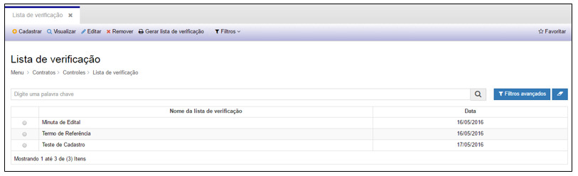

**Figura 1 - Consultando listas de verificação**

Nesta tela é possível realizar ações como: **Cadastrar** uma nova Lista, **Visualizar** o cadastro de uma Lista, Editar informações do
cadastro de uma Lista, **Remover, Gerar Lista de Verificação** e ainda criar **Filtros** específicos de busca.

1. Para cadastrar uma nova Lista de Verificação, basta clicar em “**Cadastrar**” e o sistema exibirá a tela seguinte:

    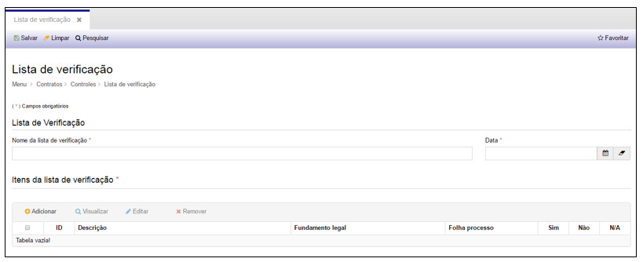
    
    **Figura 2 - Cadastrando lista de verificação**
    
Preencha os campos a seguir.

Lista de Verificação:

- **Nome da Lista de Verificação**: nome que irá identificar a lista de verificação
- **Data**: data em que a lista é cadastrada
    
Itens da Lista de Verificação:

Em seguida clique em “**Adicionar**” para inserir os itens da lista de verificação, e a tela seguinte será exibida:

    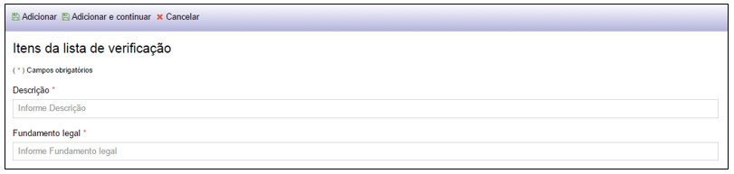
    
    **Figura 3 - Inserindo itens da lista de verificação**
    
    - **Descrição**: nome do item de verificação que posteriormente será respondido como Sim, Não ou Não se Aplica
    - **Fundamento Legal**: citação do artigo, inciso ou parte da legislação que menciona sobre o item a ser verificado
    
Clique em “**Adicionar**” para incluir um item à lista de verificação ou

Clique em “**Adicionar e continuar**” para incluir outro item à lista de verificação ou

Clique em “**Cancelar**”.

!!! warning "ATENÇÃO"

    Pelo menos um item deverá ser adicionado à Lista de Verificação

Anexos e Observação:

    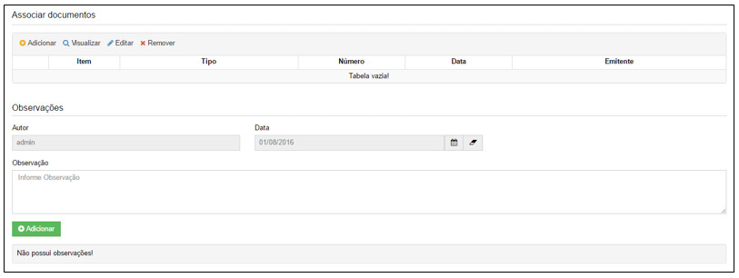
    
    **Figura 4 - Anexos e observação de lista de verificação**
    
Clique em “**Adicionar**”, para anexar documentos no cadastro e a tela seguinte será exibida.

    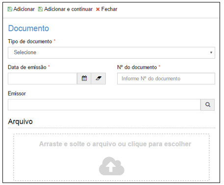
    
    **Figura 5 - Anexando documentos**
    
    - **Tipo de Documento**: tipo de documento (exemplo: ata, ofício, nota de empenho...)
    - **Data da Emissão**: data em que o documento foi emitido
    - **Nº do Documento**: número do documento emitido
    - **Emissor**: nome do emissor do documento
    - **Arquivo**: abra o explorer e arraste o documento para a área indicada ou clique na área indicada para selecionar o 
    documento
    
Clique em “**Adicionar**” para incluir um documento à notificação ou

Clique em “**Adicionar e continuar**” para incluir outro documento à notificação ou

Clique em “**Cancelar**”.

!!! note "NOTA"

    A associação de documentos não é obrigatória.

    - **Observação**: descrição de informação que seja relevante para o cadastro. Ao adicionar uma observação, o nome do usuário,
    data e horário serão gravados na tela.
    
    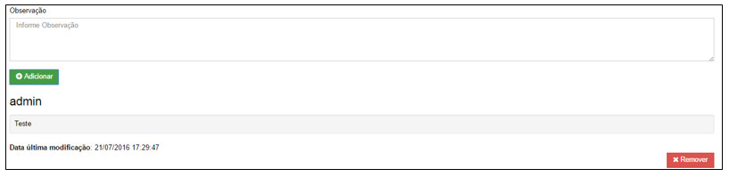
    
    **Figura 6 - Adicionando uma observação**
    
Após o preenchimento dos campos, clique em “**Salvar**”, para que o sistema armazene as informações no banco de dados.

Nesta tela as seguintes ações também poderão ser realizadas:

    - **Limpar**: limpa todos os campos preenchidos antes de salvar o cadastro.
    - **Pesquisar**: retorna à tela de pesquisa.
    
2. Para visualizar as informações de um cadastro, selecione uma Lista de Verificação e clique em “Visualizar”, conforme demonstrado
a seguir.

    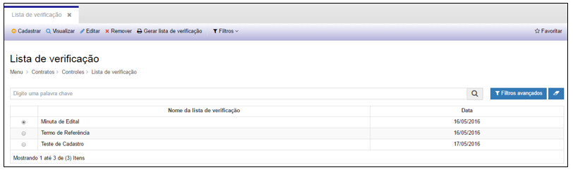
    
    **Figura 7 - Selecionando uma lista de verificação**
    
    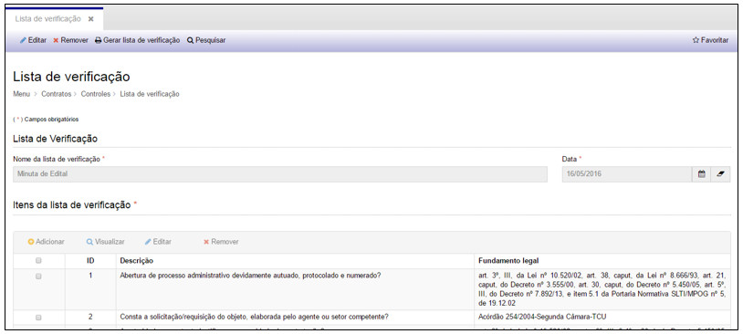
    
    **Figura 8 - Visualizando uma lista de verificação**
    
Na tela de visualização é possível realizar as seguintes ações:

    - **Editar**: alterar informações do cadastro
    - **Remover**: excluir o cadastro
    - **Gerar Lista de Verificação**: gerar o documento com as informações do cadastro
    - **Pesquisar**: retornar à tela de pesquisa de cadastro
    
3. Para editar as informações de um cadastro, selecione uma Lista de Verificação e clique em “**Editar**”. A tela apresentada será
a do cadastro da Lista de Verificação.

4. Para criar filtros de busca, clique em “**Filtros**”. Esta ação permite a configuração de filtros específicos.

5. Para remover um cadastro, selecione uma Lista de Verificação e clique em “**Remover**”.

6. Para gerar o documento com as informações do cadastro, selecione uma Lista de Verificação e clique em “**Gerar Lista de 
Verificação**”.

**Figura 9 - Selecionando uma lista de verificação**

O sistema exibirá uma mensagem e logo em seguida o documento será gerado em uma nova aba.

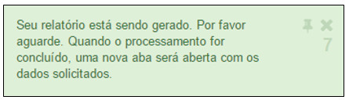

**Figura 10- Mensagem de documento gerado**

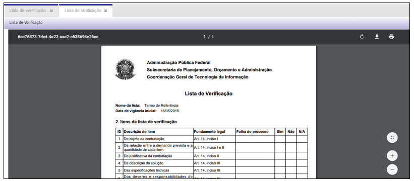

**Figura 11- Documento de uma lista de verificação gerado**

Com o documento gerado é possível: **Aumentar o zoom, Diminuir o zoom, Fazer o download** (em .pdf) e **Imprimir**.

Questionários
----------------

Ao clicar na opção “**Questionários**” no submenu “**Controles**”, o sistema apresentará a tela de consulta/pesquisa dos 
questionários cadastrados:

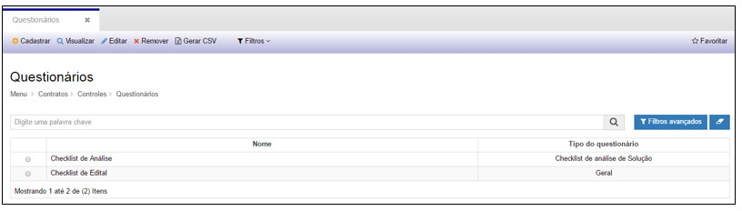

**Figura 12 - Consultando questionários**

Nesta tela é possível realizar ações como: **Cadastrar** um novo Questionário, **Visualizar** o cadastro de um Questionário, 
**Editar** informações do cadastro de um Questionário, **Remover, Gerar CSV** e ainda criar **Filtros** específicos de busca.

1. Para cadastrar um novo Questionário, basta clicar em “**Cadastrar**” e o sistema exibirá a tela seguinte:

    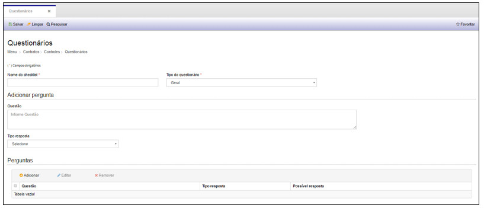
    
    **Figura 13 - Cadastrando questionário**
    
Preencha os campos a seguir.

    - **Nome do Checklist**: nome de identificação do questionário
    - **Tipo de Questionário**: o questionário pode ser do tipo Checklist de análise da solução ou Geral
    - **Questão**: nome da pergunta que será verificada no questionário
    - **Tipo de Resposta**: tipo definido para a resposta da questão que pode ser Booleana, Múltipla escolha, Texto livre ou Única 
    escolha
    
Perguntas:

Em seguida clique em “**Adicionar**” para inserir a questão na tabela de perguntas, e a tela seguinte será exibida:

    !!! note "NOTA"
    
        Várias questões podem ser adicionadas a um mesmo questionário.

Após o preenchimento dos campos, clique em “**Salvar**”, para que o sistema armazene as informações no banco de dados.

Nesta tela as seguintes ações também poderão ser realizadas:

    - **Limpar**: limpa todos os campos preenchidos antes de salvar o cadastro.
    - **Pesquisar**: retorna à tela de pesquisa.
    
2. Para visualizar as informações de um cadastro, selecione um Questionário e clique em “**Visualizar**”, conforme demonstrado a 
seguir.

    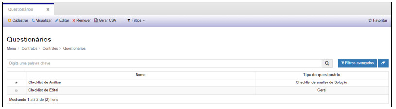
    
    **Figura 14 - Selecionando um questionário**
    
    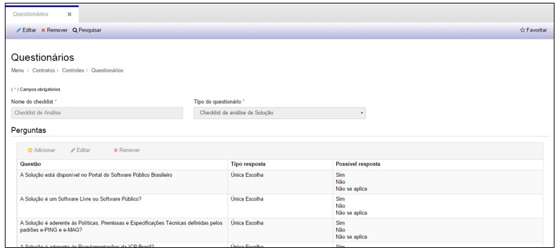
    
    **Figura 15 - Visualizando um questionário**
    
Na tela de visualização é possível realizar as seguintes ações:

    - **Editar**: alterar informações do cadastro
    - **Remover**: excluir o cadastro
    - **Pesquisar**: retornar à tela de pesquisa de cadastro
    
3. Para editar as informações de um cadastro, selecione um Questionário e clique em “**Editar**”. A tela apresentada será a do 
cadastro dos Questionários.

4. Para criar filtros de busca, clique em “**Filtros**”. Esta ação permite a configuração de filtros específicos.

5. Para remover um cadastro, selecione uma Lista de Verificação e clique em “**Remover**”.

Definições
------------

Ao clicar na opção “**Definições**” no submenu “**Controles**”, o sistema apresentará a tela de visualização e edição de textos
padrões:

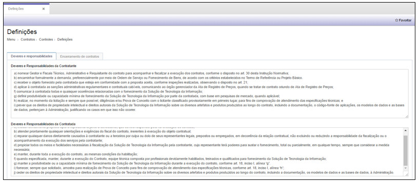

**Figura 16 - Visualização textos de deveres e responsabilidades em definições**

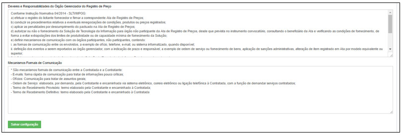

**Figura 17 - Visualização textos de deveres e responsabilidades em definições (continuação)**

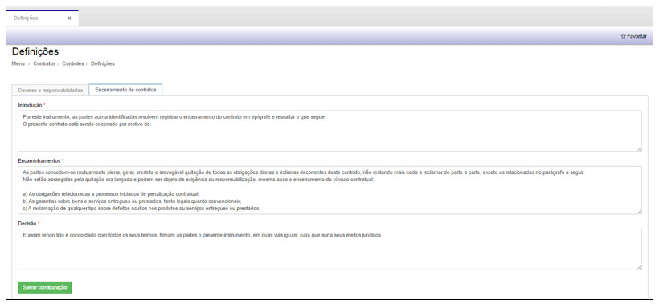

**Figura 18 - Visualizando textos de encerramento de contratos em definições**

Nesta tela é possível visualizar pré cadastrados de **Deveres e Responsabilidades**, e **Encerramento de Contratos**.

1. Para **Editar** ou **Remover** os textos, basta fazer a alteração diretamente no texto desejado e clicar no botão “**Salvar 
Configuração**” no final da página.

Os textos disponibilizados são informações padrão que aparecerão no cadastro do contrato e no cadastro de encerramento do contrato.
Caso a alteração do texto seja apenas para um cadastro específico, a alteração deverá ser feita no próprio cadastro.

!!! tip "About"

    <b>Product/Version:</b> CITSmart | 7.00 &nbsp;&nbsp;
    <b>Updated:</b>08/14/2019 - Larissa Lourenço

