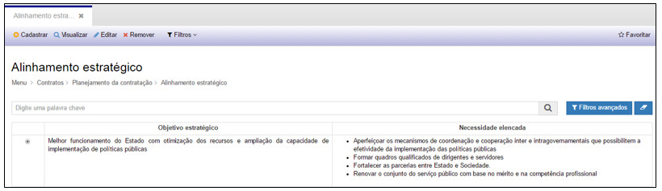
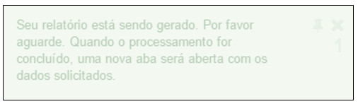

title:  Cadastro e Pesquisa do Planejamento da Contratação
Description: Permite planejar adequadamente a necessidade da contratação de um serviço e/ou material. 
# Cadastro e Pesquisa do Planejamento da Contratação

A fase de **Planejamento da Contratação** permite planejar adequadamente a necessidade da contratação de um serviço e/ou material, 
possibilitando cadastrar os **Programas** de Governo com suas ações, O **Alinhamento Estratégico** com seus objetivos e necessidades, 
O **Estudo Técnico**, o **Termo de Referência/Projeto Básico** e ainda realizar **Análise de Riscos** de todo o processo de 
contratação, como veremos a seguir.

Programas
-----------

Ao clicar na opção “**Programas**” no submenu “**Planejamento da Contratação**”, o sistema apresentará a tela de consulta/pesquisa dos
Programas cadastrados:

**Figura 1 - Consultando programas**

Nesta tela é possível realizar ações como: **Cadastrar** um novo Programa, **Visualizar** o cadastro de um Programa, **Editar**
informações do cadastro de um Programa, **Remover** um cadastro, **Gerar CSV** e ainda criar **Filtros** específicos de busca.

1. Para cadastrar um novo Programa, basta clicar em “**Cadastrar**” e o sistema exibirá a tela seguinte:

**Figura 2 - Cadastrando um programa**

Preencha os campos a seguir.

Informações do Programa:

- **Ano Exercício**: ano de exercício de execução das ações
- **Tipo de Programa**: o programa pode ser do tipo (Gestão e Manutenção, Operações Especiais ou Temático)
- **Código do Programa**: número de identificação do programa
- **Nome do Programa**: nome do programa

Em seguida clique em “**Adicionar**” para inserir Ações do Programa, e a tela seguinte será exibida:

**Figura 3 - Inserindo ações ao programa**

- **Código da Ação**: número de identificação da ação orçamentária
- **Nome da Ação**: nome da ação orçamentária
- **Descrição da Ação**: detalhamento da ação
- **Base Legal**: legislação que rege a ação

Clique em “**Adicionar**” para incluir uma ação ao programa ou

Clique em “**Adicionar e continuar**” para incluir outra ação ao programa ou

Clique em “**Cancelar**”.

!!! warning "ATENÇÃO"

    Pelo menos uma ação deverá ser adicionada no cadastro do Programa.

Após preencher os campos do Programa e das Ações, clique em “**Salvar**”, para que o sistema armazene as informações no banco de 
dados.

Nesta tela as seguintes ações também poderão ser realizadas:

- **Limpar**: limpa todos os campos preenchidos antes de salvar o cadastro.
- **Pesquisar**: retorna à tela de pesquisa.

2. Para visualizar as informações de um cadastro, selecione um Programa e clique em “**Visualizar**”, conforme demonstrado a seguir.

**Figura 4 - Selecionando um programa**

**Figura 5 - Visualizando um programa**

Na tela de visualização é possível realizar as seguintes ações:

- **Editar**: alterar informações do cadastro
- **Remover**: excluir o cadastro
- **Pesquisar**: retornar à tela de pesquisa de cadastro

3. Para editar as informações de um cadastro, selecione um Programa e clique em “**Editar**”. A tela apresentada será a do cadastro 
do Programa.

4. Para remover as informações de um cadastro, selecione um Programa e clique em “**Remover**” e o sistema exibirá uma mensagem 
solicitando a confirmação da exclusão, como demonstrado a seguir:

    
    
    **Figura 6 - Confirmando a exclusão de um programa**
    
Clique em “Confirmar” para excluir o Programa ou clique em “Cancelar” para desistir da exclusão do Programa.

5. Para gerar a tabela de programas em um arquivo excel, clique em “**Gerar CSV**”.

6. Para criar filtros de busca, clique em “**Filtros**”. Esta ação permite a configuração de filtros específicos.

Alinhamento estratégico
--------------------------

Ao clicar na opção “**Alinhamento Estratégico**” no submenu “**Planejamento da Contratação**”, o sistema apresentará a tela de 
consulta/pesquisa dos Objetivos Estratégicos cadastrados:

**Figura 7 - Consultando alinhamento estratégico**

Nesta tela é possível realizar ações como: **Cadastrar** um novo Alinhamento Estratégico, **Visualizar** o cadastro de um 
Alinhamento Estratégico, **Editar** informações do cadastro de um Alinhamento Estratégico, **Remover** um cadastro, **Gerar CSV**
e ainda criar **Filtros** específicos de busca.

1. Para cadastrar um novo Alinhamento Estratégico, basta clicar em “**Cadastrar**” e o sistema exibirá a tela seguinte:

**Figura 8 - Cadastrando um alinhamento estratégico**

Preencha os campos a seguir.

Objetivo Estratégico:

- **Identificação do Objetivo**: nome do objetivo estratégico
- **Descrição**: detalhamento do objetivo estratégico

Em seguida clique em “**Adicionar**” para inserir as Necessidades, e a tela seguinte será exibida:

**Figura 9 - Inserindo necessidades elencadas**

- **Necessidade Elencada**: detalhamento da necessidade

Clique em “**Adicionar**” para incluir uma necessidade ao objetivo estratégico ou

Clique em “**Adicionar e continuar**” para incluir outra necessidade ao objetivo estratégico ou

Clique em “**Cancelar**”.

!!! info "IMPORTANTE"

    Pelo menos uma necessidade deverá ser adicionada no cadastro do Objetivo Estratégico.

Após preencher os campos do Objetivo Estratégico e das Necessidades, clique em “**Salvar**”, para que o sistema armazene as 
informações no banco de dados.

Nesta tela as seguintes ações também poderão ser realizadas:

- **Limpar**: limpa todos os campos preenchidos antes de salvar o cadastro.
- **Pesquisar**: retorna à tela de pesquisa.

2. Para visualizar as informações de um cadastro, selecione um Objetivo Estratégico e clique em “**Visualizar**”, conforme 
demonstrado a seguir.

**Figura 10 - Selecionando um objetivo estratégico**

**Figura 11 - Visualizando um objetivo estratégico**

Na tela de visualização é possível realizar as seguintes ações:

- **Editar**: alterar informações do cadastro
- **Remover**: excluir o cadastro
- **Pesquisar**: retornar à tela de pesquisa de cadastro

3. Para editar as informações de um cadastro, selecione um Objetivo Estratégico e clique em “**Editar**”. A tela apresentada será a
do cadastro do Objetivo Estratégico.

4. Para remover as informações de um cadastro, selecione um Objetivo Estratégico e clique em “**Remover**” e o sistema exibirá uma
mensagem solicitando a confirmação da exclusão, como demonstrado a seguir:

    
    
    **Figura 12 - Confirmando a exclusão de um objetivo estratégico**
    
Clique em “**Confirmar**” para excluir o Objetivo Estratégico ou clique em “Cancelar” para desistir da exclusão do Programa.

5. Para gerar a tabela de Objetivos Estratégicos em um arquivo excel, clique em “**Gerar CSV**”.

6. Para criar filtros de busca, clique em “**Filtros**”. Esta ação permite a configuração de filtros específicos.

Estudo técnico
-------------------

Ao clicar na opção “**Estudo Técnico**” no submenu “**Planejamento da Contratação**”, o sistema apresentará a tela de 
consulta/pesquisa dos Estudos Técnicos cadastrados:

**Figura 13 - Consultando estudo técnico**

Nesta tela é possível realizar ações como: **Cadastrar** um novo Estudo Técnico, **Visualizar** o cadastro de um Estudo Técnico, 
**Editar** informações do cadastro de um Estudo Técnico, **Remover** um cadastro, **Gerar CSV, Mostrar Rascunho, Gerar Estudo 
Técnico** e ainda criar **Filtros** específicos de busca.

1. Para cadastrar um novo Estudo Técnico, basta clicar em “**Cadastrar**” e o sistema exibirá a tela seguinte:

Note que o cadastro do Estudo Técnico é dividido em etapas. Navegue pelas etapas para preencher os campos.

Etapa 1: Planejamento da Contratação

**Figura 14 - Cadastrando um estudo técnico – Etapa 1**

- **Nº da Portaria**: número de identificação da publicação da portaria
- **Data da Instituição da Equipe**: data em que a equipe de planejamento da contratação foi instituída
- **Integrante Técnico**: nome do servidor que exerce o papel de integrante técnico
- **Integrante Requisitante**: nome do servidor que exerce o papel de integrante requisitante
- **Integrante Administrativo**: nome do servidor que exerce o papel de integrante administrativo
- **Descrição**: detalhamento da solução que será objeto da contratação

Após o preenchimento dos campos, clique em “**Próximo**” ou clique na etapa 2 – “**Definições de Requisitos**”, para seguir com o
preenchimento do cadastro.

Etapa 2: Definições de Requisitos

**Figura 15 - Cadastrando um estudo técnico - Etapa 2**

Clique em “**Adicionar**”, para inserir os requisitos de negócio da contratação e a tela seguinte será exibida.

**Figura 16 - Adicionando requisitos de negócio**

- **Objetivo Estratégico**: objetivo estratégico já cadastrado
- **Necessidade Elencada**: nome da necessidade relacionada ao objetivo estratégico selecionado
- **Justificativa da Necessidade**: detalhamento da necessidade selecionada

Clique em “**Adicionar**” para incluir um requisito de negócio ao estudo técnico ou

Clique em “**Adicionar e continuar**” para incluir outro negócio ao estudo técnico ou

Clique em “**Cancelar**”.

!!! info "IMPORTANTE"

    Pelo menos um requisito de negócio deverá ser adicionado no cadastro do Estudo Técnico.

- **Requisitos Técnicos**: descrição dos requisitos técnicos para a contratação da solução
- **Requisitos de Capacitação**: descrição dos requisitos de capacitação para a contratação da solução

Após o preenchimento dos campos, clique em “**Próximo**” ou clique na etapa 3 – “**Levantamento das Alternativas**”, para seguir 
com o preenchimento do cadastro.

Etapa 3: Levantamento das Alternativas

**Figura 17 - Cadastrando estudo técnico - Etapa 3**

**Figura 18 - Cadastrando estudo técnico - Etapa 3 (continuação)**

Clique em “**Adicionar**”, para inserir as informações da solução escolhida para a contratação e a tela seguinte será exibida.

**Figura 19 - Adicionando informações da solução**

- **Órgão Externo**: nome do órgão externo utilizador da solução
- **Fornecedor**: nome do fornecedor da solução. Caso não tenha o fornecedor cadastrado, vá até o Menu Corporativo e acesse 
“Pessoas (Agentes)” > “Cadastro de Pessoas” para adicioná-lo e em seguida retorne ao cadastro do Estudo Técnico
- **Valor**: valor de custo da solução
- **Descrição da Alternativa**: detalhamento da solução objeto da contratação
- Responda ao **Checklist de Análise** conforme mostrado na imagem acima.

Clique em “**Adicionar**” para incluir uma solução ao estudo técnico ou

Clique em “**Adicionar e continuar**” para incluir outra solução ao estudo técnico ou

Clique em “**Cancelar**”.

!!! info "IMPORTANTE"

    Pelo menos uma solução deverá ser adicionada no cadastro do Estudo Técnico.

- **Justificativa da Solução Escolhida**: detalhamento da solução escolhida
- **ROI**: descrição do retorno sobre investimento (Return On Investment)

Em seguida, clique em “**Adicionar**”, para inserir as informações da descrição dos bens e serviços que compõem a solução para a 
contratação e a tela seguinte será exibida.

**Figura 20- Adicionando bem ou serviço**

- **Nome do Bem ou Serviço**: nome do bem ou serviço da solução
- **Descrição dos bens e serviços que compõem a solução**: detalhamento dos bens e serviços.

Clique em “**Adicionar**” para incluir um bem ou serviço ao estudo técnico ou

Clique em “**Adicionar e continuar**” para incluir outro bem ou serviço ao estudo técnico ou

Clique em “**Cancelar**”.

!!! info "IMPORTANTE"

    Pelo menos um bem ou serviço deverá ser adicionado no cadastro do Estudo Técnico.

Após o preenchimento dos campos, clique em “**Próximo**” ou clique na etapa 4 – “**Benefícios e Necessidades**”, para seguir com o 
preenchimento do cadastro.

Etapa 4: Benefícios e Necessidades

**Figura 21 - Cadastrando estudo técnico - Etapa 4**

Clique em “**Adicionar**”, para inserir as informações dos Benefícios Esperados para a contratação e a tela seguinte será exibida.

**Figura 22 - Adicionando benefícios esperados**

- **Nome**: nome do benefício esperados com a solução
- **Descrição**: detalhamento do benefício esperado

Clique em “**Adicionar**” para incluir um benefício ao estudo técnico ou

Clique em “**Adicionar e continuar**” para incluir outro benefício ao estudo técnico ou

Clique em “**Cancelar**”.

!!! info "IMPORTANTE"

    Pelo menos um benefício esperado deverá ser adicionado no cadastro do Estudo Técnico.

- **Descrição das Necessidades de Adequação**: detalhamento das necessidades de adequação do ambiente

Após o preenchimento dos campos, clique em “**Próximo**” ou clique na etapa 5 – “**Recursos Necessários**”, para seguir com o 
preenchimento do cadastro.

Etapa 5: Recursos Necessários

**Figura 23 - Cadastrando estudo técnico - Etapa 5**

Clique em “**Adicionar**”, para inserir as informações dos Recursos Materiais para a contratação e a tela seguinte será exibida.

**Figura 24 - Adicionando recursos materiais**

- **Quantidade**: quantitativo de recursos materiais necessários
- **Disponível**: sim ou não
- **Descrição**: detalhamento do recurso material necessário
- **Ação para Obtenção**: descrição ou nome da ação necessária para obtenção do recurso material

Clique em “**Adicionar**” para incluir um recurso material ao estudo técnico ou

Clique em “**Adicionar e continuar**” para incluir outro recurso material ao estudo técnico ou

Clique em “**Cancelar**”.

!!! info "IMPORTANTE"

    Pelo menos um recurso material deverá ser adicionado no cadastro do Estudo Técnico.

Clique em “**Adicionar**”, para inserir as informações dos Recursos Humanos para a contratação e a tela seguinte será exibida.

**Figura 25 - Adicionando recursos humanos**

- **Formação**: tipo de formação exigida para o recurso humano
- **Atividades**: relação de atividades que serão executadas pelo recurso humano

Clique em “**Adicionar**” para incluir um recurso humano ao estudo técnico ou

Clique em “**Adicionar e continuar**” para incluir outro recurso humano ao estudo técnico ou

Clique em “**Cancelar**”.

!!! info "IMPORTANTE"

    Pelo menos um recurso humano deverá ser adicionado no cadastro do Estudo Técnico.

Após o preenchimento dos campos, clique em “**Próximo**” ou clique na etapa 6 – “**Estratégia Contratual**”, para seguir com o 
preenchimento do cadastro.

Etapa 6: Estratégia Contratual

**Figura 26 - Cadastrando estudo técnico - Etapa 6**

Clique em “**Adicionar**”, para inserir as ações de contingência da estratégia contratual e a tela seguinte será exibida.

**Figura 27 - Adicionando ação de contingência**

- **Ação**: nome ou detalhamento da ação de contingência
- **Responsável**: nome do papel responsável pela ação de contingência

Clique em “**Adicionar**” para incluir uma ação de contingência ao estudo técnico ou

Clique em “**Adicionar e continuar**” para incluir outra ação de contingência ao estudo técnico ou

Clique em “**Cancelar**”.

!!! info "IMPORTANTE"

    Pelo menos uma ação de contingência deverá ser adicionada no cadastro do Estudo Técnico.

Após o preenchimento dos campos, clique em “**Próximo**” ou clique na etapa 7 – “**Anexos e Observações**”, para seguir com o 
preenchimento do cadastro.

Etapa 7: Anexos e Observações

**Figura 28 - Cadastrando estudo técnico - Etapa 7**

Clique em “**Adicionar**”, para anexar documentos no cadastro e a tela seguinte será exibida.

**Figura 29 - Anexando documentos**

- **Tipo de Documento**: tipo de documento (exemplo: ata, ofício, nota de empenho...)
- **Data da Emissão**: data em que o documento foi emitido
- **Nº do Documento**: número do documento emitido
- **Emissor**: nome do emissor do documento
- **Arquivo**: abra o explorer e arraste o documento para a área indicada ou clique na área indicada para selecionar o documento

Clique em “**Adicionar**” para incluir um documento ao estudo técnico ou

Clique em “**Adicionar e continuar**” para incluir outro documento ao estudo técnico ou

Clique em “**Cancelar**”.

!!! note "NOTA"

    A associação de documentos não é obrigatória.

- **Observação**: descrição de informação que seja relevante para o cadastro. Ao adicionar uma observação, o nome do usuário, data e
horário serão gravados na tela.

**Figura 30 - Adicionando uma observação**

Após o preenchimento dos campos, clique em “**Salvar**”, para que o sistema armazene as informações no banco de dados.

Nesta tela as seguintes ações também poderão ser realizadas:

- **Limpar**: limpa todos os campos preenchidos antes de salvar o cadastro.
- **Pesquisar**: retorna à tela de pesquisa.

1. Para visualizar as informações de um cadastro, selecione um Estudo Técnico e clique em “**Visualizar**”, conforme demonstrado a
seguir.

**Figura 31 - Selecionando um estudo técnico**

**Figura 32 - Visualizando um estudo técnico**

Na tela de visualização é possível realizar as seguintes ações:

- **Editar**: alterar informações do cadastro
- **Remover**: excluir o cadastro
- **Gerar Estudo Técnico**: gerar o documento com as informações do cadastro
- **Pesquisar**: retornar à tela de pesquisa de cadastro

2. Para editar as informações de um cadastro, selecione um Estudo Técnico e clique em “**Editar**”. A tela apresentada será a do 
cadastro do Estudo Técnico.

3. Para remover as informações de um cadastro, selecione um Estudo Técnico e clique em “**Remover**” e o sistema exibirá uma
mensagem solicitando a confirmação da exclusão, como demonstrado a seguir:

**Figura 33 - Confirmando a exclusão de um estudo técnico**

Clique em “**Confirmar**” para excluir o Estudo Técnico ou clique em “Cancelar” para desistir da exclusão.

4. Para gerar a tabela de Estudo Técnico em um arquivo excel, clique em “**Gerar CSV**”.

5. Para criar filtros de busca, clique em “**Filtros**”. Esta ação permite a configuração de filtros específicos.

6. Para mostrar rascunho de cadastros, clique em “**Mostrar Rascunho**”. Os rascunhos são salvos automaticamente pelo sistema ao 
iniciar um cadastro.

**Figura 34 - Exibindo rascunhos de cadastros iniciados**

Na tela de rascunho é possível:

- **Carregar**: abre a tela de cadastro permite continuar de onde parou
- **Remover**: exclui um rascunho
- **Fechar**: fecha a tela de rascunho
- **Transferir**: transfere o documento para outro usuário finalizar o cadastro

**Figura 35 - Transferindo um rascunho**

Ao clicar em “**Salvar**”, o rascunho aparecerá na tela de rascunhos do usuário informado.

Ao clicar em “**Cancelar**”, a ação de transferir é cancelada e a tela retorna para a lista de rascunhos.

Ao clicar em “**Fechar**”, a tela de rascunhos é fechada completamente

7. Para gerar o documento com as informações do cadastro, selecione um Estudo Técnico e clique em “**Gerar Estudo Técnico**”.

**Figura 36 - Selecionando um estudo técnico**

O sistema exibirá uma mensagem e logo em seguida o documento será gerado em uma nova aba.

**Figura 37 - Mensagem de documento gerado**

**Figura 38 - Documento de estudo técnico gerado**

Com o documento gerado é possível: **Aumentar o zoom, Diminuir o zoom, Fazer o download** (em .pdf) e **Imprimir**.

Termo de referencia/projeto básico
------------------------------------

Ao clicar na opção “**Termo de Referência/Projeto Básico**” no submenu “**Planejamento da Contratação**”, o sistema apresentará a 
tela de consulta/pesquisa dos Termos de Referência cadastrados:

**Figura 39 - Consultando termo de referência / Projeto básico**

Nesta tela é possível realizar ações como: **Cadastrar** um novo Termo de Referência, **Visualizar** o cadastro de um Termo de 
Referência, **Editar** informações do cadastro de um Termo de Referência, **Remover** um cadastro, **Gerar CSV, Mostrar Rascunho, 
Gerar Termo de Referência** e ainda criar **Filtros** específicos de busca.

1. Para cadastrar um novo Termo de Referência, basta clicar em “**Cadastrar**” e o sistema exibirá a tela seguinte:

Note que o cadastro do Termo de Referência é dividido em etapas. Navegue pelas etapas para preencher os campos.

Etapa 1: Equipe de Planejamento da Contratação

**Figura 40 - Cadastrando um termo de referência - Etapa 1**

- **Estudo Técnico**: número de identificação do Estudo Técnico que será vinculado ao Termo de Referência. Ao informar o Estudo 
Técnico, o sistema buscará as informações dos integrantes.
- **Data da Instituição da Equipe**: data em que a equipe de planejamento da contratação foi instituída
- **Objeto de Contratação**: detalhamento do objeto de contratação

Após o preenchimento dos campos, clique em “**Próximo**” ou clique na etapa 2 – “**Justificativa da Contratação**”, para seguir com 
o preenchimento do cadastro.

Etapa 2: Justificativa da Contratação

**Figura 41 - Cadastrando um termo de referência - Etapa 2**

**Figura 42 - Cadastrando um termo de referência - Etapa 2 (continuação)**

**Figura 43 - Cadastrando um termo de referência - Etapa 2 (continuação)**

Note que os campos preenchidos pelo sistema são derivados do Estudo Técnico informado na Etapa 1 – Equipe de Planejamento da 
Contratação.

Clique em “**Adicionar**”, para inserir o detalhamento da solução e a tela seguinte será exibida.

**Figura 44 - Tela de detalhamento da solução**

**Figura 45 - Adicionando detalhamento da solução (continuação)**

Detalhamento da Solução:

- **Bens e Serviços que Compõem a Solução**: Bens e serviços referentes ao Estudo Técnico vinculado no cadastrado do Termo de 
Referência.
- **Forma de Pagamento**: forma como será efetuado o pagamento da contratação
- **Prazo de Entrega**: data para a entrega dos bens e/ou serviços
- **Local de Entrega/Execução**: nome do local onde será entregue os bens ou executado o serviço

Estimativa de Preço:

- **Quantidade**: quantitativo de bens e serviços
- **Unidade**: unidade de medida relacionado aos bens e serviços
- **Valor Unitário**: valor de cada unidade
- **Fornecedor**: nome do fornecedor do bem ou serviço
- **Órgão Externo**: nome do órgão externo utilizador do bem ou serviço

Critérios de Aceitação:

- **Métrica**: detalhamento da métrica
- **Indicador**: detalhamento do indicador
- **Nível de Serviço**: detalhamento do nível de serviço

Procedimentos de Glosa:

- **Descrição da Glosa**: detalhamento da glosa quando houver

Clique em “**Adicionar**” para incluir um detalhamento da solução ao Termo de Referência ou

Clique em “**Adicionar e continuar**” para incluir outro detalhamento da solução ao Termo de Referência ou

Clique em “**Cancelar**”.

!!! info "IMPORTANTE"

    Pelo menos um detalhamento da solução deverá ser adicionado no cadastro do Termo de Referência.

Após o preenchimento dos campos, clique em “**Próximo**” ou clique na etapa 3 – “**Especificações Técnicas**”, para seguir com o
preenchimento do cadastro.

Etapa 3: Especificações Técnicas

**Figura 46 -Cadastrando termo de referência - Etapa 3**

**Figura 47 - Cadastrando termo de referência - Etapa 3 (continuação)**

**Figura 48 - Cadastrando termo de referência - Etapa 3 (continuação)**

**Figura 49 - Cadastrando termo de referência - Etapa 3 (continuação)**

As informações de “**Especificações Técnicas**”, são preenchidas pelo sistema de a partir da vinculação ao Estudo Técnico informado 
no início do cadastro.

Os campos de “**Deveres e Responsabilidades da Contratante**”, “**Deveres e Responsabilidades da Contratada**”, “**Deveres e 
Responsabilidades do Órgão Gerenciador do Registro de Preço**” e “**Mecanismos Formais de Comunicação**” são preenchidos pelo 
sistema como texto padrão que podem ser alterados no próprio campo ou nos casos em que não for necessário pode-se utilizar o botão
“**Limpar**” para excluir todo o texto do campo.

- **Documentação Mínima Exigida**: detalhamento da documentação mínima exigida para a contratação.

Após o preenchimento dos campos, clique em “**Próximo**” ou clique na etapa 4 – “**Modelo de Gestão do Contrato**”, para seguir com
o preenchimento do cadastro.

Etapa 4: Modelo de Gestão do Contrato

**Figura 50 - Cadastrando termo de referência - Etapa 4**

- **Procedimentos de Teste e Inspeção**: detalhamento dos procedimentos que serão adotados para testes e inspeção

As informações de “**Recursos Humanos para Atividade de Fiscalização**”, são preenchidos pelo sistema como texto padrão.

Após o preenchimento dos campos, clique em “**Próximo**” ou clique na etapa 5 – “**Sanções Aplicáveis**”, para seguir com o 
preenchimento do cadastro.

Etapa 5: Sanções Aplicáveis

**Figura 52 - Cadastrando termo de referência - Etapa 5 (continuação)**

A tabela de penalidades e sanções cadastradas possibilita: **Adicionar, Visualizar, Editar** e **Remover** um item cadastrado. Para
realizar as ações de visualização, edição e exclusão, basta selecionar um item da tabela e clicar na ação escolhida.

Clique em “**Adicionar**”, para inserir as Penalidades e a tela seguinte será exibida.

**Figura 53 - Adicionando penalidades**

- **Penalidade**: nome da penalidade que poderá ser aplicada
- **Ocorrência**: tipo de ocorrência relacionada à penalidade que será aplicada quando ocorrer a infração

Clique em “**Adicionar**” para incluir uma penalidade ao termo de referência ou

Clique em “**Adicionar e continuar**” para incluir outra penalidade ao termo de referência ou

Clique em “**Cancelar**”.

!!! info "IMPORTANTE"

    Pelo menos uma penalidade deverá ser adicionada no cadastro do Termo de Referência.

Clique em “**Adicionar**”, para inserir as Sanções e a tela seguinte será exibida.

**Figura 54 - Adicionando sanções**

- **Sanção**: nome da sanção que poderá ser aplicada
- **Tipo de Sanção**: tipo relacionado ao nome da sanção
- **Descrição**: detalhamento explicativo da sanção quando ocorrer

Clique em “**Adicionar**” para incluir uma sanção ao termo de referência ou

Clique em “**Adicionar e continuar**” para incluir outra sanção ao termo de referência ou

Clique em “**Cancelar**”.

!!! info "IMPORTANTE"

    
    Pelo menos uma sanção deverá ser adicionada no cadastro do Termo de Referência.

Após o preenchimento dos campos, clique em “**Próximo**” ou clique na etapa 6 – “**Critérios de Seleção**”, para seguir com o 
preenchimento do cadastro.

Etapa 6: Critérios de Seleção

**Figura 55 - Cadastrando termo de referência - Etapa 6**

**Figura 56 - Cadastrando termo de referência - Etapa 6 (continuação)**

- **Empreitada**: tipo de preço que pode ser Preço Global ou Preço Unitário
- **Adjudicação do Objeto**: tipo de adjudicação que pode ser Global ou Por Item
- **Justificativa**: detalhamento do critério de seleção
- **Qualificação Técnica**: detalhamento da qualificação técnica
- **Modalidade**: tipos de modalidades cabíveis para a contratação que pode ser Concorrência, Concurso, Convite, Leilão, Tomada de Preço
- **Justificativa da Modalidade**: detalhamento explicativo da modalidade escolhida
- **Justificativa para Aplicação do Direito de Preferência**: detalhamento explicativo relacionado ao direito de preferência
- **Justificativa para Contratação Direta**: detalhamento explicativo caso haja contratação direta
- **Critérios Técnicos de Habilitação**: detalhamentos dos critérios técnicos no caso de habilitação

Após o preenchimento dos campos, clique em “**Próximo**” ou clique na etapa 7 – “**Anexos e Observações**”, para seguir com o 
preenchimento do cadastro.

Etapa 7: Anexos e Observações

**Figura 57 - Cadastrando termo de referência - Etapa 7**

**Figura 58 - Cadastrando termo de referência - Etapa 7 (continuação)**

Clique em “**Adicionar**”, para anexar documentos no cadastro e a tela seguinte será exibida.

**Figura 59 - Anexando documentos**

- **Tipo de Documento**: tipo de documento (exemplo: ata, ofício, nota de empenho
- **Data da Emissão**: data em que o documento foi emitido
- **Nº do Documento**: número do documento emitido
- **Emissor**: nome do emissor do documento
- **Arquivo**: abra o explorer e arraste o documento para a área indicada ou clique na área indicada para selecionar o documento

Clique em “**Adicionar**” para incluir um documento ao termo de referência ou

Clique em “**Adicionar e continuar**” para incluir outro documento ao termo de referência ou

Clique em “**Cancelar**”.

!!! note "NOTA"

    A associação de documentos não é obrigatória.

- **Observação**: descrição de informação que seja relevante para o cadastro. Ao adicionar uma observação, o nome do usuário, data 
e horário serão gravados na tela.

**Figura 60 - Adicionando uma observação**

Após o preenchimento dos campos, clique em “**Salvar**”, para que o sistema armazene as informações no banco de dados.

Nesta tela as seguintes ações também poderão ser realizadas:

- **Limpar**: limpa todos os campos preenchidos antes de salvar o cadastro.
- **Pesquisar**: retorna à tela de pesquisa.

2. Para visualizar as informações de um cadastro, selecione um Termo de Referência e clique em “**Visualizar**”, conforme 
demonstrado a seguir.

**Figura 61 - Selecionando um termo de referência**

**Figura 62 - Visualizando um termo de referência**

Na tela de visualização é possível realizar as seguintes ações:

- **Editar**: alterar informações do cadastro
- **Remover**: excluir o cadastro
- **Gerar Termo de Referência**: gerar o documento com as informações do cadastro
- **Pesquisar**: retornar à tela de pesquisa de cadastro

3. Para editar as informações de um cadastro, selecione um Termo de Referência e clique em “**Editar**”. A tela apresentada será a 
do cadastro do Termo de Referência.

4. Para remover as informações de um cadastro, selecione um Termo de Referência e clique em “**Remover**” e o sistema exibirá uma 
mensagem solicitando a confirmação da exclusão, como demonstrado a seguir:

**Figura 63 - Confirmando a exclusão de um termo de referência**

Clique em “**Confirmar**” para excluir o Termo de Referência ou clique em “**Cancelar” para desistir da exclusão.

5. Para gerar a tabela de Termo de Referência em um arquivo excel, clique em “**Gerar CSV**”.

6. Para criar filtros de busca, clique em “**Filtros**”. Esta ação permite a configuração de filtros específicos.

7. Para mostrar rascunho de cadastros, clique em “**Mostrar Rascunho**”. Os rascunhos são salvos automaticamente pelo sistema ao 
iniciar um cadastro.

**Figura 64 - Exibindo rascunhos de cadastros iniciados**

Na tela de rascunho é possível:

- **Carregar**: abre a tela de cadastro permite continuar de onde parou
- **Remover**: exclui um rascunho
- **Fechar**: fecha a tela de rascunho
- **Transferir**: transfere o documento para outro usuário finalizar o cadastro

**Figura 65 - Transferindo um rascunho**

Ao clicar em “**Salvar**”, o rascunho aparecerá na tela de rascunhos do usuário informado.

Ao clicar em “**Cancelar**”, a ação de transferir é cancelada e a tela retorna para a lista de rascunhos.

Ao clicar em “**Fechar**”, a tela de rascunhos é fechada completamente

8. Para gerar o documento com as informações do cadastro, selecione um Termo de Referência e clique em “**Gerar Termo de 
Referência**”.

**Figura 66 - Selecionando um termo de referência**

O sistema exibirá uma mensagem e logo em seguida o documento será gerado em uma nova aba.

**Figura 67 - Mensagem de documento gerado**

**Figura 68 - Documento de termo de referência gerado**

Com o documento gerado é possível: **Aumentar o zoom, Diminuir o zoom, Fazer o download** (em .pdf) e **Imprimir**.

Análise de riscos
-------------------

Ao clicar na opção “**Análise de Riscos**” no submenu “**Planejamento da Contratação**”, o sistema apresentará a tela de 
consulta/pesquisa das análises de riscos cadastradas:

**Figura 69 - Consultando análise de riscos**

Nesta tela é possível realizar ações como: **Cadastrar** uma nova Análise de Riscos, **Visualizar** o cadastro de uma Análise de 
Riscos, **Editar** informações do cadastro de uma Análise de Riscos, **Remover** um cadastro, **Gerar CSV, Mostrar Rascunho, Gerar 
Análise de Riscos** ainda criar **Filtros** específicos de busca.

1. Para cadastrar uma nova Análise de Riscos, basta clicar em “**Cadastrar**” e o sistema exibirá a tela seguinte:

**Figura 70 - Cadastrando uma análise de riscos**

**Figura 71 - Cadastrando uma análise de riscos**

**Figura 72 - Cadastrando uma análise de riscos**

Preencha os campos a seguir.

Análise de Riscos:

- **Data**: data do registro da análise de riscos
- **Nº Termo de Referência**: número de identificação do Termo de Referência vinculado à Análise de Riscos

!!! note "NOTA"

    Os campos em cinza são preenchidos pelo sistema.

Riscos:

- **Tipo de Análise de Riscos**: o tipo da análise depende do tipo de contratação, se é da solução ou do processo de contratação
- **Título do Risco**: nome do risco
- **Probabilidade**: nível da probabilidade
- **Impacto**: nível do impacto

!!! info "IMPORTANTE"

    O nível do risco será calculado pelo sistema (Probabilidade x Impacto = Nível do Risco).

Danos Potenciais:

Clique em “**Adicionar**” para inserir os danos potenciais do risco, e a tela seguinte será exibida:

**Figura 73 - Adicionando danos potenciais**

- **Dano Identificado**: nome do dano potencial que poderá causar diante do risco

Clique em “**Adicionar**” para incluir um dano potencial à análise de riscos ou

Clique em “**Adicionar e continuar**” para incluir outro dano potencial à análise de riscos ou

Clique em “**Cancelar**".

!!! info "IMPORTANTE"

    Pelo menos um dano potencial deverá ser adicionado no cadastro da Análise de Riscos.

Ações:

Clique em “**Adicionar**” para inserir as ações preventiva e de contingência, e a tela seguinte será exibida:

**Figura 74- Adicionando ações**

- **Tipo da Ação**: tipo da ação a ser tomada quando ocorrer o risco
- **Descrição da Ação**: detalhamento da ação especificada quando ocorrer o risco
- **Responsável**: tipo de papel responsável pela ação
- **Prazo**: data limite para que a ação seja executada

Clique em “**Adicionar**” para incluir uma ação à análise de riscos ou

Clique em “**Adicionar e continuar**” para incluir outra ação à análise de riscos ou

Clique em “**Cancelar**".

!!! info "IMPORTANTE"

    Pelo menos uma ação deverá ser adicionada no cadastro da Análise de Riscos.

Anexos e Observações:

**Figura 75 - Anexos e observação da análise de riscos**

**Figura 76 - Anexando documentos**

- **Tipo de Documento**: tipo de documento (exemplo: ata, ofício, nota de empenho...)
- **Data da Emissão**: data em que o documento foi emitido
- **Nº do Documento**: número do documento emitido
- **Emissor**: nome do emissor do documento
- **Arquivo**: abra o explorer e arraste o documento para a área indicada ou clique na área indicada para selecionar o documento

Clique em “**Adicionar**” para incluir um documento à análise de riscos ou

Clique em “**Adicionar e continuar**” para incluir outro documento à análise de riscos ou

Clique em “**Cancelar**".

!!! note "NOTA"

    A associação de documentos não é obrigatória.

- **Observação**: descrição de informação que seja relevante para o cadastro. Ao adicionar uma observação, o nome do usuário, data 
e horário será gravados na tela.

**Figura 77 - Adicionando uma observação**

Após o preenchimento dos campos, clique em “**Salvar**”, para que o sistema armazene as informações no banco de dados.

Nesta tela as seguintes ações também poderão ser realizadas:

- **Limpar**: limpa todos os campos preenchidos antes de salvar o cadastro.
- **Pesquisar**: retorna à tela de pesquisa.

2. Para visualizar as informações de um cadastro, selecione uma Análise de Riscos e clique em “**Visualizar**, conforme demonstrado 
a seguir.

**Figura 78 - Selecionando uma análise de riscos**

**Figura 79 - Visualizando uma análise de riscos**

Na tela de visualização é possível realizar as seguintes ações:

- **Editar**: alterar informações do cadastro
- **Remover**: excluir o cadastro
- **Gerar Análise de Riscos**: gerar o documento com as informações do cadastro
- **Pesquisar**: retornar à tela de pesquisa de cadastro

3. Para editar as informações de um cadastro, selecione uma Análise de Riscos e clique em “**Editar**”. A tela apresentada será a 
do cadastro da Análise de Riscos.

4. Para remover as informações de um cadastro, selecione uma Análise de Riscos e clique em “**Remover**” e o sistema exibirá uma 
mensagem solicitando a confirmação da exclusão, como demonstrado a seguir:

**Figura 80 - Confirmando a exclusão de uma análise de riscos**

Clique em “**Confirmar** para excluir a Análise de Riscos ou clique em “**Cancelar**” para desistir da exclusão.

5. Para gerar a tabela de Análise de Riscos em um arquivo excel, clique em “**Gerar CSV**"

6. Para criar filtros de busca, clique em “**Filtros**”. Esta ação permite a configuração de filtros específicos.

7. Para mostrar rascunho de cadastros, clique em “**Mostrar Rascunho**”. Os rascunhos são salvos automaticamente pelo sistema ao 
iniciar um cadastro.

**Figura 81 - Exibindo rascunhos de cadastros iniciados**

Na tela de rascunho é possível:

- **Carregar**: abre a tela de cadastro permite continuar de onde parou
- **Remover**: exclui um rascunho
- **Fechar**: fecha a tela de rascunho
- **Transferir**: transfere o documento para outro usuário finalizar o cadastro

**Figura 82 - Transferindo um rascunho**

Ao clicar em “**Salvar**”, o rascunho aparecerá na tela de rascunhos do usuário informado.

Ao clicar em “**Cancelar**”, a ação de transferir é cancelada e a tela retorna para a lista de rascunhos.

Ao clicar em “**Fechar**”, a tela de rascunhos é fechada completamente

8. Para gerar o documento com as informações do cadastro, selecione uma Análise de Riscos e clique em “**Gerar Análise de 
Riscos**".

**Figura 83 - Selecionando uma análise de riscos**

O sistema exibirá uma mensagem e logo em seguida o documento será gerado em uma nova aba.

**Figura 84 - Mensagem de documento gerado**

**Figura 85 - Documento de análise de riscos gerado**

Com o documento gerado é possível: **Aumentar o zoom, Diminuir o zoom, Fazer o download** (em .pdf) e **Imprimir**.

!!! tip "About"

    <b>Product/Version:</b> CITSmart | 7.00 &nbsp;&nbsp;
    <b>Updated:</b>08/15/2019 - Larissa Lourenço
    

