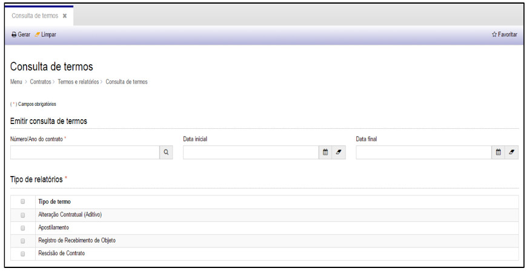
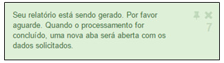
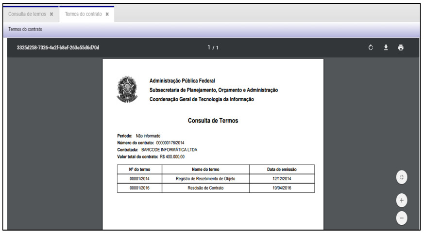
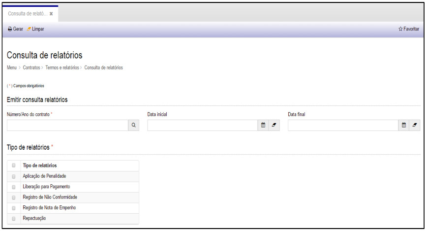
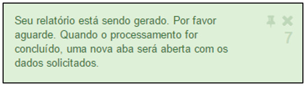
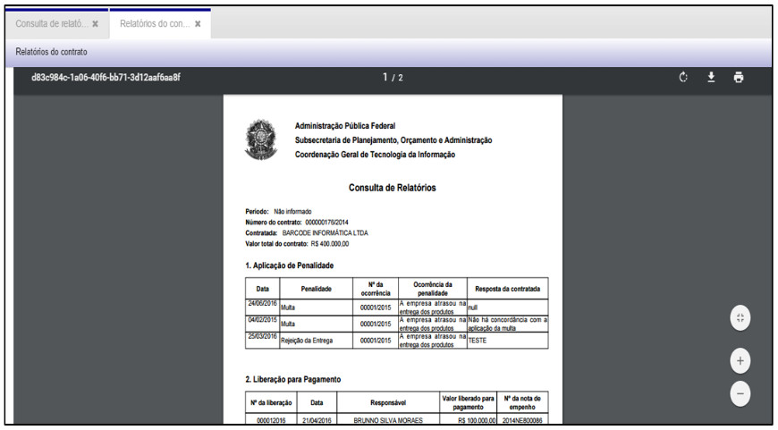

title:  Pesquisa de Termos e Relatórios
Description: Permite consultar todos os Termos e Relatórios emitidos para um ContratoDisponibiliza ações diversas, tais como, incluir, alterar e excluir calendários (escalas) de jornadas de trabalho. 
# Pesquisa de Termos e Relatórios

O menu Termos e Relatórios permite consultar todos os Termos e Relatórios emitidos para um Contrato e em um período informado, 
conforme veremos a seguir.

Como acessar
---------------

Ao clicar na opção “**Consulta de Termos**” no submenu “**Termos e Relatórios**”, o sistema apresentará a tela de consulta de
termos emitidos para um contrato específico:

**Figura 1 - Consultando Termos**

Consulta de termos
--------------------

Nesta tela é possível **Gerar** a consulta de termos e **Limpar** as informações da pesquisa.

1. Para consultar os termos emitidos para um contrato, preenchas os campos a seguir:

- **Número/Ano do Contrato**: número de identificação do Contrato que será objeto da consulta
- **Data Inicial**: Data inicial do intervalo da consulta
- **Data Final**: Data final do intervalo da consulta

2. Selecione os tipos de relatórios que serão contemplados na consulta.

3. Em seguida, clique em “**Gerar**”.

O sistema exibirá uma mensagem e logo em seguida o documento será gerado em uma nova aba.

**Figura 2 - Mensagem de Documento Gerado**

**Figura 3 - Documento de Consulta de Termos Gerado**

O sistema irá mostrar todos os termos gerados para o contrato informado.

Com o documento gerado é possível: **Aumentar o zoom, Diminuir o zoom, Fazer o download** (em .pdf) e **Imprimir**.

Consulta de relatórios
------------------------

Ao clicar na opção “**Consulta de Relatórios**” no submenu “**Termos e Relatórios**”, o sistema apresentará a tela de 
consulta de relatórios emitidos:

**Figura 4 - Consultando Relatórios**

Nesta tela é possível **Gerar** a consulta de termos e **Limpar** as informações da pesquisa.

1. Para consultar os relatórios emitidos para um contrato, preenchas os campos a seguir:

- **Número/Ano do Contrato**: número de identificação do Contrato que será objeto da consulta
- **Data Inicial**: Data inicial do intervalo da consulta
- **Data Final**: Data final do intervalo da consulta

2. Selecione os tipos de termos que serão contemplados na consulta.

3. Em seguida, clique em “**Gerar**”.

O sistema exibirá uma mensagem e logo em seguida o documento será gerado em uma nova aba.

**Figura 5 - Mensagem de Documento Gerado**

**Figura 6 - Documento de Consulta de Termos Gerado**

O sistema irá mostrar todos os relatórios gerados para o contrato informado.

Com o documento gerado é possível: **Aumentar o zoom, Diminuir o zoom, Fazer o download** (em .pdf) e **Imprimir**.

!!! tip "About"

    <b>Product/Version:</b> CITSmart | 7.00 &nbsp;&nbsp;
    <b>Updated:</b>08/16/2019 - Larissa Lourenço
        

