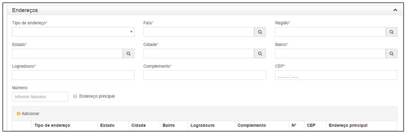
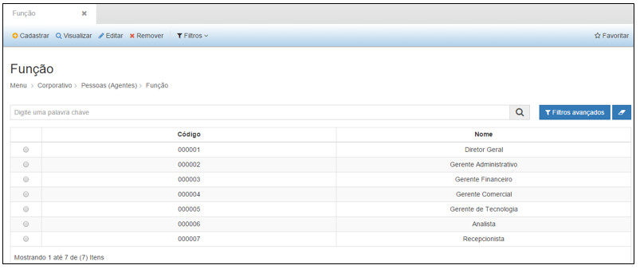

title:  Cadastro e Pesquisa de Pessoas (Agentes)
Description: Disponibiliza o cadastro de agentes. 
# Cadastro e Pesquisa de Pessoas (Agentes)

Cadastro de pessoas
--------------------

Ao clicar na opção “**Cadastro de Pessoas**” no submenu “**Pessoas (Agentes)**”, o sistema apresentará a tela seguinte, com todas as 
pessoas físicas e jurídicas cadastradas.

**Figura 1 - Consultando pessoas**

Na tela de pesquisa é possível, **Cadastrar** uma nova Pessoa, **Visualizar** as informações cadastradas de uma Pessoa, **Editar** as
informações de uma Pessoa e ainda criar **Filtros** específicos de busca de informações de Pessoas.

Para cadastrar uma nova Pessoa (física ou jurídica), basta clicar em **Cadastrar** para que a seguinte tela seja exibida:

**Figura 2 - Cadastrando pessoas**

Nesta tela, o usuário deverá preencher os seguintes campos:

- **Nome**: nome da pessoa física ou nome da empresa a ser cadastrada;
- **E-mail**: endereço do correio eletrônico da pessoa física ou da empresa a ser cadastrada.

Marque “**Física**” ou “**Jurídica**” em “**Tipo pessoa**” conforme o tipo de pessoa a ser cadastrada.

Ao marcar “Tipo pessoa” como “Física”, o sistema apresentará os seguintes campos na tela a serem preenchidos:

**Figura 3 - Cadastrando Dados de Pessoa Física**

- **CPF**: número do cadastro de pessoa física;
- **RG**: número do registro geral (carteira de identidade);
- **Título de eleitor**: número do título eleitoral;
- **Número passaporte**: número do passaporte de viagem;
- **Nome da mãe**: nome completo da mãe;
- **Nome do pai**: nome completo do pai;
- **Data de nascimento**: dia, mês e ano de nascimento;
- **Estado civil**: selecione o estado civil da pessoa a ser cadastrada;
- **Sexo**: marque o sexo da pessoa a ser cadastrada.

Ao marcar “Tipo pessoa” como “Jurídica”, o sistema apresentará os seguintes campos na tela a serem preenchidos:

**Figura 4 - Cadastrando dados de pessoa jurídica**

- **CNPJ**: número de cadastro da empresa junto à Receita;
- **Nome fantasia**: nome fantasia da empresa;
- **Razão social**: nome real da empresa;
- **Inscrição estadual**: número da inscrição caso exista;
- **Inscrição municipal**: número da inscrição caso exista
- **Porte**: selecione o tipo do porte da empresa (micro empresa, pequena, média ou grande);
- **Abrangência**: selecione o tipo de abrangência da empresa (local, nacional, regional);
- **Site**: link da página web da empresa.

Marque as opções (Filial, Filantrópico, Imposto simples) abaixo, conforme necessário:

**Figura 5 - Tela de opções**

Em seguida preencha os campos “Contatos”, para registrar representante da pessoa física dentro do órgão ou da pessoa jurídica 
dentro da empresa.

**Figura 6 - Cadastrando contatos**

- **Nome**: nome completo do contato da pessoa cadastrada;
- **Telefone**: número telefônico para contato;
- **Cargo**: cargo do contato dentro do órgão ou dentro da empresa;
- **Representante legal**: marque esta opção caso o contato seja representante da pessoa cadastrada;
- **CPF**: número do cadastro de pessoa física do contato;
- **E-mail**: endereço do correio eletrônico do contato.

Após inserir as informações nos campos acima, clique no botão “**Adicionar**” para que os dados sejam armazenados na tabela.

Em seguida, preencha as informações de “**Telefones**”, conforme abaixo:

**Figura 7 - Cadastrando telefones**

- **Tipo**: especificação do contato telefônico (comercial, residencial, celular);
- **Número**: número do telefone.

Clique no botão “**Adicionar**” para armazenar os contatos telefônicos da pessoa física ou da pessoa jurídica.

Em seguida, preencha as informações de “**Endereços**”, conforme abaixo:

**Figura 8 - Cadastrando endereços**

- **Tipo de endereço**: selecione o endereço (Residencial ou Comercial);
- **País**: digite o nome do país onde reside a pessoa ou empresa;
- **Região**: digite o nome da região no país;
- **Estado**: digite o nome do estado localizado dentro da região ou dentro do país;
- **Cidade**: digite o nome da cidade localizada dentro do estado;
- **Bairro**: digite o nome do bairro localizado dentro da cidade;
- **Logradouro**: nome da rua, avenida ou quadra do bairro;
- **Número**: número da rua ou quadra;
- **Complemento**: informações complementares ao logradouro;
- **CEP**: número do CEP do endereço.

Clique no botão “**Adicionar**” para armazenar as informações do endereço e em seguida selecione o papel em “**Tipo**".

**Figura 9 - Selecionando tipo de papel**

Após inserir todas as informações necessárias, clique em “**Salvar**”, para que o sistema armazene as informações inseridas;

Nesta tela as seguintes ações também poderão ser realizadas:

- **Limpar**: limpa todos os campos preenchidos antes de salvar o cadastro.
- **Pesquisar**: retorna à tela de pesquisa.

1. Para visualizar as informações de um cadastro clique em “**Visualizar**” e o sistema exibirá a tela de cadastro. A tela de 
visualização permite também editar as informações e retornar à tela de pesquisa;

2. Para editar um cadastro clique em “**Editar**”, e o sistema exibirá a tela de cadastro selecionado, permitindo a edição das 
informações;

3. Para excluir um cadastro, clique em “**Remover**”, e o sistema excluirá completamente o cadastro;

4. O botão “**Filtros**” permite criar filtros específicos para visualização na tela de pesquisa.

As ações disponíveis dentro da tela de visualização de um Centro de Custo são:

- **Editar**: permite editar as informações de um registro;
- **Bloquear**: permite bloquear a utilização de um Endereço, a partir de uma data inicial informada;
- **Pesquisar**: retorna à tela de pesquisa.

**Figura 10 - Bloqueando uma pessoa**

Função
----------

Ao clicar na opção “**Função**” no submenu “**Pessoas (Agentes)**”, o sistema apresentará a tela seguinte, com todas as funções 
cadastradas.

**Figura 11 - Consultando funções**

Na tela de pesquisa é possível, **Cadastrar** uma nova Função, **Visualizar** as informações cadastradas de uma Função, **Editar** 
as informações de uma Função e ainda criar **Filtros** específicos de busca de informações de Funções.

Para cadastrar uma nova Função, basta clicar em “**Cadastrar**” para que a seguinte tela seja exibida:

**Figura 12 - Cadastrando uma função**

Nesta tela, o usuário deverá preencher os seguintes campos:

- **Código**: código da função a ser cadastrado;
- **Nome**: nome da função que está sendo cadastrada.

Após inserir todas as informações necessárias, clique em “**Salvar**”, para que o sistema armazene as informações inseridas.

Nesta tela as seguintes ações também poderão ser realizadas:

- **Limpar**: limpa todos os campos preenchidos antes de salvar o cadastro;
- **Pesquisar**: retorna à tela de pesquisa.

Para visualizar as informações de um cadastro clique em “**Visualizar**” e o sistema exibirá a tela de cadastro. A tela de 
visualização permite também editar as informações e retornar à tela de pesquisa.

Para editar um cadastro clique em “**Editar**”, e o sistema exibirá a tela de cadastro selecionado, permitindo a edição das
informações.

Para excluir um cadastro, clique em “**Remover**”, e o sistema excluirá completamente o cadastro.

O botão “**Filtros**” permite criar filtros específicos para visualização na tela de pesquisa.

As ações disponíveis dentro da tela de visualização de uma Função são:

- **Editar**: permite editar as informações de um registro;
- **Bloquear**: permite bloquear a utilização de uma Função, a partir de uma data inicial informada;
- **Pesquisar**: retorna à tela de pesquisa.

**Figura 13 - Bloqueando uma Pessoa**

!!! tip "About"

    <b>Product/Version:</b> CITSmart | 7.00 &nbsp;&nbsp;
    <b>Updated:</b>08/14/2019 - Larissa Lourenço

