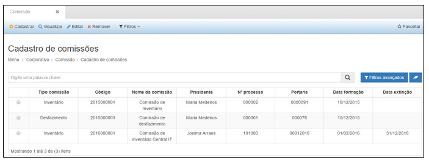
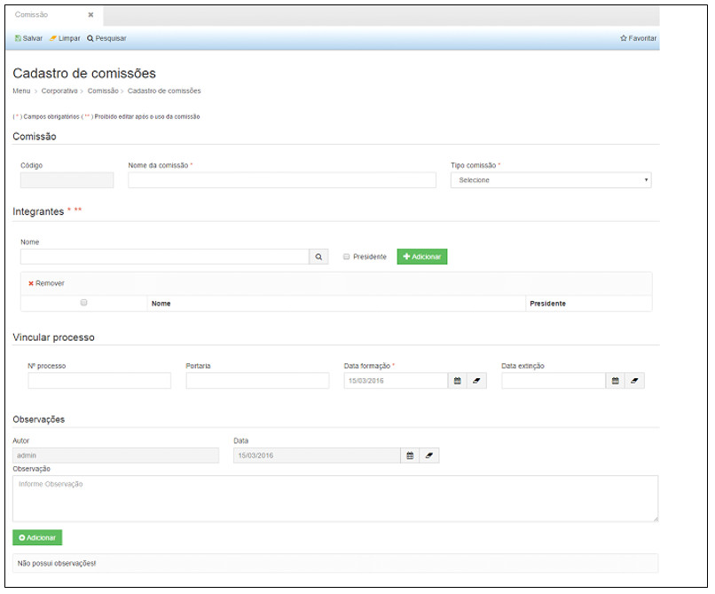
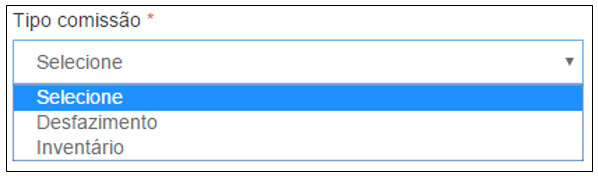
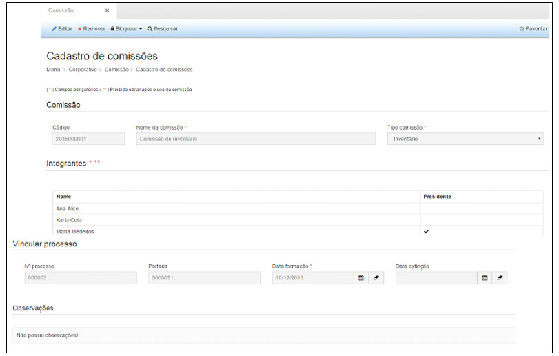
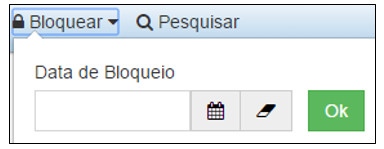

title:  Cadastro e pesquisa de comissão
Description: Disponibiliza o cadastro de comissões. 
# Cadastro e pesquisa de comissão

Como acessar
---------------

Ao clicar na opção “**Cadastro de Comissões**” no submenu “**Comissão**”, o sistema apresentará a tela seguinte, com todas as 
definições de características cadastradas.

**Figura 1 - Consultando cadastro de comissões**

Cadastro de comissões
-----------------------

Na tela de pesquisa é possível, **Cadastrar** uma Comissão, **Visualizar** as informações cadastradas de uma Comissão, **Editar**
as informações de uma Comissão e ainda criar **Filtros** específicos de busca de informações de Comissão.

Para cadastrar uma nova Comissão, basta clicar em “**Cadastrar**” para que a seguinte tela seja exibida:

**Figura 2 - Cadastrando uma comissão**

Nesta tela o usuário deverá preencher os seguintes campos:

Comissão:

- **Código**: será preenchido automaticamente pelo sistema.
- **Nome da Comissão**: nome que será dada à comissão.
- **Tipo de Comissão**: o usuário deverá selecionar um tipo de comissão, de acordo com as opções disponibilizadas pelo sistema.

**Figura 3 - Selecionando o tipo de comissão**

Integrantes:

- **Nome**: nome dos integrantes que farão parte da comissão. Para aquele integrante que for presidir a comissão o campo 
, deverá ser marcado. Após inserir o nome do integrante, o usuário deverá clicar em “**Adicionar**”.

Vincular Processo:

- **N° Processo**: número do processo que institui a comissão.
- **Portaria**: número da portaria que institui a comissão.
- **Data Formação**: data de formação da comissão
- **Data Extinção**: data de extinção da comissão.

Observação:

- **Autor**: o sistema trará automaticamente o nome do usuário que está logado.
- **Data**: O sistema trará automaticamente a data de cadastro da comissão.
- **Observação**: o usuário poderá inserir as informações complementares que julgar necessário.

Após inserir todas as informações necessárias, clique em “**Salvar**”, para que o sistema armazene as informações inseridas.

Nesta tela as seguintes ações também poderão ser realizadas:

- **Limpar**: limpa todos os campos preenchidos antes de salvar o cadastro.
- **Pesquisar**: retorna à tela de pesquisa.

Para visualizar as informações de um cadastro clique em “**Visualizar**” e o sistema exibirá a tela de cadastro. A tela de
visualização permite também editar as informações e retornar à tela de pesquisa.

**Figura 4 - Visualizando um cadastro de comissão**

Para editar um cadastro clique em “**Editar**”, e o sistema exibirá a tela de cadastro selecionado, permitindo a edição das 
informações.

Para excluir um cadastro, clique em “**Remover**”, e o sistema excluirá completamente o cadastro.

O botão “**Filtros**” permite criar filtros específicos para visualização na tela de pesquisa.

As ações disponíveis dentro da tela de visualização de uma Comissão são:

- **Editar**: permite editar as informações de um registro.
- **Remover**: permite excluir um cadastro.
- **Bloquear**: permite bloquear a utilização de uma Comissão, a partir de uma data inicial informada.
- **Pesquisar**: retorna à tela de pesquisa.

**Figura 5 - Bloquear**

!!! tip "About"

    <b>Product/Version:</b> CITSmart | 7.00 &nbsp;&nbsp;
    <b>Updated:</b>08/14/2019 - Larissa Lourenço
