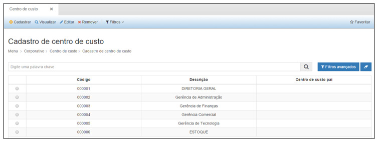
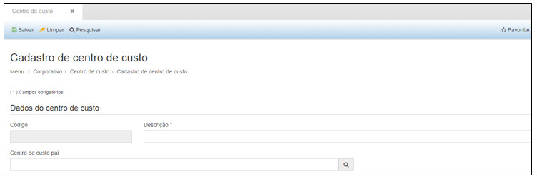

title:  Cadastro e pesquisa de centro de custo
Description: Disponibiliza o cadastro do centro de custo. 
# Cadastro e pesquisa de centro de custo

Como acessar
----------------

Ao clicar na opção “**Cadastro de Centro de Custo**” no submenu “**Centro de Custo**”, o sistema apresentará a tela seguinte, com 
todos os Centros de Custo cadastrados.

**Figura 1 - Consultando cadastro de centro de custos**

Cadastro de Centro de Custo
-----------------------------

Na tela de pesquisa é possível, **Cadastrar** um novo Centro de Custo, **Visualizar** as informações cadastradas de um Centro de
Custo, **Editar** as informações de um Centro de Custo de e ainda criar **Filtros** específicos de busca de informações de Centro de 
Custo.

Para cadastrar um novo Centro de Custo, basta clicar em “**Cadastrar**” para que a seguinte tela seja exibida:

**Figura 2 - Cadastrando um centro de custo**

Nesta tela, o usuário deverá preencher os seguintes campos:

- **Descrição**: descrição do centro de custo.
- **Centro de Custo pai**: selecionar o centro de custo pai, caso possua.

Após inserir todas as informações necessárias, clique em “**Salvar**”, para que o sistema armazene as informações inseridas.

Nesta tela as seguintes ações também poderão ser realizadas:

- **Limpar**: limpa todos os campos preenchidos antes de salvar o cadastro.
- **Pesquisar**: retorna à tela de pesquisa.

Para visualizar as informações de um cadastro clique em “**Visualizar**” e o sistema exibirá a tela de cadastro. A tela de 
visualização permite também editar as informações e retornar à tela de pesquisa.

Para editar um cadastro clique em “**Editar**”, e o sistema exibirá a tela de cadastro selecionado, permitindo a edição das 
informações.

Para excluir um cadastro, clique em “**Remover**, e o sistema excluirá completamente o cadastro.

O botão “**Filtros**” permite criar filtros específicos para visualização na tela de pesquisa.

As ações disponíveis dentro da tela de visualização de um Centro de Custo são:

- **Editar**: permite editar as informações de um registro.
- **Pesquisar**: retorna à tela de pesquisa.

!!! tip "About"

    <b>Product/Version:</b> CITSmart | GRP &nbsp;&nbsp;
    <b>Updated:</b>08/14/2019 - Larissa Lourenço
