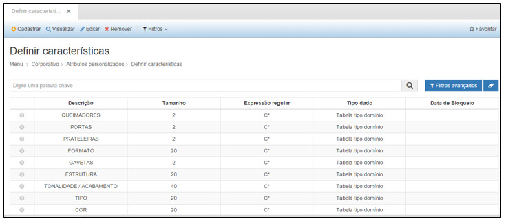
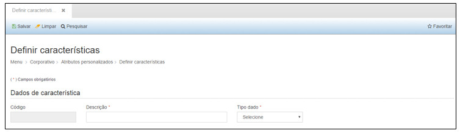
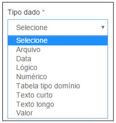
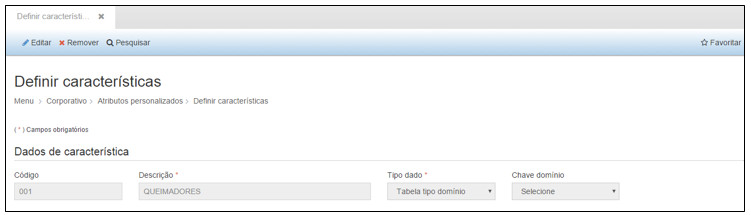
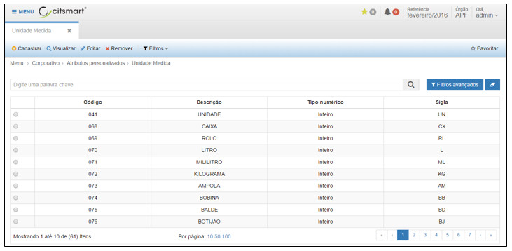
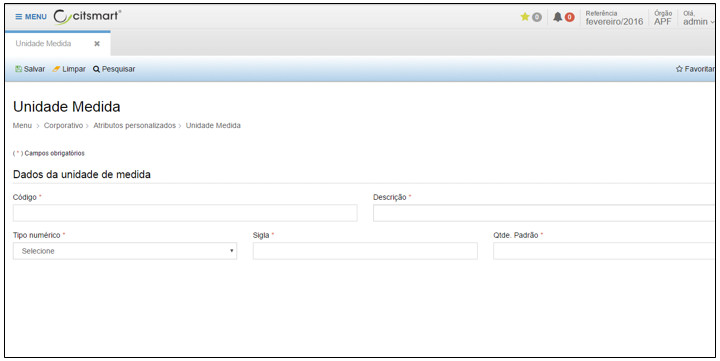
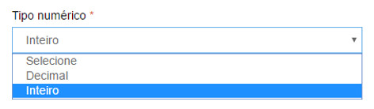
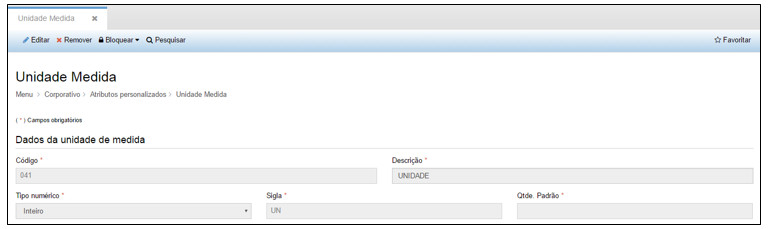
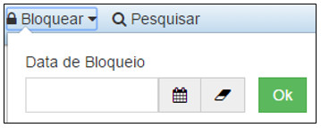

title:  Cadastro e pesquisa de atributos personalizados
Description: Disponibiliza o cadastro de atributos personalizados. 
# Cadastro e pesquisa de atributos personalizados

Como acessar
--------------

Ao clicar na opção “**Definir Características**” no submenu “**Atributos Personalizados**”, o sistema apresentará a tela seguinte, com
todas as definições de características cadastradas.

**Figura 1 - Definindo características**

Definir características
--------------------------

Na tela de pesquisa é possível, **Cadastrar** uma Característica, **Visualizar** as informações cadastradas de uma Característica, 
**Editar** as informações de uma Característica e ainda criar Filtros específicos de busca de informações de Características.

1. Para cadastrar uma nova Característica, basta clicar em “**Cadastrar**” para que a seguinte tela seja exibida:

**Figura 2 - Cadastrando uma característica**

Nesta tela o usuário deverá preencher os seguintes campos:

- **Descrição**: nome da nova característica/atributo personalizado.
- **Tipo dado**: tipo do dado cadastrado.

**Figura 3 - Selecionando o tipo de dado**

!!! note "NOTA"

    Para as opções de “Texto curto” e “Texto longo”, informar o tamanho dos caracteres permitidos. Para as opções de “Tabela tipo 
    domínio”, informar a opção de “Chave domínio” que será habilitado para o usuário.
    
Após inserir todas as informações necessárias, clique em “**Salvar**”, para que o sistema armazene as informações inseridas.

Nesta tela as seguintes ações também poderão ser realizadas:

- **Limpar**: limpa todos os campos preenchidos antes de salvar o cadastro.
- **Pesquisar**: retorna à tela de pesquisa.

Para visualizar as informações de um cadastro clique em “**Visualizar**” e o sistema exibirá a tela de cadastro. A tela de
visualização permite também editar as informações e retornar à tela de pesquisa.

**Figura 4 - Visualizando características**

Para editar um cadastro clique em “**Editar**”, e o sistema exibirá a tela de cadastro selecionado, permitindo a edição das 
informações.

Para excluir um cadastro, clique em “**Remover**”, e o sistema excluirá completamente o cadastro.

O botão “**Filtros**” permite criar filtros específicos para visualização na tela de pesquisa.

As ações disponíveis dentro da tela de visualização de uma Definição de Característica são:

- **Editar**: permite editar as informações de um registro.
- **Remover**: permite excluir uma Característica.
- **Pesquisar**: retorna à tela de pesquisa.]

Unidade de medida
--------------------

Ao clicar na opção “**Unidade de Medida**” no submenu “**Atributos Personalizados**”, o sistema apresentará a tela seguinte, com 
todas as unidades de medida cadastradas.

**Figura 5 - Consultando unidades de medida**

Na tela de pesquisa é possível, **Cadastrar** uma Unidade de Medida, **Visualizar** as informações cadastradas de uma Unidade de
Medida, **Editar** as informações de uma Unidade de Medida e ainda criar **Filtros** específicos de busca de informações de Unidade
de Medida.

Para cadastrar uma nova Unidade de Medida, basta clicar em “**Cadastrar**” para que a seguinte tela seja exibida:

**Figura 6 - Cadastrando uma unidade de medida**

Nesta tela o usuário deverá preencher os seguintes campos:

- **Código**: será preenchido automaticamente pelo sistema.
- **Descrição**: Descrição que será dada a unidade de medida. Ex.: (Unidade, Litro, Caixa).
- **Tipo de Numérico**: o usuário deverá selecionar um tipo numérico, conforme imagem a seguir. Ex.:(Inteiro, Decimal.)

**Figura 7 - Selecionando o tipo numérico**

- **Sigla**: O usuário deverá informar o tipo de sigla para a unidade cadastrada. Ex.:(UN, LT, CX).
- **Qtde. Padrão**: O usuário deverá informar uma quantidade padrão para a unidade cadastrada.

Após inserir todas as informações necessárias, clique em “**Salvar**”, para que o sistema armazene as informações inseridas.

Nesta tela as seguintes ações também poderão ser realizadas:

- **Limpar**: limpa todos os campos preenchidos antes de salvar o cadastro.
- **Pesquisar**: retorna à tela de pesquisa.

Para visualizar as informações de um cadastro clique em “**Visualizar**” e o sistema exibirá a tela de cadastro. A tela de 
visualização permite também editar as informações e retornar à tela de pesquisa.

**Figura 8 - Visualizando uma unidade de medida**

Para editar um cadastro clique em “**Editar**, e o sistema exibirá a tela de cadastro selecionado, permitindo a edição das 
informações.

Para excluir um cadastro, clique em **Remover**, e o sistema excluirá completamente o cadastro.

O botão **Filtros** permite criar filtros específicos para visualização na tela de pesquisa.

As ações disponíveis dentro da tela de visualização de uma Unidade de Medida são:

- **Editar**: permite editar as informações de um registro.
- **Remover**: permite excluir uma Característica.
- **Bloquear**: permite bloquear a utilização de uma Unidade de Medida, a partir de uma data inicial informada.
- **Pesquisar**: retorna à tela de pesquisa.

**Figura 9 - Bloqueando uma unidade de medida**

!!! tip "About"

    <b>Product/Version:</b> CITSmart | 7.00 &nbsp;&nbsp;
    <b>Updated:</b>08/13/2019 - Larissa Lourenço
        
