title:  Cadastro e pesquisa de localidades
Description: Disponibiliza o cadastro de localidades. 
# Cadastro e pesquisa de localidades

País
-------

Ao clicar na opção “**País**” no submenu “**Localidades**”, o sistema apresentará a tela seguinte, com todos os Países cadastrados no
sistema:

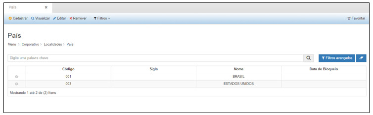

**Figura 1 - Consultando Países**

Na tela de pesquisa é possível, **Cadastrar** um novo País, **Visualizar** as informações de um País cadastrado, **Editar**
as informações de um País cadastrado, **Remover** o cadastro de um País e ainda criar **Filtros** específicos de busca de informações 
dos países.

Para cadastrar um novo País, basta clicar em “**Cadastrar**” para que a seguinte tela seja exibida:

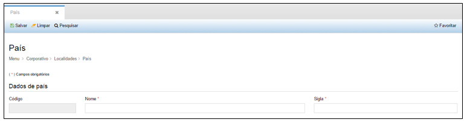

**Figura 2 - Cadastrando País**

Nesta tela, o usuário deverá preencher os seguintes campos:

- **Nome**: nome do país que será cadastrado.
- **Sigla**: sigla do país que será cadastrado.

Após inserir todas as informações necessárias, clique em “**Salvar**”, para que o sistema armazene as informações inseridas.

Nesta tela as seguintes ações também poderão ser realizadas:

- **Limpar**: limpa todos os campos preenchidos antes de salvar o cadastro.
- **Remover**: remove o registro.
- **Pesquisar**: retorna à tela de pesquisa.

Para visualizar as informações de um cadastro clique em “**Visualizar**” e o sistema exibirá a tela de cadastro. A tela de
visualização permite também editar as informações e retornar à tela de pesquisa.

Para editar um cadastro clique em “Editar”, e o sistema exibirá a tela de cadastro selecionado, permitindo a edição das informações.

Para excluir um cadastro, clique em “**Remover**”, e o sistema excluirá completamente o cadastro.

O botão “**Filtros**” permite criar filtros específicos para visualização na tela de pesquisa.

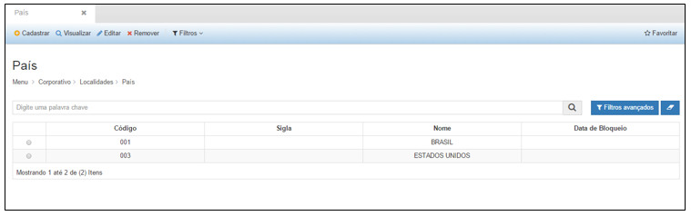

**Figura 3 - Consultando Países**

As ações disponíveis dentro da visualização de um País são:

- **Editar**: permite editar as informações de um registro.
- **Remover**: permite excluir o registro de um País.
- **Bloquear**: permite bloquear a utilização de um País, a partir de uma data inicial informada.

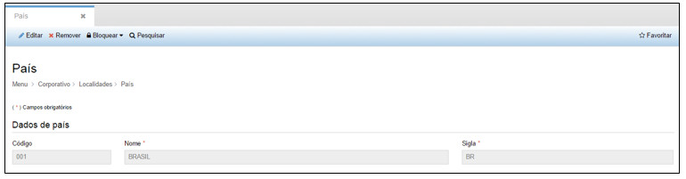

**Figura 4 - Visualizando um País**

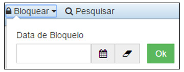

**Figura 5 - Bloqueando um País**

Região
--------

Ao clicar na opção “**Região**” no submenu “**Localidades**”, o sistema apresentará a tela seguinte, com todas as regiões 
cadastradas no sistema:

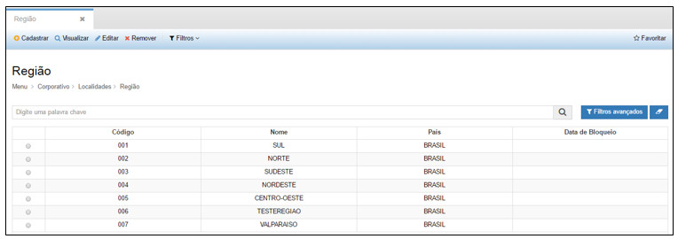

**Figura 6 - Consultando Regiões**

Na tela de pesquisa é possível, **Cadastrar** uma nova Região, **Visualizar** as informações de uma Região cadastrada, **Editar**
as informações de uma Região cadastrada, **Remover** o cadastro de uma Região e ainda criar **Filtros** específicos de busca de 
informações das Regiões.

Para cadastrar uma nova Região, basta clicar em “**Cadastrar**” para que a seguinte tela seja exibida:

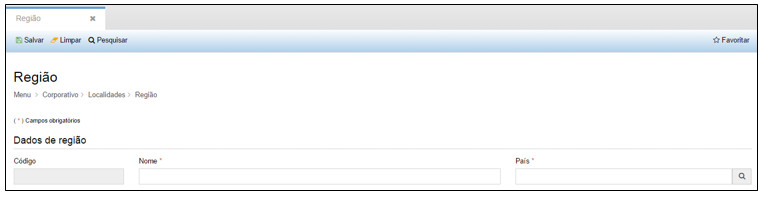

**Figura 7 - Cadastrando uma Região**

Nesta tela, o usuário deverá preencher os seguintes campos:

- **Nome**: nome da Região que será cadastrado.
- **País**: nome da País associado à região.

Após inserir todas as informações necessárias, clique em “**Salvar**”, para que o sistema armazene as informações inseridas.

Nesta tela as seguintes ações também poderão ser realizadas:

- **Limpar**: limpa todos os campos preenchidos antes de salvar o cadastro.
- **Pesquisar**: retorna à tela de pesquisa.

Para visualizar as informações de um cadastro clique em “**Visualizar**” e o sistema exibirá a tela de cadastro. A tela de 
visualização permite também editar as informações e retornar à tela de pesquisa.

Para editar um cadastro clique em “**Editar**”, e o sistema exibirá a tela de cadastro selecionado, permitindo a edição das 
informações.

Para excluir um cadastro, clique em “**Remover**”, e o sistema excluirá completamente o cadastro.

O botão “**Filtros**” permite criar filtros específicos para visualização na tela de pesquisa.

As ações disponíveis dentro da visualização de uma Região são:

- **Editar**: permite editar as informações de um registro.
- **Remover**: permite excluir o registro de uma Região.
- **Bloquear**: permite bloquear a utilização de uma Região, a partir de uma data inicial informada.

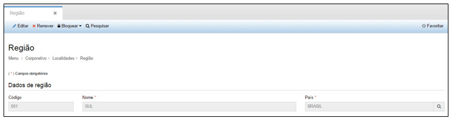

**Figura 8 - Visualizando uma Região**

**Figura 9 - Bloqueando uma Região**

Estado
--------

Ao clicar na opção “**Estado**” no submenu “**Localidades**”, o sistema apresentará a tela seguinte, com todos os Estados 
cadastrados no sistema:

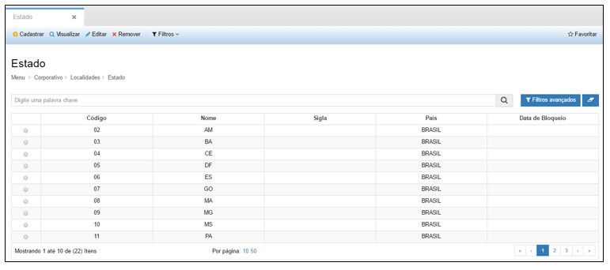

**Figura 10 - Consultando Estados**

Na tela de pesquisa é possível, **Cadastrar** um novo Estado, **Visualizar** as informações de um Estado cadastrado, **Editar**
as informações de um Estado cadastrado, **Remover** o cadastro de um Estado e ainda criar **Filtros** específicos de busca de 
informações dos Estados.

Para cadastrar um novo Estado, basta clicar em “**Cadastrar**” para que a seguinte tela seja exibida:

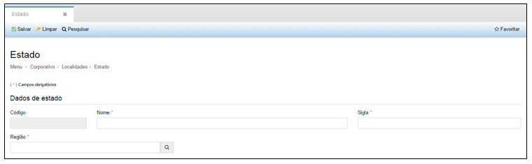

**Figura 11 - Cadastrando um Estado**

Nesta tela, o usuário deverá preencher os seguintes campos:

- **Nome**: nome do Estado que será cadastrado.
- **Sigla**: sigla do Estado.

Após inserir todas as informações necessárias, clique em “**Salvar**”, para que o sistema armazene as informações inseridas.

Nesta tela as seguintes ações também poderão ser realizadas:

- **Limpar**: limpa todos os campos preenchidos antes de salvar o cadastro.
- **Pesquisar**: retorna à tela de pesquisa.

Para visualizar as informações de um cadastro clique em “**Visualizar**” e o sistema exibirá a tela de cadastro. A tela de 
visualização permite também editar as informações e retornar à tela de pesquisa.

Para editar um cadastro clique em “**Editar**”, e o sistema exibirá a tela de cadastro selecionado, permitindo a edição das
informações.

Para excluir um cadastro, clique em “**Remover**”, e o sistema excluirá completamente o cadastro.

O botão “**Filtros**” permite criar filtros específicos para visualização na tela de pesquisa.

As ações disponíveis dentro da visualização de um Estado são:

- **Editar**: permite editar as informações de um registro.
- **Remover**: permite excluir o registro de um Estado.
- **Bloquear**: permite bloquear a utilização de um Estado, a partir de uma data inicial informada.

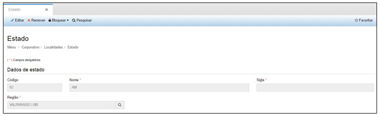

**Figura 12 - Visualizando um Estado**

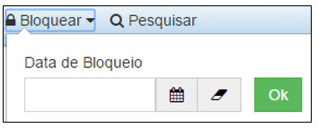

**Figura 13 - Bloqueando um Estado**

Cidade
--------

Ao clicar na opção “**Cidade**” no submenu “**Localidades**”, o sistema apresentará a tela seguinte, com todas as Cidades
cadastradas no sistema:

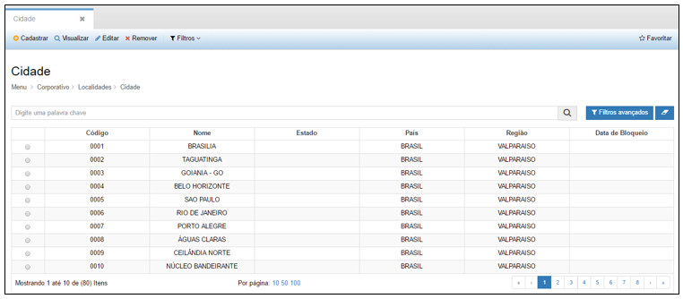

**Figura 14 - Consultando Cidades**

Na tela de pesquisa é possível, **Cadastrar** uma nova Cidades, **Visualizar** as informações de uma Cidade cadastrada, **Editar**
as informações de uma Cidade cadastrada, **Remover** o cadastro de uma Cidade e ainda criar **Filtros** específicos de busca de
informações das Cidades.

Para cadastrar uma nova Cidade, basta clicar em “**Cadastrar**” para que a seguinte tela seja exibida:

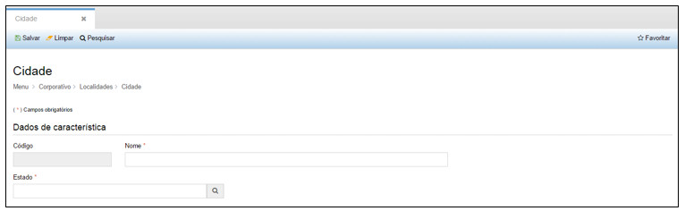

**Figura 15 - Cadastrando uma Cidade**

Nesta tela, o usuário deverá preencher os seguintes campos:

- **Nome**: nome da Cidade que será cadastrada.
- **Estado**: sigla do Estado associado à Cidade.

Após inserir todas as informações necessárias, clique em “Salvar”, para que o sistema armazene as informações inseridas.

Nesta tela as seguintes ações também poderão ser realizadas:

- **Limpar**: limpa todos os campos preenchidos antes de salvar o cadastro.
- **Pesquisar**: retorna à tela de pesquisa.

Ao selecionar uma Cidade e clicar em “Visualizar”, as informações do cadastro serão exibidas. A tela de visualização permite também 
editar as informações e retornar à tela de pesquisa.

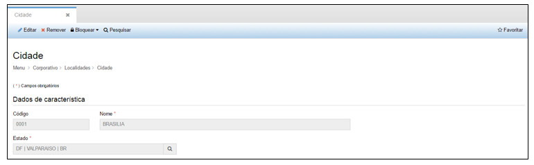

**Figura 16 - Visualizando uma Cidade**

Ao selecionar uma Cidade e clicar em “**Editar**”, a tela do cadastro selecionado é exibida, permitindo a edição das informações.

Ao selecionar uma Cidade e clicar em “**Remover**”, o sistema excluirá o completamente o cadastro.

O botão “**Filtros**” permite criar filtros específicos para visualização na tela de pesquisa.

As ações disponíveis dentro da visualização de uma Cidade são:

- **Editar**: permite editar as informações de um registro.
- **Remover**: permite excluir o registro de uma Cidade.
- **Bloquear**: permite bloquear a utilização de uma Cidade, a partir de uma data inicial informada.

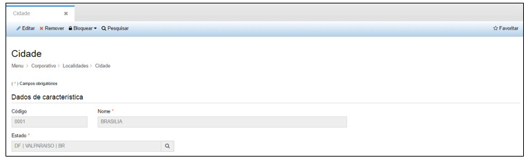

**Figura 17 - Visualizando uma Cidade**

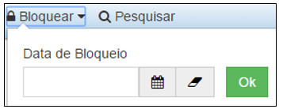

**Figura 18 - Bloqueando uma Cidade**

Bairro
--------

Ao clicar na opção “**Bairro**” no submenu “**Localidades**”, o sistema apresentará a tela seguinte, com todos os Bairros 
cadastrados no sistema:

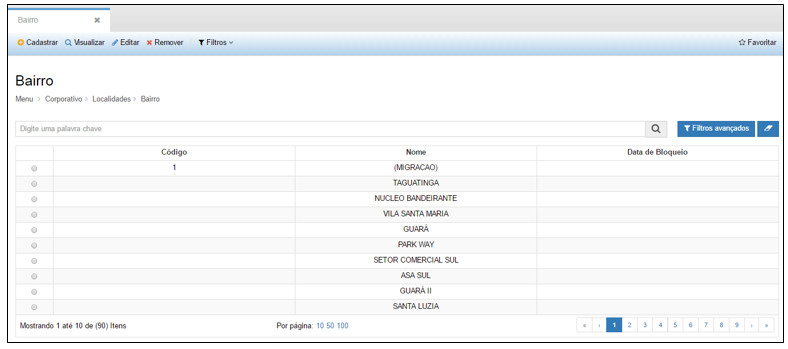

**Figura 19 - Consultando Bairros**

Na tela de pesquisa é possível, **Cadastrar** um novo Bairro, **Visualizar** as informações de um Bairro cadastrado, **Editar** as
informações de um Bairro cadastrado, **Remover** o cadastro de um Bairro e ainda criar **Filtros** específicos de busca de 
informações dos Bairros.

Para cadastrar um novo Bairro, basta clicar em “**Cadastrar**” para que a seguinte tela seja exibida:

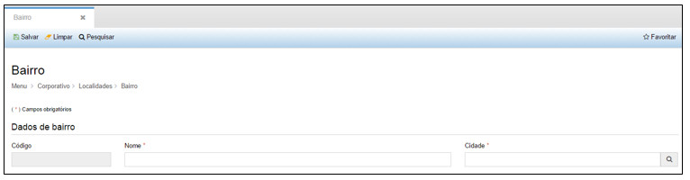

**Figura 20 - Cadastrando um Bairro**

Nesta tela, o usuário deverá preencher os seguintes campos:

- **Nome**: nome do Bairro que será cadastrado.
- **Cidade**: nome da Cidade associada ao Bairro.

Após inserir todas as informações necessárias, clique em “**Salvar**”, para que o sistema armazene as informações inseridas.

Nesta tela as seguintes ações também poderão ser realizadas:

- **Limpar**: limpa todos os campos preenchidos antes de salvar o cadastro.
- **Pesquisar**: retorna à tela de pesquisa.

Para visualizar as informações de um cadastro clique em “**Visualizar**” e o sistema exibirá a tela de cadastro. A tela de 
visualização permite também editar as informações e retornar à tela de pesquisa.

Para editar um cadastro clique em “**Editar**”, e o sistema exibirá a tela de cadastro selecionado, permitindo a edição das
informações.

Para excluir um cadastro, clique em “**Remover**”, e o sistema excluirá completamente o cadastro.

O botão “**Filtros**” permite criar filtros específicos para visualização na tela de pesquisa.

As ações disponíveis dentro da visualização de um Bairro são:

- **Editar**: permite editar as informações de um registro.
- **Remover**: permite excluir o registro de um Bairro.
- **Bloquear**: permite bloquear a utilização de um Bairro, a partir de uma data inicial informada.

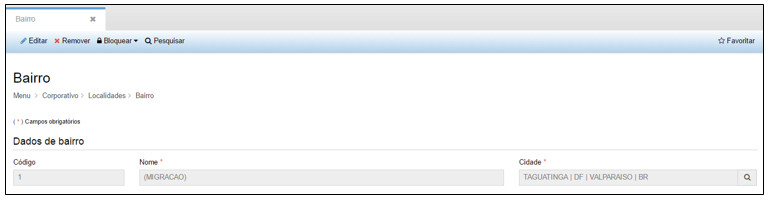

**Figura 21 - Visualizando um Bairro**

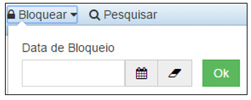

**Figura 22 - Bloqueando um Bairro**

Endereço
---------

Ao clicar na opção “**Endereço**” no submenu “**Localidades**”, o sistema apresentará a tela seguinte, com todos os Endereços 
cadastrados no sistema:

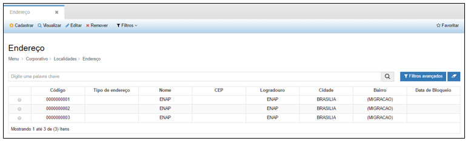

**Figura 23 - Consultando Endereços**

Na tela de pesquisa é possível, **Cadastrar** um novo Endereço, **Visualizar** as informações de um Endereço cadastrado, **Editar**
as informações de um Endereço cadastrado, **Remover** o cadastro de um Endereço e ainda criar **Filtros** específicos de busca de 
informações dos Endereços.

Para cadastrar um novo Endereço, basta clicar em “**Cadastrar**” para que a seguinte tela seja exibida:

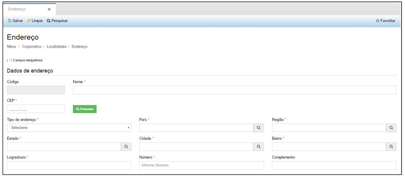

**Figura 24 - Cadastrando Endereço**

Nesta tela, o usuário deverá preencher os seguintes campos:

- **Nome**: nome do Endereço que será cadastrado.
- **CEP**: número do cep relacionado ao endereço.
- **Tipo de endereço**: escolher o tipo residencial ou comercial.
- **País**: nome do país relacionado à Região.
- **Região**: nome da região relacionada ao Estado.
- **Estado**: nome do estado relacionado à Cidade.
- **Cidade**: nome da cidade associada ao Endereço
- **Bairro**: nome do bairro associado à Cidade.
- **Logradouro**: descrição do endereço como por exemplo, rua, avenida.
- **Número**: número da rua, quadra, avenida, lote.
- **Complemento**: informações adicionais do endereço, como por exemplo, nome de edifício, referência.

Após inserir todas as informações necessárias, clique em “**Salvar**”, para que o sistema armazene as informações inseridas.

Nesta tela as seguintes ações também poderão ser realizadas:

- **Limpar**: limpa todos os campos preenchidos antes de salvar o cadastro.
- **Pesquisar**: retorna à tela de pesquisa.

Para visualizar as informações de um cadastro clique em “**Visualizar**” e o sistema exibirá a tela de cadastro. A tela de
visualização permite também editar as informações e retornar à tela de pesquisa.

Para editar um cadastro clique em “**Editar**”, e o sistema exibirá a tela de cadastro selecionado, permitindo a edição das
informações.

Para excluir um cadastro, clique em “**Remover**”, e o sistema excluirá completamente o cadastro.

O botão “**Filtros**” permite criar filtros específicos para visualização na tela de pesquisa.

As ações disponíveis dentro da visualização de um Endereço são:

- **Editar**: permite editar as informações de um registro.
- **Remover**: permite excluir o registro de um Endereço.
- **Bloquear**: permite bloquear a utilização de um Endereço, a partir de uma data inicial informada.

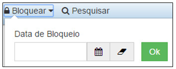

**Figura 25 - Bloqueando um Endereço**

Localização
------------

Ao clicar na opção “**Localização**” no submenu “**Localidades**”, o sistema apresentará a tela seguinte, com todas as Localizações 
cadastradas no sistema:

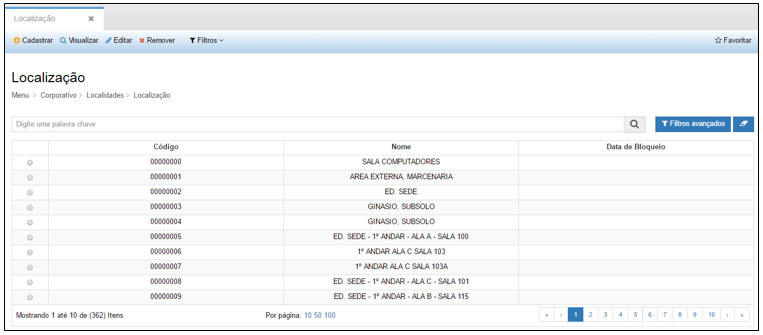

**Figura 26 - Consultando Localizações**

Na tela de pesquisa é possível, **Cadastrar** uma nova Localização, **Visualizar** as informações de uma Localização cadastrada, 
**Editar** as informações de uma Localização cadastrada, **Remover** o cadastro de uma Localização e ainda criar **Filtros**
específicos de busca de informações das Localizações.

Para cadastrar uma nova Localização, basta clicar em “**Cadastrar**” para que a seguinte tela seja exibida:

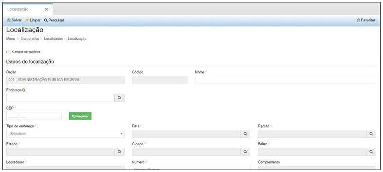

**Figura 27 - Cadastrando uma Localização**

Nesta tela, o usuário deverá preencher os seguintes campos:

- **Nome**: nome da Localização que será cadastrada.
- **Endereço**: nome do endereço.
- **CEP**: número do cep relacionado ao endereço.
- **Tipo de endereço**: escolher o tipo residencial ou comercial.
- **Número**: número da rua, quadra, avenida, lote.

Após inserir todas as informações necessárias, clique em “**Salvar**”, para que o sistema armazene as informações inseridas.

Nesta tela as seguintes ações também poderão ser realizadas:

- **Limpar**: limpa todos os campos preenchidos antes de salvar o cadastro.
- **Pesquisar**: retorna à tela de pesquisa.

Para visualizar as informações de um cadastro clique em “**Visualizar**” e o sistema exibirá a tela de cadastro. A tela de 
visualização permite também editar as informações e retornar à tela de pesquisa.

Para editar um cadastro clique em “**Editar**”, e o sistema exibirá a tela de cadastro selecionado, permitindo a edição das 
informações.

Para excluir um cadastro, clique em “**Remover**”, e o sistema excluirá completamente o cadastro.

O botão “**Filtros**” permite criar filtros específicos para visualização na tela de pesquisa.

As ações disponíveis dentro da tela de visualização de uma Localização são:

- **Editar**: permite editar as informações de um registro
- **Remover**: permite excluir o registro de uma Localização.
- **Bloquear**: permite bloquear a utilização de uma Localização, a partir de uma data inicial informada.

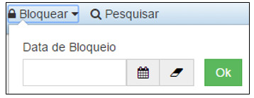

**Figura 28 - Bloqueando uma Localização**

!!! tip "About"

    <b>Product/Version:</b> CITSmart | 7.00 &nbsp;&nbsp;
    <b>Updated:</b>08/14/2019 - Larissa Lourenço
        
