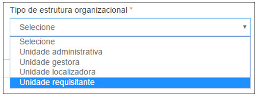

title:  Cadastro e pesquisa da estrutura organizacional
Description: Disponibiliza o cadastro da estrutura organizacional. 
# Cadastro e pesquisa da estrutura organizacional

Órgão
-------

Ao clicar na opção “**Órgão**” no submenu “**Estrutura Organizacional**”, o sistema apresentará a tela seguinte, com todos os Órgãos 
cadastrados.

**Figura 1 - Consultando órgão cadastrado**

Na tela de pesquisa é possível, **Cadastrar** um novo Órgão, **Visualizar** as informações cadastrais de um Órgão, **Editar** as
informações de um Órgão e ainda criar **Filtros** específicos de busca de informações do Órgão.

Para cadastrar um novo Órgão, basta clicar em “**Cadastrar**” para que a seguinte tela seja exibida:

**Figura 2 - Cadastrando um órgão**

Nesta tela, o usuário deverá preencher os seguintes campos:

    - **Nome**: nome do órgão que será cadastrado.
    - **Sigla**: sigla do órgão que será cadastrado.
    - **Data início**: data início da vigência do órgão.
    - **Data fim**: data fim para vigência do órgão.
    
Após inserir todas as informações necessárias, clique em “**Salvar**”, para que o sistema armazene as informações inseridas.

Nesta tela as seguintes ações também poderão ser realizadas:

    - **Limpar**: limpa todos os campos preenchidos antes de salvar o cadastro.
    - **Pesquisar**: retorna à tela de pesquisa.
    
Para visualizar as informações de um cadastro clique em “**Visualizar**” e o sistema exibirá a tela de cadastro. A tela de 
visualização permite também editar as informações e retornar à tela de pesquisa.

Para editar um cadastro clique em “**Editar**”, e o sistema exibirá a tela de cadastro selecionado, permitindo a edição das 
informações.

Para excluir um cadastro, clique em “**Remover**”, e o sistema excluirá completamente o cadastro.

O botão “**Filtros**” permite criar filtros específicos para visualização na tela de pesquisa.

As ações disponíveis dentro da tela de visualização de um Órgão são:

    - **Editar**: permite editar as informações de um registro.
    - **Pesquisar**: retorna à tela de pesquisa.
    
Nível de autoridade
---------------------

Ao clicar na opção “**Nível de Autoridade**” no submenu “**Estrutura Organizacional**”, o sistema apresentará a tela seguinte, com 
todos Níveis de Autoridade cadastrados.

*Cadastro das unidades*

Ao clicar na opção “**Cadastro de Unidades**” no submenu “**Estrutura Organizacional**”, o sistema apresentará a tela seguinte, com
todos os Cadastrados das Unidades.

**Figura 3 - Consultando cadastro das unidades**

Na tela de pesquisa é possível, **Cadastrar** uma nova Unidade, **Visualizar** as informações cadastradas de uma Unidade, **Editar**
as informações de uma Unidade e ainda criar Filtros específicos de busca de informações das Unidades.

Para cadastrar uma nova Unidade, basta clicar em “**Cadastrar**” para que a seguinte tela seja exibida:

**Figura 4 - Cadastrando unidades**

!!! info "IMPORTANTE"

    Se não houver nenhuma unidade do tipo “Almoxarifado” habilitada no sistema não será possível realizar as operações de 
    patrimônio e almoxarifado como, por exemplo: “Entrada de bens” e “Entrada de materiais”. Há necessidade de haver, ao menos, um 
    almoxarifado habilitado como padrão.
    
Nesta tela, o usuário deverá preencher os seguintes campos:

    - **Estrutura Superior**: seleciona a estrutura superior, quando houver.
    - **Nome**: nome da estrutura organizacional.
    - **Sigla**: sigla utilizada para a estrutura organizacional.
    - **Tipo de Estrutura Organizacional**: o usuário deverá selecionar o tipo de estrutura organizacional, de acordo com as opções
    oferecidas pelo sistema, conforme imagem abaixo:
    
    
    
    **Figura 5 - Selecionando uma estrutura organizacional**
    
    - **Classificação**: número ou nome identificador da estrutura.
    - **Data Início**: data do cadastro da unidade.
    - **Data Fim**: campo não obrigatório.
    - **Localização**: local onde reside a estrutura organizacional.
    - **Responsável: selecione e adicione o(s) responsável(eis) pela unidade. Caso o sistema não encontre o nome inserido, um novo 
    responsável pode ser adicionado clicando no ícone  ** Erro! Fonte de referência não encontrada**.

Após inserir todas as informações necessárias, clique em “**Salvar**”, para que o sistema armazene as informações inseridas.

Nesta tela as seguintes ações também poderão ser realizadas:

    - **Limpar**: limpa todos os campos preenchidos antes de salvar o cadastro.
    - **Pesquisar**: retorna à tela de pesquisa.
    
Para visualizar as informações de um cadastro clique em “**Visualizar**” e o sistema exibirá a tela de cadastro. A tela de
visualização permite também editar as informações e retornar à tela de pesquisa.

Para editar um cadastro clique em “**Editar**”, e o sistema exibirá a tela de cadastro selecionado, permitindo a edição das 
informações.

Para excluir um cadastro, clique em “**Remover**”, e o sistema excluirá completamente o cadastro.

O botão “**Filtros**” permite criar filtros específicos para visualização na tela de pesquisa.

As ações disponíveis dentro da tela de visualização de uma Unidade são:

    - **Editar**: permite editar as informações de um registro.
    - **Remover**: permite excluir o registro de uma Unidade.
    - **Bloquear**: permite bloquear a utilização de uma Unidade, a partir de uma data inicial informada.
    - **Definições de Patrimônio**: permite definir a unidade como Unidade Localizadora de Bens.
    - **Definições de Almoxarifado**: permite definir a unidade como almoxarifado padrão da instituição.
    - **Pesquisar**: retorna à tela de pesquisa.
    
    
    
    **Figura 6 - Bloqueando uma unidade**
    
Para definir a unidade para **Patrimônio**, clique em “**Definições de Patrimônio**” (disponível no menu superior) será apresentada 
a tela a seguir, onde será possível definir se a unidade em questão é uma “Unidade localizadora de bens”.

**Figura 7 - Definindo estruturas para patrimônio**

Caso a unidade seja do tipo “**Unidade Localizadora de Bens**”, o botão com esse título deverá ser habilitado para “Sim”.

!!! note "NOTA"

    Se a unidade não estiver habilitada como “Unidade localizadora de bens”, ela não estará disponível/visível para realização das
    operações do módulo patrimônio (transferências internas, por exemplo).
    
Caso a unidade seja do tipo “**Almoxarifado**”, o botão com esse título deverá ser habilitado para “Sim”.

Caso a unidade seja do tipo “**Almoxarifado Padrão**”, o botão com esse título deverá ser habilitado para “Sim”. Se houver outra 
unidade definida como “**Almoxarifado padrão**” será apresentada uma mensagem de alerta conforme figura a seguir:

**Figura 8 - Definições das estruturas para patrimônio**

Após efetuar as alterações necessárias clique em “**Salvar**”, para que o sistema armazene as “**Definições das Estruturas para o 
Patrimônio**”. Ou em “**Cancelar**”, para descartar as configurações realizadas.

Para definir a unidade como **Almoxarifado**, clique em “Definições de Almoxarifado” (disponível no menu superior) será apresentada
a tela a seguir, onde será possível definir se a unidade em questão é uma “Unidade localizadora de bens”.

**Figura 9 - Definindo Unidade para Almoxarifado**

Centro de Custo: informe o centro de custo relacionado à Unidade.

Caso a unidade seja do tipo “**Unidade Requisitante**”, o botão com esse título deverá ser habilitado para “Sim”.

!!! info "IMPORTANTE"

    Se não houver nenhuma unidade do tipo “Almoxarifado” habilitada no sistema não será possível realizar as operações de patrimônio
    e almoxarifado como, por exemplo: “Entrada de bens” e “Entrada de materiais. Há necessidade de haver, ao menos, um almoxarifado
    habilitado como padrão.
    
Caso a unidade seja do tipo “Almoxarifado”, o botão com esse título deverá ser habilitado para “Sim”. Quando esta opção for 
habilitada, o sistema disponibilizará a opção “Dias que pode realizar requisições”, que é utilizado pelos os órgãos/instituições
que possuem calendário específico para “abertura” de período para solicitações de materiais por unidade requisitante.

!!! note "NOTA"

    Caso nenhum dia seja marcado, o sistema entenderá que a requisição de materiais poderá ser realizada pela unidade requisitante 
    em qualquer dia do mês, sendo este último, o padrão (default) do sistema.
    
Caso a unidade seja do tipo “**Almoxarifado Padrão**”, o botão com esse título deverá ser habilitado para “Sim”.

Caso a unidade seja do tipo “**Almoxarifado Padrão**”, o botão com esse título deverá ser habilitado para “Sim”. Se houver outra 
unidade definida como “**Almoxarifado padrão**” será apresentada uma mensagem de alerta;

Após efetuar as alterações necessárias clique em “**Salvar**”, para que o sistema armazene as “**Definições das Estruturas para o 
Almoxarifado**”. Ou em “**Cancelar**”, para descartar as configurações realizadas.

Para retornar a tela de pesquisa, basta clicar em “**Pesquisar**”.

Localização
------------

Para cadastrar uma localização, clique em “Localização” no submenu e escolha a opção cadastrar. A seguinte tela será apresentada:

**Figura 10 - Localização**

Preencha os campos do cadastro, conforme orientações abaixo:

    - **Localização superior**: permite vincular a localização a ser cadastrada a uma localização superior.
    - **Código**: será gerado automaticamente pelo sistema;
    - **Nome**: nome da localização
    - **Endereço**: ao preencher o campo CEP, o sistema trará automaticamente o restante dos campos preenchidos.
    
Mapa organizacional
---------------------

Ao clicar na opção “**Mapa Organizacional**” no submenu “**Estrutura Organizacional**”, o sistema apresentará a tela seguinte, com 
todos os Mapas Organizacionais cadastrados.

**Figura 11 - Consultando mapa organizacional**

Na tela de pesquisa é possível, **Cadastrar** um novo Mapa Organizacional, **Visualizar** as informações cadastradas de um Mapa 
Organizacional, **Editar** as informações de um Mapa Organizacional de e ainda criar **Filtros** específicos de busca de 
informações dos Mapas.

Para cadastrar um novo Mapa Organizacional, basta clicar em “**Cadastrar**” para que a seguinte tela seja exibida:

**Figura 12 - Cadastrando um mapa organizacional**

Nesta tela, o usuário deverá preencher os seguintes campos:

    - **Nome**: nome que será dado ao mapa organizacional.
    - **Data início**: data início para o mapa organizacional.
    - **Data fim**: data fim para o mapa organizacional.
    - **Observação**: permite inserir uma observação, para aquele mapa que está sendo cadastrado. Logo após o preenchimento deste 
    campo, clique em “**Adicionar**”, para que o sistema armazene a observação inserida.
    
Após inserir todas as informações necessárias, clique em “**Salvar**”, para que o sistema armazene as informações inseridas.

Nesta tela as seguintes ações também poderão ser realizadas:

    - **Limpar**: limpa todos os campos preenchidos antes de salvar o cadastro.
    - **Pesquisar**: retorna à tela de pesquisa.
    
Para visualizar as informações de um cadastro clique em “**Visualizar**” e o sistema exibirá a tela de cadastro. A tela de 
visualização permite também editar as informações e retornar à tela de pesquisa.

Para editar um cadastro clique em “**Editar**”, e o sistema exibirá a tela de cadastro selecionado, permitindo a edição das 
informações.

Para excluir um cadastro, clique em “**Remover**”, e o sistema excluirá completamente o cadastro.

O botão “**Filtros**” permite criar filtros específicos para visualização na tela de pesquisa.

A única ação disponível dentro da tela de visualização de um Mapa Organizacional é:

    - **Pesquisar**: retorna à tela de pesquisa.
    
!!! tip "About"

    <b>Product/Version:</b> CITSmart | 7.00 &nbsp;&nbsp;
    <b>Updated:</b>08/13/2019 - Larissa Lourenço
