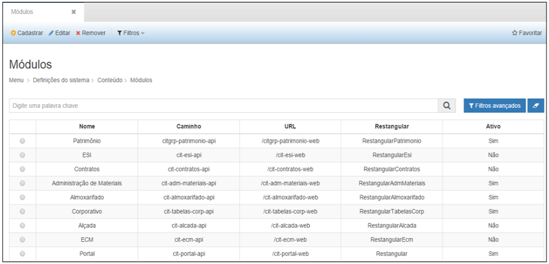

title: Módulo definição do sistema

Description: Permite efetuar configurações relacionadas a configurações gerais, segurança (usuários e grupos), domínios e configurações de conteúdo.

# Módulo definição do sistema

O **Menu Definições** do Sistema, permite efetuar configurações relacionadas a
configurações gerais, segurança (usuários e grupos), domínios e configurações de
conteúdo.

O usuário terá disponível os submenus listados abaixo:

-   Geral

    -   Definições Gerais

    -   Notificação

-   Segurança

    -   Usuário

    -   Grupo

    -   Perfil de acesso

-   Conteúdo

    -   Menu

    -   Módulos

    -   Arquivos Padrão

    -   Internacionalização

-   Tabelas de domínio

    -   Cadastro de Domínios

Para acessá-lo basta clicar em **Menu** e logo após em “**Definições do
Sistema**”, conforme abaixo:

**Figura 1 - Opções do Menu Definições do Sistema**

Geral
-----

Esta funcionalidade envolve a configuração de informações, como: **Definições
Gerais** e **Notificação**.

Exibe as definições de comportamentos dentro do sistema.

Ao clicar em “**Definições Gerais**” do submenu “**Geral**”, o sistema
apresentará a seguinte tela:

    

    **Figura 2 - Definindo Configurações Gerais**

-   **Aba Página Login**: permite alterar a imagem carregada ao realizar o login
    no módulo.

-   **Aba Relatórios**: permite a configuração dos cabeçalhos e logo utilizados
    nos relatórios do Módulo.

-   **Aba Almoxarifado**: permite as configurações iniciais para o módulo
    Almoxarifado, conforme apresentado a seguir:

    -   **Tipo de avaliação monetária de estoque**: por padrão o sistema já
        apresenta essa opção preenchida com o tipo “média móvel”.

    -   **Unidade de medida de entrada**: é possível escolher entre as opções
        “considerar a mesma unidade de medida de armazenamento” ou “Permitir
        múltiplas unidades de medida na entrada.”

    -   **Verificar preço médio de entrada de materiais (0 – 100%):** define a
        porcentagem de diferença a ser considerado o preço médio de materiais.

    -   **Configuração de Ressuprimento: **permite definir as informações para
        que o sistema informe sobre a necessidade de ressuprimento de materiais,
        definindo:

        -   Tempo de aquisição (em meses);

        -   Intervalo de aquisição (em meses);

        -   Estoque de segurança (0 a 100%);

        -   Quem é necessário notificar: usuários ou grupos de usuários.

        -   OBS: Vide figura a seguir

    
    
    **Figura 3 - Aba Almoxarifado**

-   **Aba Patrimônio:** permite realizar as configurações iniciais para o módulo
    Patrimônio, conforme apresentado a seguir:

    -   **Máscara do número patrimonial**: define qual a máscara a ser utilizada
        para gerar os números patrimoniais da instituição;

    -   **Conta almoxarifado**: define a conta contábil vinculada ao
        almoxarifado para a entrada de bens patrimoniais.

    -   **Método de depreciação em reavaliação/redução**: define como deve
        permanecer a depreciação após o bem sofrer uma reavaliação de seu valor
        líquido.

    -   **Método de movimentação em conta reavaliação/redução**: define qual
        método de movimentação para as contas/bens que sofrem reavaliação;

    -   **Configuração Transferência Externa**

        -   **Tipo da transferência externa**: define a forma como devem ser
            realizadas as transferências de valores entre unidades gestoras.

        -   **Conta origem**: conta contábil das UGs que realizam a
            transferência;

        -   **Conta destino**: conta contábil destino das UGs que recebem a
            transferência;

        -   **Conta de Cessão**: definição da conta contábil para a cessão de
            bens;

**Figura 4 - Aba Patrimônio**

**Figura 5 - Configurações Gerais**

**Figura 6 - Configurações Gerais**

Notificação
-----------

Esta funcionalidade exibe as notificações para que o sistema envie ao usuário,
de acordo com as definições configuradas.

Ao selecionar a opção “**Notificação**” no submenu “**Geral**”, a seguinte tela
será mostrada:

    

    **Figura 7 - Visualizando Notificações Configuradas**

Na tela de pesquisa é possível, **Visualizar** as informações de uma Notificação
cadastrado, **Remover** uma Notificação e ainda criar **Filtros**específicos de
busca de informações das Notificações.

Segurança
---------

Exibe as definições de segurança dentro do sistema.

!!! warning "ATENÇÃO"

    Para realizar as configurações referentes a “Usuário”, há necessidade de
    ser administrador do sistema, bem como só é possível realizar essas
    configurações quando não há integração com o sistema de
    autenticação/autorização da instituição/órgão, pois neste caso, as regras de
    acesso seguem aos padrões e políticas de segurança definidos à rede
    corporativa.

Usuário
-------

Esta funcionalidade é utilizada para cadastrar usuários do sistema, além de
visualizar os usuários já cadastrados, editar e remover cadastros.

Ao clicar em Usuário, a tela de pesquisa será exibida permitindo visualizar os
cadastros realizados.

    
    
    **Figura 8 - Pesquisando Usuários**

As opções de botões apresentadas na tela permitem: **cadastrar** um novo
usuário, **visualizar** o cadastro de um usuário selecionado, **editar**
informações de um cadastro, **remover** um usuário e criar **filtros** de
visualização.

Ao clicar em “**Cadastrar**”, e a tela abaixo será aberta para realizar o
cadastro de um novo usuário.

    

    **Figura 9 - Cadastrando Usuário**

Nesta tela de cadastro, as seguintes informações deverão ser preenchidas:

-   **Nome**: nome completo do usuário a ser cadastrado.

-   **E-mail**: endereço de correio eletrônico do usuário.

-   **Senha**: senha de acesso ao sistema.

-   **Confirma senha**: repetir a senha do campo anterior.

-   **Dica de senha**: dica para relembrar a senha.

-   **Senha mobile**: senha de acesso mobile.

-   **Confirma senha**: repetir a senha do campo anterior.

-   **Dica de senha**: dica para relembrar a senha.

-   **Permissões**: selecione a(s) permissão(ões) de usuário.

-   **Grupos**: selecione o(s) grupo(s) de acesso que o usuário fará parte. Para
    tanto, as permissões e grupos deverão estar previamente cadastrados e
    configurados.

-   **Órgão**: digite, por exemplo, a primeira letra do nome do órgão e tecle
    ENTER, o sistema incluirá automaticamente o órgão na tabela.

Após preencher todos os campos, clique em “**Salvar**”, para que o sistema
armazene as informações no banco de dados.

Nesta tela as seguintes ações também poderão ser realizadas:

-   **Limpar: **limpa todos os campos preenchidos.

-   **Remover: **remove o registro.

-   **Pesquisar: **retorna à tela de pesquisa.

Ao selecionar um usuário e clicar em “**Visualizar**”, as informações
cadastradas são exibidas.

    
    

    **Figura 10 - Visualizando um Cadastro**

A tela de visualização permite também editar as informações e retornar à tela de
pesquisa.

Ao selecionar um usuário e clicar em “**Editar**”, a tela do cadastro
selecionado é exibida, permitindo a edição das informações.

Ao selecionar um usuário e clicar em “**Remover**”, o sistema excluirá o
completamente o cadastro.

O botão “**Filtros**” permite criar filtros específicos para visualização na
tela de pesquisa.

Grupo
-----

Esta funcionalidade é utilizada para cadastrar grupos de usuários do sistema,
além de visualizar grupos, editar e remover cadastros de grupos.

Ao clicar em Grupo, a tela de pesquisa será exibida permitindo visualizar os
cadastros realizados.

    

    **Figura 11 - Pesquisando Grupos de Usuários**

As opções de botões apresentadas na tela permitem:

-   **Cadastrar**: permite realizar o cadastro de um grupo no sistema.

-   **Visualizar**: permite visualizar as informações do cadastro do grupo
    selecionado.

-   **Editar**: permite editar as informações do grupo selecionado.

-   **Remover**: permite remover o cadastro do grupo selecionado.

-   **Filtros**: permite configurar filtros específicos de visualização.

Ao clicar em “**Cadastrar**”, e a tela abaixo será aberta para realizar o
cadastro de um novo grupo.

    
    

    **Figura 12 - Cadastrando Grupo de Usuários**

A tela de cadastro apresentará alguns campos para preenchimento, conforme
abaixo:

-   **Nome**: nome do novo grupo.

-   **Sigla**: sigla para o grupo.

-   **E-mail**: endereço de correio eletrônico do grupo.

-   **Permissões**: tipos de permissão do grupo.

-   **Usuários**: listagem de usuários cadastrados no sistema.

-   **Usuários selecionados**: listagem de usuários selecionados para serem
    integrantes do grupo.

Após preencher todos os campos, clique em “**Salvar**”, para que o sistema
armazene as informações no banco de dados.

Nesta tela as seguintes ações também poderão ser realizadas:

-   **Limpar: **limpa todos os campos preenchidos.

-   **Remover: **remove o registro.

-   **Pesquisar: **retorna à tela de pesquisa.

Ao selecionar um grupo e clicar em “**Visualizar**”, as informações cadastradas
serão exibidas.

A tela de visualização permite também editar as informações e retornar à tela de
pesquisa.

Ao selecionar um grupo e clicar em “**Editar**”, a tela do cadastro selecionado
é exibida, permitindo a edição das informações.

Ao selecionar um grupo e clicar em “**Remover**”, o sistema excluirá o
completamente o cadastro.

O botão “**Filtros**” permite criar filtros específicos para visualização na
tela de pesquisa.

Um grupo de usuário poderá ser bloqueado, impedindo atividades dentro do
sistema, clicando no botão “**Bloquear**”. Esta ação é exibida dentro do
cadastro do grupo inserindo a data de início do bloqueio do grupo. O desbloqueio
do grupo não será automático, devendo ser feito manualmente.

**Figura 13 - Bloqueando Grupo**

Menu conteúdo
-------------

Esta funcionalidade serve para configuração do Menu, dos módulos existentes na
plataforma, arquivos e internacionalização.

**Figura 14 - Menu Conteúdo**

Menu
----

Esta funcionalidade é utilizada para configurar as informações apresentadas no
menu, cadastrar novos módulos e configurar a internacionalização.

Para configurar o Menu, clique sobre a funcionalidade para alterar a ordem dos
módulos, ícones e cores, como mostrado na imagem abaixo:

    
     

     **Figura 15 - Configurando o Menu**

Ao clicar no ícone   , as opções da funcionalidade serão mostradas à frente,
conforme abaixo.

    
    
    **Figura 17- Exibindo Configurações do Menu**

Ao clicar no ícone   (Adicionar), a seguinte tela será exibida para adicionar um
novo menu principal

    
     
    
     **Figura 19 - Adicionando Opções Dentro do Menu**

-   **Nome**: Nome do novo menu.

-   **Chave Única**: Nome do menu separado por hífen.

-   **Ícone**: Selecione um ícone para identificar o menu.

-   **Cor**: Selecione uma cor para identificar o menu principal.

-   **Opacidade da cor do menu**: Insira um número para identificar a opacidade
    da cor.

-   **Permissões**: Selecione o tipo de permissão a esta funcionalidade.

-   **Grupos**: Selecione um grupo para permitir acesso à funcionalidade ou
    menu.

-   **Ativo**: Defina “**Sim**” ou “**Não**” para ativar ou desativar a
    funcionalidade ou menu.

Após realizar as alterações desejadas, clique em “**Salvar**” para que o sistema
armazene as informações no banco de dados.

    
Ao clicar no ícone  (Arquivos do Menu), a seguinte tela será exibida para inserir novos arquivos no menu.

    
    
    **Figura 18 - Adicionando um Arquivos do Menu**

Após informar o Caminho, selecionar o Tipo e marcar Ativo, clique em
“**Adicionar novo item**” para que o sistema armazene as novas configurações.

Ao clicar no ícone  (Editar menu), a tela do menu escolhido será exibida para
edição.

Para remover um menu, basta clicar no ícone  (Remover menu), à frente do menu
escolhido.

Módulos
-------

Esta funcionalidade é utilizada para cadastrar novos módulos dentro da
plataforma e configurar informações relacionadas a eles.

Ao clicar em “Módulos”, o sistema exibirá a seguinte tela:

    
    
    **Figura 19- Exibindo os Módulos Cadastrados**

Nesta tela o usuário, terá disponível as seguintes opções:

-   Cadastrar;

-   Editar;

-   Remover;

-   Filtros;

Ao clicar em “**Cadastrar**”, o sistema irá apresentar ao usuário a seguinte
tela:

    
    
    **Figura 20 - Cadastrando Módulo**

Nesta tela o usuário deverá preencher os seguintes campos:

-   **Nome**: nome do módulo novo.

-   **Caminho**: nome do caminho de acesso ao módulo.

-   **URL**: nome da url de acesso ao módulo.

-   **Retangular**: nome retangular.

-   **Ativo**: opção para deixar o módulo ativo (Sim/Não).

Após inserir todas as informações necessárias, o usuário deverá clicar em
“**Salvar**”, para que o sistema armazene as configurações.

Caso deseje limpar todos os campos, basta clicar em “**Limpar**”.

Para retornar a tela anterior, basta clicar em “**Pesquisar**”.

Para editar informações de um módulo, clique em “**Editar**”, e o sistema
exibirá a seguinte tela:

    
    
    **Figura 21 - Editando Informações do Módulo**

Após editar os campos desejados, clique em “Salvar”, para que o sistema armazene
as configurações, ou clique em “Remover”, para excluir o módulo.

Arquivos padrão
---------------

Esta funcionalidade serve para adicionar arquivos de formatação .css ou arquivos
.js que são utilizados pela ferramenta para execução dos módulos.

    
    
    **Figura 22 - Adicionando Arquivos Padrão**

Internacionalização
-------------------

Ao selecionar a opção “Internacionalização” no submenu “Conteúdo”, será
apresentada ao usuário a seguinte tela:

    
    
    **Figura 22 - Internacionalização**

Menu tarefas domínio
-----------------------

Esta funcionalidade serve para apresentar as diversas tabelas de domínios
utilizadas dentro da plataforma CITSmart.

Cadastro de domínios
--------------------

Ao clicar em “Cadastro de Domínios”, a seguinte tela será apresentada para
visualizar as tabelas de domínios cadastradas:

**Figura 23 - Lista de Domínios Cadastrados**

!!! tip "About"

    <b>Product/Version:</b> CITSmart | 8.00 &nbsp;&nbsp;
    <b>Updated:</b>08/14/2019 – Anna Martins
