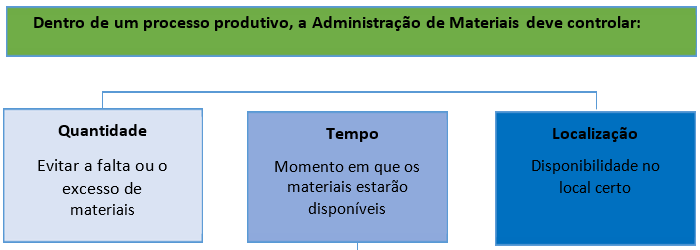

title: Conceitos aplcáveis
Description: conceitos aplicáveis

# Conceitos aplicáveis

Administração de material
-------------------------

Nenhum órgão ou empresa funciona sem matéria-prima, produtos, equipamentos,
instrumentos, peças de manutenção e tantos outros materiais. E todos esses
materiais precisam ser guardados, conservados, movimentados de um setor para
outro. Eles precisam ser administrados.

Trata de todas as etapas de movimentação e de guarda desses bens móveis e
materiais de consumo, visando garantir que o investimento seja adequado e
conforme as metas e orçamentos previstos à instituição.

**Figura 1 - Obrigações da Administração de Materiais**

É o processo de aquisição, registro, conservação, e controle do acervo de bens
permanentes de um órgão público ou que tenha este tipo de controle exigido
regimentalmente.

O controle patrimonial é uma atividade administrativa que visa à preservação e
defesa deste acervo. Este controle consiste no registro (tombamento), na
identificação da utilização e do estado da conservação dos bens e na sua
localização no espaço físico da organização ou fora dela. Consiste também na
retirada (baixa) do bem do acervo.

O patrimônio ou acervo patrimonial de uma organização é normalmente representado
pelo conjunto de seus bens imóveis e permanentes móveis.

Envolve uma fase importante: a CONSCIENTIZAÇÃO dos usuários sobre a importância
da mencionada CONSERVAÇÃO do bem público.

   !!! note "NOTA"

        De acordo com a IN/SEDAP nº 205/1988, e com o Decreto nº 99.658/1990,
        material é uma designação genérica de equipamentos, componentes,
        sobressalentes, acessórios, veículos em geral, matérias-primas e outros
        itens empregados ou passíveis de emprego nas atividades das organizações
        públicas federais, independentemente de qualquer fator, bem como aquele
        oriundo de demolição ou desmontagem, aparas, acondicionamentos, embalagens e
        resíduos economicamente aproveitáveis.

   !!! warning "ATENÇÃO"

        Subentende-se que a legislação supracitada, quando trata de material,
        refere-se a bens permanentes e de consumo.

Material de consumo
-------------------

Material de Consumo é aquele que, em razão de seu uso corrente, perde sua
identidade física em dois anos e/ou tem sua utilização limitada a esse período.
Sua aquisição é feita em despesa de custeio e não possui controle após sua
distribuição.

Quanto à situação de materiais de consumo, um bem será classificado como:

-   Na validade: quando o produto estiver dentro de seu prazo de validade;

-   Vencido: quando a validade já estiver expirada

-   Avariado: quando o produto está dentro do prazo de validade, porém por algum
    motivo não pode ser utilizado para a finalidade a que se destina.

Todo pedido de aquisição deverá ser processado pelo almoxarifado ao setor de
compras, e, para isso, deve manter um controle de estoque mínimo, para atingir o
ponto de pedido.

Material permanente
-------------------

Material Permanente é aquele que, em razão de seu uso corrente, tem durabilidade
e utilização superior a dois anos. Sua aquisição é feita em despesa de capital e
possui controle individualizado.

No caso de bens patrimoniais, poderão ser classificados da seguinte forma:

-   **Bom**: quando estiver em perfeitas condições e em uso normal;

-   **Ocioso**: quando embora esteja em perfeitas condições não está sendo
    usado;

-   **Recuperável**: quando estiver avariado e sua recuperação for possível e
    orçar, no máximo, até cinquenta por cento de seu valor de mercado;

-   **Antieconômico**: quando estiver avariado e sua recuperação orçar mais do
    que cinquenta por cento de seu valor de mercado ou seu rendimento for
    precário, em virtude de uso prolongado, desgaste prematuro ou obsoletismo;

-   **Irrecuperável**: quando não mais puder ser utilizado para o fim a que se
    destina devido à perda de suas características ou em razão da inviabilidade
    econômica de sua recuperação.

    !!! note "NOTA"

        Os materiais permanentes não podem:

        -  Ser caracterizado como material de consumo;
        -  Ser peça de reposição;
        -  Ter seu prazo de vida útil superior a 02 (dois) ano

    !!! note "NOTA"

        Material permanente, bem e bem patrimonial (móveis e imóveis) são
        considerados sinônimos. Para este curso, consideraremos apenas os bens
        móveis.

O pedido de compra de material permanente deve ser feito ao encarregado do
patrimônio, que o repassará ao setor de compras.

É importante que o almoxarifado receba uma cópia da nota de empenho de cada
equipamento ou material permanente que vai ser adquirido pela unidade, a fim de
juntar ao pedido de compra de material de consumo os materiais que sejam
necessários às suas atividades.

Aquisição de um bem permanente
------------------------------

A aquisição de um bem permanente inicia-se com a REQUISIÇÃO, onde a unidade
administrativa ESPECIFICA o material, dando sua descrição que será incorporada
posteriormente ao acervo patrimonial do órgão.

Nesta etapa, o bem precisa ser CLASSIFICADO contabilmente (por exemplo,
equipamento de informática, veículo, etc.), para, posteriormente, ser codificado
nos registros patrimoniais. Esta aquisição se dá através de um processo
licitatório que se encerra com o RECEBIMENTO do bem pelo GESTOR PATRIMONIAL.

   !!! info "IMPORTANTE"

        Para haver racionalização das compras e de acordo com o item 2.1 da
        IN/SEDAP nº 205/1988, é recomendável que as unidades centralizem as
        aquisições de material de uso comum, a fim de obter maior economicidade,
        evitando-se a proliferação indesejável de outros setores de compras.

Estoque mínimo e estoque máximo
-------------------------------

O responsável pela guarda do material deverá manter sob controle os estoques
mínimos de cada tipo de material, para que eles não faltem no almoxarifado,
ocasionando compras sistemáticas por suprimento de fundos ou por dispensa de
licitação, demonstrando, por muitas vezes, um fracionamento de despesa,
comprometendo a gestão do ordenador de despesa.

Para isso, o almoxarife deve identificar sempre o intervalo de aquisição para
cada item e a quantidade de ressuprimento, emitindo os pedidos de compra do
material rotineiramente adquirido e estocável, a fim, também, de manter os itens
de material estocados em níveis compatíveis com a política traçada pelo órgão ou
entidade.

Incorporações (entradas)
------------------------

Caracteriza-se como incorporação, a entrada de um bem no acervo patrimonial do
órgão/instituição, bem como a adição do seu valor à conta do ativo imobilizado.

   !!! warning “ATENÇÃO”

       Os Materiais permanentes recebidos, mediante qualquer processo de
       aquisição, devem ser incorporados ao patrimônio antes de serem distribuídos
       às Unidades que irão utilizá-los.

   !!! note “NOTA”

        Conforme item 3.2, capítulo Recebimento e Aceitação, da IN/SEDAP nº
        205/1988, são considerados documentos hábeis para recebimento, em tais casos
        rotineiros:
        -   Nota Fiscal, Fatura e Nota fiscal/Fatura;
        -   Termo de Cessão/Doação ou Declaração exarada no processo elative à
            Permuta;
        -   Guia de Remessa de Material ou Nota de Transferência; ou Guia de
            Produção.

Desses documentos constarão, obrigatoriamente: descrição do material,
quantidade, unidade de medida, preços (unitário e total).

   !!! note “NOTA”

        Quanto à sua natureza e finalidade os materiais são classificados na forma
        disposta no Plano de Contas da Administração Pública Federal, conforme
        aspectos e critérios de classificação em naturezas de despesas contábeis, da
        Secretaria do Tesouro Nacional, instituída pela Portaria nº 448 de 13 de
        Setembro de 2002.

Recebimento provisório
----------------------

É o ato pelo qual o material encomendado é entregue ao órgão público no local
previamente designado, não implicando em aceitação. Transfere apenas a
responsabilidade pela guarda e conservação do material, do fornecedor ao órgão
recebedor.

Enquanto se aguarda o aceite do material, que deve ter a ciência do fornecedor,
não se deve movimentá-lo, no total ou em parte, e o pagamento somente poderá
ocorrer após o aceite, que representa a segunda fase da despesa (liquidação).

   !!! note "NOTA"

        O recebimento ocorrerá nos almoxarifados, salvo quando o material não
        possa ou não deva ali ser estocado ou recebido, caso em que a entrega se
        fará nos locais designados, e qualquer que seja o local de recebimento, o
        registro de entrada do material será sempre no almoxarifado (vide o item 3
        da IN/SEDAP nº 205/1988).

Recebimento definitivo (aceite)
-------------------------------

É a operação segundo a qual se declara, na documentação fiscal, que o material
recebido satisfaz às especificações contratadas, isto é, o atestado de
recebimento do material aposto no verso do documento fiscal, encerrando a
segunda fase da despesa, que é a liquidação, estando o processo pronto para
pagamento.

O material que apenas depende de conferências com os termos do pedido do
documento de entrega, será recebido e aceito pelo encarregado do almoxarifado ou
por servidor designado para esse fim.

Se o material depende, também, de exame qualitativo, o encarregado do
almoxarifado, ou servidor designado, indicará essa condição no documento de
entrega do fornecedor e solicitará ao departamento de administração ou à unidade
equivalente o exame, para a respectiva aceitação.

O exame qualitativo poderá ser feito por técnico especializado ou por comissão
especial, da qual, em princípio, fará parte o encarregado do almoxarifado.

Quando o material não corresponder com exatidão ao que foi pedido, ou ainda,
apresentar faltas ou defeitos, o encarregado do recebimento providenciará junto
ao fornecedor a regularização da entrega para efeito de aceitação.

Materiais de consumo: incorporações orçamentárias
-------------------------------------------------

São as aquisições, cuja nota de empenho tenha sido emitida no próprio exercício
nas naturezas de despesa 3490.3000 e 3490.9200, cuja apropriação da despesa
somente pode ser efetuada após o recebimento e o aceite do material.

Materiais permanentes: incorporações orçamentárias
--------------------------------------------------

São todas as incorporações de material de consumo que independem da execução do
orçamento do exercício, nas rubricas 3490.3000 e 3490.9292, que irão refletir as
entradas extraorçamentárias do Relatório Mensal do Almoxarifado – RMA, devendo
ocorrer nas seguintes situações:

-   **Aquisição por restos a pagar**: São as compras ocorridas, por meio de
    notas de empenhos emitidas no exercício anterior, inscritas em restos a
    pagar não processados, cujo processo de liquidação somente tenha ocorrido no
    presente exercício. Caso o empenho tenha sido cancelado e os restos a pagar
    estejam com inscrição interrompida, mas, prevalecendo o direito do credor, a
    incorporação será orçamentária, visto que haverá compromisso do orçamento
    corrente à conta da rubrica de exercícios anteriores.

-   **Retorno de material requisitado e não consumido**: Esse fato ocorre quando
    determinados setores devolvem ao almoxarifado materiais em desuso, devendo o
    almoxarife reincorporá-los pelo valor de outro igual ou semelhante.

    -   Caso os materiais devolvidos não puderem ser transformados em outro,
        tornando-se, portanto, inativos, o setor de controle de estoques
        providenciará a sua retirada do local de armazenagem dos itens ativos,
        ou a sua colocação em local que não atrapalhe a movimentação daqueles
        que ainda estão em uso constante.

    -   Os materiais considerados inativos deverão ser relacionados e informados
        ao departamento de administração ou unidade equivalente, para que o
        administrador adote os procedimentos quanto a sua destinação, que pode
        ser a cessão, a transferência, a alienação, a doação, o abandono ou
        inutilização.

-   **Produção**: A produção de material de consumo ocorre quando a unidade
    possui estoque de matérias-primas para transformação de outro material,
    podendo esse fato ocorrer nas gráficas, marcenarias, editoras etc., ou mesmo
    em serviços prestados por terceiros.

    -   No caso do material ser produzido na própria unidade, haverá necessidade
        de, se viável, controlar a produção através de uma guia de produção,
        ordem de produção, ordem de serviço etc., onde serão agregados os custos
        com matéria-prima, mão de obra (direta/indireta), desgaste dos
        equipamentos e outros serviços (fretes, água e esgoto, energia, telefone
        etc.).

    -   Quanto aos materiais recebidos e aceitos por produção fora da unidade,
        com a entrega dos insumos pela administração, cujo pagamento tenha
        ocorrido na classificação de outros serviços de terceiros, o valor do
        material deverá ser incluído em carga pelo custo da matéria-prima
        acrescido do valor da nota fiscal de serviços.

    -   Cabe ressaltar que, para o material produzido fora da unidade, com
        matéria-prima fornecida pelo próprio fornecedor, a classificação
        orçamentária deverá ocorrer no elemento de despesa 3490.3000 – material
        de consumo, ou 3490.9200 – despesas de exercícios anteriores, o que se
        configurará como incorporações orçamentárias.

-   **Doação**: É a modalidade de movimentação de material do acervo, com
    transferência gratuita do direito à propriedade, entre a Administração
    Pública Federal Direta e entidades autárquicas, fundacionais, demais poderes
    da União e órgãos ou entidades da administração dos estados, Distrito
    Federal, municípios ou instituições filantrópicas declaradas de utilidade
    pública pelo Governo Federal. A doação pode ocorrer para as seguintes
    destinações:

    -   Quando ocioso ou recuperável, para outro órgão da Administração Pública
        Federal Indireta, autárquica ou fundacional ou para outro órgão
        integrante de qualquer dos demais poderes da União.

    -   Quando antieconômico, para os estados e municípios mais carentes,
        Distrito Federal e Instituições filantrópicas declaradas de utilidade
        pública pelo Governo Federal (Decreto Federal), com registro na entidade
        competente, em plena vigência.

    -   Quando adquirido com recursos de convênio celebrado com estado,
        território, Distrito Federal ou município e que, a critério do ministro
        de estado, do dirigente da autarquia ou fundação, seja necessário à
        continuação de programas governamentais, após a extinção do convênio,
        para a respectiva entidade convenente.

    -   A doação será efetivada mediante termo de doação, do qual constarão a
        indicação da transferência de carga patrimonial, da unidade doadora para
        a donatária, e o valor da aquisição ou custo de produção.

-   **Sobra de estoques**: A sobra ocorre quando há a conferência pela comissão
    de inventário no final do exercício, ou pelo próprio encarregado do
    almoxarifado, periodicamente, devendo ser incorporada com a autorização da
    administração.

-   **Arredondamento para mais**: O arredondamento para mais pode ocorrer nas
    seguintes situações:

    -   nas saídas quando é adotado o valor pelo preço médio ponderado;

    -   nas mudanças do valor unitário por mudanças de critério de estoque, como
        por exemplo da unidade “resma” para “um”, ocasionando uma dízima
        periódica; e

    -   nas compras com valor unitário com mais de duas casas decimais, quando o
        controle do estoque somente trabalha com duas.

-   **Transferências**: É a modalidade de movimentação de material, com troca de
    responsabilidade, de uma unidade organizacional para outra, dentro do mesmo
    órgão ou entidade.

-   **Cessão**: É a modalidade de movimentação de material, com transferência
    gratuita de posse e troca de responsabilidade, entre órgãos da administração
    pública federal direta.

-   **Reavaliação**: A reavaliação deverá ocorrer, no mínimo, antes da alienação
    de determinados lotes de materiais, por venda ou por permuta, pois ambas as
    modalidades necessitam da correção dos seus valores, a primeira em virtude
    do preço mínimo de leilão, e a segunda porque os lotes de permuta devem ter
    valores coincidentes ou aproximados.

-   **Outras incorporações**: Ocorre quando há outro tipo de incorporação que
    não se configurem como compras, retorno ao almoxarifado, produção, doação,
    sobra, arredondamento, permuta, transferência, cessão e reavaliação, como,
    por exemplo, uma incorporação decorrente de uma reclassificação do estoque
    ou dos bens do patrimônio.

### Materiais permanentes: incorporações orçamentárias

São as compras de materiais permanentes adquiridas com nota de empenho emitida
no mesmo exercício do recebimento/ aceite do material, nas naturezas de despesa
4590.5200 e 4590.9202.

Materiais permanentes: extraorçamentárias
-----------------------------------------

São todos os registros de recebimentos/aceites de materiais permanentes no
almoxarifado ou no patrimônio, independentes da execução orçamentária, conforme
evidenciado a seguir:

-   **Aquisição por restos a pagar**: São as compras ocorridas por meio de notas
    de empenhos emitidas no exercício anterior, inscritas em restos a pagar não
    processados, cujo processo de liquidação somente tenha ocorrido no presente
    exercício. Caso o empenho tenha sido cancelado e os restos a pagar estejam
    com inscrição interrompida, mas, prevalecendo o direito do credor, a
    incorporação será orçamentária, visto que haverá compromisso do orçamento
    corrente à conta da rubrica de exercícios anteriores.

-   **Produção**:  A produção de material permanente ocorre quando a unidade
    possui estoque de matérias-primas para transformação de outro material,
    podendo esse fato ocorrer nas marcenarias, editoras, serralherias etc., ou
    mesmo em serviços prestados por terceiros.

    -   No caso do bem ser produzido na própria unidade, haverá necessidade de,
        se viável, controlar a produção através de uma guia de produção, ordem
        de produção, ordem de serviço etc., onde serão agregados os custos com
        matéria-prima, mão de obra (direta/indireta), desgaste dos equipamentos
        e outros serviços (fretes, água e esgoto, energia, telefone etc.).

    -   Quanto aos materiais recebidos e aceitos por produção fora da unidade,
        com a entrega dos insumos pela administração, cujo pagamento tenha
        ocorrido na classificação de outros serviços de terceiros, o valor do
        material deverá ser incluído em carga pelo custo da matéria-prima
        acrescido do valor da nota fiscal de serviços.

    -   Cabe ressaltar que o material produzido fora da unidade, com
        matéria-prima fornecida pelo próprio fornecedor, a classificação
        orçamentária deverá ocorrer no elemento de despesa 4590.5200, ou
        4590.9202– despesas de exercícios anteriores – equipamentos e material
        permanente, o que se configurará como incorporações orçamentárias.

-   **Doação**: É a modalidade de movimentação de bem do acervo, com
    transferência gratuita do direito à propriedade, entre a Administração
    Pública Federal Direta e entidades autárquicas, fundacionais, demais poderes
    da União e órgãos ou entidades da administração dos estados, Distrito
    Federal, municípios ou instituições filantrópicas declaradas de utilidade
    pública pelo governo federal.

    -   A doação ocorrerá quando o bem for recebido de outro Órgão da
        Administração Pública Federal Indireta, autárquica ou fundacional ou em
        outro órgão integrante de qualquer dos demais poderes da união,
        classificado como ocioso ou recuperável.

    -   A doação será efetivada mediante termo de doação, do qual constarão a
        indicação da transferência de carga patrimonial, da unidade doadora para
        a donatária, e o valor da aquisição ou custo de produção.

-   **Indenização**: A indenização ocorrerá quando houver a apuração da
    responsabilidade de alguém pelo extravio, dano, roubo ou furto etc., e que
    ao responsabilizado for dada a opção de ressarcimento por outro bem de igual
    característica. Assim, o patrimônio procederá a baixa do antigo bem, por
    perda, e o incorporará pelo valor atual, designando-lhe novo tombamento.

-   **Transferência**: A transferência ocorre quando um bem é recebido de outra
    unidade organizacional, no âmbito do mesmo órgão ou entidade, com troca de
    responsabilidade.

-   **Cessão**: Ocorre quando há transferência gratuita da posse de um bem
    público de uma entidade ou órgão, a fim de que o cessionário o utilize nas
    condições estabelecidas no respectivo termo, por tempo certo ou
    indeterminado. É ato de colaboração entre repartições públicas, em que
    aquela que tem bens desnecessários aos seus serviços cede o uso a outra que
    deles está precisando.

-   **Reavaliação**: A reavaliação deverá ocorrer, no mínimo, antes da alienação
    de determinados lotes de materiais, por venda ou por permuta, pois ambas as
    modalidades necessitam da correção dos seus valores, a primeira em virtude
    do preço mínimo de leilão, e a segunda porque os lotes de permuta devem ter
    valores coincidentes ou aproximados.

-   **Outras incorporações**: Ocorrem quando há outro tipo de incorporação que
    não se configurem como compras, retorno ao almoxarifado, produção, doação,
    sobra, arredondamento, permuta, transferência, cessão e reavaliação, como,
    por exemplo, uma incorporação decorrente de uma reclassificação dos bens
    incorporados ao patrimônio.

### Tombamento de bens permanentes

Tombamento é o procedimento administrativo que consiste em identificar cada
material permanente com um número único de registro patrimonial, denominado
número de patrimônio ou tombamento:

-   o número de patrimônio é aposto mediante gravação, fixação de plaqueta,
    etiqueta ou qualquer outro método adequado às características físicas do
    bem;

-   o material permanente cuja identificação, feita na forma do item anterior,
    seja impossível ou inconveniente em face às suas características físicas,
    será tombado por agrupamento em um único número de patrimônio como, por
    exemplo, persianas, cortinas, dentre outros;

-   o número de patrimônio é único para todas as unidades do órgão/instituição.

    !!! warning "ATENÇÃO"

        Materiais permanentes e materiais de consumo recebidos, mediante qualquer
        processo de aquisição, devem ser incorporados ao patrimônio antes de serem
        distribuídos às Unidades que irão utilizá-los.

Carga
-----

Carga é a efetiva responsabilidade pela guarda e uso de material pelo seu
consignatário, sendo que o material somente assim será considerado, no
almoxarifado, após o cumprimento das formalidades de recebimento e aceitação.

   !!! warning "ATENÇÃO"

        É responsabilidade do titular da Unidade Administrativa (UA), no qual o bem
        está localizado, a guarda, utilização e manutenção do mesmo. O detentor de
        carga patrimonial assume, de fato, a responsabilidade sobre os bens
        patrimoniais a partir do recebimento do formulário “TERMO DE
        RESPONSABILIDADE” e, consequentemente da sua assinatura. Normalmente, o
        TERMO DE RESPONSABILIDADE é emitido em 02 (duas) vias, sendo que a 1ª via
        será entregue ao responsável pela carga patrimonial do referido bem, e a 2ª
        via será arquivada no Setor de Patrimônio.

Termo de responsabilidade
-------------------------

É o documento onde estão relacionados os bens componentes da carga setorial de
uma determinada unidade do órgão, sendo o mesmo assinado pelo responsável da
unidade, respondendo este diretamente pela utilização e conservação de cada um
dos itens constantes.

A cada nova incorporação de bem permanente à unidade setorial signatária, a
carga patrimonial deverá ser atualizada.

Esta atualização pode ser feita reemitindo-se o Termo de Responsabilidade do
setor, ou criando-se um termo complementar para os itens incluídos.

   !!! abstract "SAIBA MAIS"

       Para mais detalhes das formalidades, vide item 6.2, capítulo carga e
       descarga, da IN/SEDAP nº 205/1988.

   !!! note "NOTA"

       Toda movimentação de entrada e saída de carga deve ser objeto de registro,
       quer trate de material de consumo nos almoxarifados, quer trate de
       equipamentos ou material permanente em uso pelo setor competente. Em ambos
       os casos, a ocorrência de tais registros está condicionada à apresentação de
       documentos que os justifiquem (Vide item 6.1 da IN/SEDAP nº 205/1988).

Nenhum material deverá ser liberado aos usuários, antes de cumpridas as
formalidades de recebimento, aceitação e registro no competente instrumento de
controle (ficha de prateleira, ficha de estoque, listagens).

O Departamento de Administração ou a unidade equivalente deverá acompanhar a
movimentação de material ocorrida no âmbito do órgão ou entidade, registrando os
elementos indispensáveis ao respectivo controle físico com a finalidade de
constatar as reais necessidades dos usuários e evitar os eventuais desperdícios.

Movimentação e controle
-----------------------

Nenhum material poderá ser movimentado antes da sua inclusão em carga, e a sua
movimentação deverá ser precedida sempre de registro no competente instrumento
de controle (ficha de prateleira, ficha de estoques, listagens processadas em
computador, dentre outros) à vista dos documentos pertinentes a cada caso, ou
seja, nota de requisição, guia de remessa, nota de transferência, termo de
doação, ou de outros documentos de descarga.

A supervisão e o controle da distribuição racional do material requisitado cabe
ao departamento de administração ou unidade equivalente, e deve obedecer aos
critérios de consumo médio de cada setor da unidade, com finalidade de evitar,
sempre que possível, a demanda reprimida e a consequente ruptura de estoque.

   !!! note "NOTA"

       Nenhum equipamento ou material permanente poderá ser distribuído à unidade
       requisitante sem a respectiva carga, que se efetiva com o competente termo
       de responsabilidade, assinado pelo consignatário, ressalvados aqueles de
       pequeno valor econômico, que deverão ser relacionados (relação-carga),
       consoante o que dispõe a IN/SEDAP nº 142/1983.

A distribuição dos equipamentos e dos materiais permanentes, com a emissão dos
competentes termos de responsabilidade ou das relações-cargas, não desobriga o
departamento de administração ou unidade equivalente de cuidar da sua
localização, recolhimento, manutenção e redistribuição.

Para efeito de identificação e inventário, os equipamentos e materiais
permanentes receberão números sequenciais de registro patrimonial, que deverão
ser apostos mediante gravação, fixação de plaquetas, carimbos ou etiqueta
apropriada, com exceção dos materiais de pequeno valor econômico ou que, pelas
suas características, não possam receber esse tipo de identificação, sendo
somente relacionados.

Na redistribuição de equipamento ou material permanente, o termo de
responsabilidade deverá ser atualizado fazendo-se dele constar a nova
localização e seu estado de conservação e assinatura do novo consignatário.

Nenhum equipamento ou material permanente poderá ser movimentado, internamente,
ainda que, sob a responsabilidade do mesmo consignatário, nem de uma unidade
organizacional para outra sem prévia ciência do departamento de administração ou
da unidade equivalente.

   !!! note "NOTA"

       O Departamento de Administração ou unidade equivalente deverá promover,
       periodicamente, o levantamento dos equipamentos e materiais permanentes em
       uso junto aos seus consignatários, com a finalidade de constatar os aspectos
       quantitativos e qualitativos deles, independentemente da sua
       responsabilidade em comunicar ao encarregado do patrimônio sobre qualquer
       irregularidade de funcionamento, extravio ou danificação dos materiais sob a
       sua guarda. (Vide item 7.12 da IN/SEDAP nº 205/1988).

A recuperação do material danificado será sempre precedida de uma verificação da
sua viabilidade econômica.

Descarga
--------

A descarga, que se efetivará com a transferência de responsabilidade pela guarda
do material:

a)  Deverá, quando viável, ser precedida de exame do material, realizado por
    comissão especial;

b)  Será, como regra geral, baseada em processo regular, onde constem todos os
    detalhes do material (descrição, estado de conservação, preço, data de
    inclusão em carga, destino de matéria-prima eventualmente aproveitável e
    demais informações); e

c)  Decorrerá, no caso de material de consumo, pelo atendimento às requisições
    internas e em qualquer caso, por cessão, venda, permuta, doação,
    inutilização, abandono (para aqueles materiais sem nenhum valor econômico) e
    furto ou roubo.

    !!! note "NOTA"

        Face ao resultado do exame mencionado na alínea “a”, o dirigente do
        Departamento de Administração ou da unidade equivalente aquilatará da
        necessidade de autorizar a descarga do material ou a sua recuperação, ou
        ainda, se houver indício de irregularidade na avaria ou desaparecimento
        desse material, mandar proceder a sindicância e/ou inquérito para apuração
        de responsabilidades, ressalvo o que dispõe o item 3.1.1. da IN/DASP nº
        142/1983.

Em princípio, não deverá ser feita descarga isolada das peças ou partes de
material que, para efeito de carga tenham sido registradas com a unidade “jogo”,
“conjunto”, “coleção”, mas sim providenciada a sua recuperação ou substituição
por outras com as mesmas características, de modo que fique assegurada,
satisfatoriamente, a reconstituição da mencionada unidade.

Na impossibilidade dessa recuperação ou substituição, deverá ser feita, ao
registro do instrumento de controle do material, a observação de que ficou
incompleto o “jogo”, “conjunto”, “coleção”, anotando-se as faltas e os
documentos que as consignaram.

Baixas de materiais de consumo
------------------------------

São todas as operações de baixa de material de consumo do estoque, que irão
representar as saídas do Relatório Mensal do Almoxarifado – RMA:

-   **Alienação de bens de estoque**: Ocorrerá na ocasião da venda, permuta ou
    doação de materiais do estoque que sejam obsoletos.

-   **Consumo por requisição**: Como o próprio nome diz, representa a baixa de
    materiais do estoque pelo consumo interno da unidade.

-   **Consumo imediato**: Ocorre quando há consumo de materiais que não sejam ou
    não possam ser estocados, como por exemplo: combustíveis colocados
    diretamente nos veículos pelos postos de revenda autorizados; gás de cozinha
    e outros materiais perecíveis que não têm características de estoque.

-   **Perda**: A perda, sempre autorizada, poderá ocorrer pelos seguintes fatos:
    incêndios, enchentes, roubos, furtos, perda de validade, inservibilidade,
    quebra de vidrarias ou similares, extravios, danificação por ácidos,
    animais, intempéries, evaporação etc.

-   **Falta no estoque**: A falta ocorre quando há a conferência pela comissão
    de inventário, no final do exercício, ou pelo próprio encarregado do
    almoxarifado, periodicamente, devendo a baixa ocorrer com a autorização da
    administração, sem prejuízo de outras sanções administrativas.

-   **Arredondamento para menos**: O arredondamento para menos, a exemplo do
    arredondamento para mais, pode ocorrer nas seguintes situações:

    -   nas saídas quando é adotado o valor pelo preço médio ponderado;

    -   nas mudanças do valor unitário por mudanças de critério de estoque, como
        por exemplo da unidade “resma” para “um”, ocasionando uma dízima
        periódica; e

    -   nas compras com valor unitário com mais de duas casas decimais, quando o
        controle do estoque somente trabalha com duas.

-   **Devolução a fornecedores**: Ocorre quando determinado material é recebido,
    aceito e incluído em carga no almoxarifado e posteriormente detectado que
    ele não condiz com o que foi comprado. Essa devolução somente deve ocorrer
    quando o fornecedor não trocar o material por aquele que foi adquirido
    anteriormente.

Baixas patrimoniais
-------------------

-   **Alienação**: Existem três formas de alienação, que são as seguintes:

    -   **Venda**: ocorre observando-se o processo licitatório, quando os bens
        são leiloados, de conformidade com o disposto na Lei no 8.666/1993, e no
        Decreto no 99.658/1990.

    -   **Permuta**: somente permitida entre órgãos da Administração Pública,
        conforme o disposto no inciso XI do art. 6o da Lei no 8.666/1993. É bom
        lembrar que a permuta poderá ser realizada sem limitação de valor, desde
        que as avaliações dos lotes sejam coincidentes, ou aproximadas, e haja
        interesse público.

    -   **Doação**: ocorrerá para as seguintes destinações:

        -   Quando ocioso ou recuperável, para outro órgão da Administração
            Pública Federal Indireta, autárquica ou fundacional ou para outro
            órgão integrante de qualquer dos demais poderes da união.

        -   Quando antieconômico, para os estados e municípios mais carentes,
            Distrito Federal e instituições filantrópicas declaradas de
            utilidade pública pelo Governo Federal (decreto federal), com
            registro na entidade competente, em plena vigência.

        -   Quando adquirido com recursos de convênio celebrado com estado,
            território, Distrito Federal ou município e que, a critério do
            ministro de estado, do dirigente da autarquia ou fundação, seja
            necessário à continuação de programa governamental, após a extinção
            do convênio, para a respectiva entidade convenente.

        -   A doação será efetivada mediante termo de doação, do qual constarão
            a indicação da transferência de carga patrimonial, da unidade
            doadora para a donatária, e o valor da aquisição ou custo de
            produção.

-   **Perda**: A perda ocorrerá em decorrência dos seguintes fatos: danificação
    total, roubos, furtos, extravios, enchentes, incêndios etc., e o bem somente
    poderá ser desincorporado do patrimônio após a autorização do administrador.
    Após adotadas os procedimentos de sua alçada, o encarregado do patrimônio
    remeterá o processo à contabilidade analítica.

-   **Cessão para outra Unidade Gestora**: Transferência é a modalidade de
    movimentação de material cedido à outra unidade organizacional que pertença
    ao mesmo órgão ou entidade.

    -   Em ambas as situações, o encarregado do patrimônio deve emitir a guia de
        remessa ou a nota de transferência, que deve ser assinada pelo
        administrador, informando o fato ao setor de contabilidade analítica.

-   **Inservibilidade**: Ocorre quando o patrimônio efetuar a baixa dos bens
    sucateados, conforme informação contida no processo da comissão de
    desfazimento de bens. Neste caso, os bens podem ser abandonados ou
    inutilizados, emitindo-se os respectivos termos de justificativa de abandono
    ou de inutilização, que serão assinados também pelo administrador. É bom
    lembrar que as partes aproveitáveis das sucatas devem ser retiradas para
    transformação ou recuperação de outro bem.

-   **Outras baixas**: Ocorrerão quando não houver outra forma mais adequada de
    desincorporação. Ex.: quando materiais como tesoura, grampeadores de mesa,
    ferramentas de pequeno porte etc., forem descarregados por se tratarem de
    material de consumo.

Contrato de comodato de bens
----------------------------

-   **Bens recebidos**: A Unidade Gestora que recebeu os bens deve, no final do
    exercício, proceder a um inventário em separado, constando, no entanto, do
    mesmo processo do inventário analítico. Na contabilidade, esses bens devem
    estar registrados em uma conta do sistema de compensação, responsabilidades
    por valores, títulos e bens – de terceiros – comodato de bens recebidos, em
    subcontas que identifiquem os seus proprietários.

-   **Bens concedidos**: Mediante o termo de contrato de comodato, devidamente
    publicado no Diário Oficial, a UG que está cedendo os bens deve informar a
    situação de cada bem em sua ficha de incorporação do patrimônio, para que o
    fato fique evidenciado no inventário analítico. Na contabilidade, esses bens
    devem estar registrados em uma conta de compensação, responsabilidades por
    valores, títulos e bens – com terceiros – comodato de bens concedidos, em
    subcontas que identifiquem a quem os bens estão cedidos.

Inventário
----------

É o instrumento de controle que permite o ajuste dos dados escriturais com o
saldo físico do acervo patrimonial em cada unidade gestora, o levantamento da
situação dos bens em uso e a necessidade de manutenção ou reparos, a verificação
da disponibilidade dos bens da unidade, bem como o saneamento do acervo.

Tem também a função de analisar o desempenho das atividades do setor de
patrimônio por meio dos resultados obtidos no levantamento físico.

O inventário poderá ser realizado a qualquer tempo, a depender das necessidades
de controle ou de atendimento de legalidade por parte da unidade patrimonial.
Neste sentido, descrevemos a seguir os tipos/ocasiões em que poderá ser
realizado o inventário.

Tipos de inventários físicos
----------------------------

-   **Anual**: É aquele destinado a comprovar a quantidade e o valor dos bens
    patrimoniais do acervo de cada unidade gestora, existente em 31 de dezembro
    de cada exercício – constituído do inventário anterior e das variações
    patrimoniais ocorridas durante o exercício.

-   **Inicial**: É aquele que é realizado quando da criação de uma Unidade
    Gestora, para identificação e registro dos bens sob a sua responsabilidade.

-   **De transferência responsabilidade**: É aquele que é realizado quando da
    mudança do dirigente de uma Unidade Gestora.

-   **De extinção ou transformação**: É aquele que é realizado quando da
    extinção ou transformação da Unidade Gestora.

-   **Eventual**: É aquele que é realizado em qualquer época, por iniciativa do
    dirigente da Unidade Gestora ou por iniciativa do órgão fiscalizador.

    !!! note "NOTA"

        Nos inventários destinados a atender as exigências do “órgão fiscalizador”
        (sistema de controle interno), os bens móveis (material de consumo,
        equipamento, material permanente e semoventes) serão agrupados segundo as
        categorias patrimoniais constantes do Plano de Contas Único (IN/STN nº
        23/1986). Obs.: Plano de Contas alterado pela IN/STN 08, de 05/11/1993.**

-   **Analítico**: É aquele em que devem figurar a perfeita caracterização do
    material, de modo que se possa identificar qualquer bem, demonstrando a
    situação e o local em que o mesmo se encontra em uso ou em reserva técnica,
    propiciando, assim, um eficaz controle exercido sobre ele, devendo conter as
    seguintes informações básicas:

    -   descrição padronizada;

    -   número de registro;

    -   valor (preço de aquisição, custo de produção, valor arbitrado ou preço
        de avaliação);

    -   estado (bom, ocioso, recuperável, antieconômico ou irrecuperável);

    -   local de uso; e

    -   outros elementos julgados necessários.

### Conceitos relacionados à estrutura organizacional

-   **Gestão**: parcela do patrimônio de uma UG que, tendo ou não personalidade
    jurídica própria, deva ter demonstrações, acompanhamento e controles
    distintos.

-   **Órgãos**: são as casas do Poder Legislativo, as Secretarias da Presidência
    da República, os Ministérios, as Entidades Supervisionadas, o Ministério
    Público da União e os Tribunais do Poder Judiciário.

-   **Órgãos Superior**: É o órgão ou entidade que tenha outros órgãos ou
    entidades subordinadas.

-   **Unidade Gestora Executora (UG)**: Realiza atos de gestão financeira e/ou
    patrimonial cujo titular, em consequência, está sujeito à tomada ou
    prestação de contas anual.

-   **Unidade Administrativa (UA)**: Departamentos que compõem cada Órgão ou
    Entidade.

-   **Unidade Local /Localizadora (UL)**: Subdepartamentos, podendo também ser o
    próprio departamento, caso este não tenha subdivisões.

### Conceitos contábeis

Ao longo do tempo, com o desgaste pelo uso, a obsolescência e a ação da
natureza, os ativos vão perdendo valor, e essa perda de valor são reconhecidos
pela contabilidade, periodicamente, até que esse ativo atinja o valor residual.
A reparação e a manutenção de um ativo não evitam a necessidade de depreciá-lo.
Assim seguem alguns conceitos (contábeis) para melhor entendimento:

-   **Depreciação**: é a redução do valor dos bens pelo desgaste ou perda de
    utilidade por uso, ação da natureza ou obsolescência.

-   **Amortização**: é a redução do valor aplicado na aquisição de direitos de
    propriedade e quaisquer outros, inclusive ativos intangíveis, com existência
    ou exercício de duração limitada, ou cujo objeto sejam bens de utilização
    por prazo legal ou contratualmente limitado.

-   **Exaustão**: é a redução do valor, decorrente da exploração, dos recursos
    minerais, florestais e outros recursos naturais esgotáveis.

    !!! note "NOTA"

        Valor depreciável, amortizável e exaurível é o valor original de um ativo
        deduzido do seu valor residual, quando possível ou necessária a sua
        determinação.

   !!! warning "ATENÇÃO"

        A depreciação será iniciada no mês seguinte à aquisição, incorporação e/ou
        sua efetiva utilização, não devendo haver depreciação em fração menor que 1
        (um) mês.

A seguir, quadro comparativo, visando facilitar o entendimento e a diferença
desses três conceitos (depreciação, amortização e exaustão).

   !(images/introduction-2.png)

   **Figura 2 - Diferenciação entre depreciação, amortização e exaustão**

   !(images/introduction-3.png)

   **Figura 3 - Bens que não sofrem depreciação**

-   **Avaliação**: é a atribuição de um valor monetário a itens do ativo ou
    passivo cuja obtenção decorreu de julgamento fundado em consenso entre as
    partes e que traduza, com razoabilidade, o processo de evidenciação dos atos
    e fatos da administração.

-   **Mensuração**: é o ato de constatação de valor monetário para itens do
    ativo ou passivo, expresso no processo de evidenciação dos atos e fatos da
    administração, revelado mediante a aplicação de procedimentos técnicos
    suportados em análises tanto qualitativas quanto quantitativas.

-   **Valor de reavaliação ou da redução do ativo a valor recuperável**: é a
    diferença entre o valor líquido contábil do bem e o valor de mercado ou de
    consenso, com base em laudo técnico.

-   **Valor recuperável**: é o valor de venda de um ativo menos o custo para a
    sua alienação (preço líquido de venda), ou o valor que a entidade do setor
    público espera recuperar pelo uso futuro desse ativo nas suas operações,
    estimado com base nos fluxos de caixa futuros trazidos a valor presente por
    meio de taxa de desconto (valor em uso), o que for maior.

-   **Reavaliação**: é a adoção do valor de mercado ou do valor de consenso
    entre as partes para os bens do ativo, quando estes forem superiores ao
    valor líquido contábil. Na impossibilidade de se estabelecer o valor de
    mercado, o valor do ativo permanente pode ser definido com base em
    parâmetros de referência, que considerem características, circunstâncias e
    localizações assemelhadas.

-   **Redução a valor recuperável (impairment)**: é o ajuste ao valor de mercado
    ou de consenso entre as partes para bens do ativo, quando esse for inferior
    ao valor líquido contábil. É o reconhecimento de uma perda dos benefícios
    econômicos futuros ou potenciais de serviço de um ativo, adicional e acima
    do reconhecimento sistemático das perdas de benefícios econômicos futuros ou
    potenciais de serviços que se efetua normalmente.

-   **Valor bruto contábil**: é o valor do bem registrado na contabilidade, em
    uma determinada data, sem a dedução da correspondente depreciação,
    amortização ou exaustão acumulada.

-   **Valor depreciável, amortizável e exaurível**: é o valor original de um
    ativo deduzido do seu valor residual, quando possível ou necessária a sua
    determinação.

-   **Valor residual**: é o montante líquido que a entidade espera, com razoável
    segurança, obter por um ativo no fim de sua vida útil econômica deduzida os
    gastos esperados para sua alienação.

-   **Valor líquido contábil**: é o valor do bem registrado na contabilidade, em
    uma determinada data, deduzido da correspondente depreciação, amortização ou
    exaustão acumulada.

-   **Vida útil econômica**: é o período de tempo definido ou estimado
    tecnicamente, durante o qual se espera obter fluxos de benefícios futuros de
    um ativo.

-   **Vida útil**: é o período de tempo durante o qual a entidade espera
    utilizar o ativo ou o número de unidade de produção ou de unidades
    semelhantes que a entidade espera obter pela utilização do ativo.

-   **Relatório de Movimentação de Almoxarifado – RMA**: O Relatório de
    Movimentação de Almoxarifado – RMA, apresenta todas as movimentações de bens
    de um almoxarifado num período de tempo definido.

-   **Relatório de Movimentação de Bens – RMB**: O Relatório de Movimentação de
    Bens – RMB, apresenta todos os bens que ingressaram e permaneceram em uma UG
    (Unidade Gestora) específica num determinado período.

!!! warning "ATENÇÃO"

    O RMB levará em consideração apenas os bens que ingressaram na UG
    especificada e permaneceram na UG até o final do período indicado.

!!! tip "About"

    <b>Product/Version:</b> CITSmart | 8.00 &nbsp;&nbsp;
    <b>Updated:</b>08/14/2019 – Anna Martins
