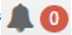

title: Sistema
Description:Sistema
# Sistema

Acessando o sistema

!!! warning "ATENÇÃO"

    Esta solução pode ser integrado ao sistema de autenticação utilizado por sua
    instituição, neste caso, o usuário e senha seriam os mesmos utilizados para
    acessar a sua rede de dados corporativa. Para este treinamento, o instrutor
    irá informar (em sala de aula) o seu usuário e senha.

O acesso ao sistema CITSmart GRP está condicionado primeiramente ao usuário ter
as permissões necessárias para desempenhar suas atividades.

Primeiramente abra o navegador, preferencialmente o Google Chrome, e informe a
URL (endereço web para acesso a aplicação pré-definido pela sua instituição).

Será a apresentada a tela de Login do CITSmart GRP, conforme ilustrada na figura
a seguir:

   

   **Figura 1 - Tela de Login**

Para acessar o sistema, preencha os campos com suas credenciais de acesso
(Usuário e Senha), logo após clique na seta , e será apresentado a tela baixo:

   

   **Figura 2 - Tela do Sistema**

Nesta tela o usuário terá acesso aos seguintes itens:

**Menu**: Ao clicar em Menu, o usuário terá acesso a todas funcionalidades do
sistema, de acordo com o seu perfil pré-definido.

**Busca**: “Não achou o que Procura?” Neste espaço o usuário poderá pesquisar o
nome de um Menu ou Funcionalidade.

   

   **Figura 3 - Opção "Não achou o que procura?"**

**Favoritos**: Neste ícone o usuário poderá “Favoritar” as telas, para que o
sistema as adicione aos seus favoritos. Ao clicar no ícone  o usuário poderá
visualizar todas as telas adicionadas, conforme ilustrado abaixo:

   

   **Figura 4 - Favoritos**

**Alertas e Notificações** : Os Alertas e Notificações poderão ser visualizados
na barra superior do sistema, conforme imagem abaixo;

   
    
   **Figura 5 - Alertas e Notificações**

No canto superior direito, serão exibidas as seguintes informações: Órgão;
Unidade Gestora (UG); Unidade Administrativa e/ou Localizadora da UG e Nome do
Usuário “logado”.

   
    
   **Figura 6 - Painel Informativo**

Ao clicar na seta abaixo do nome de usuário, o sistema apresentará as opções de
Idioma, Redefinir Senha, Sair e Sobre onde é possível verificar a versão do
sistema que está sendo utilizada.

   
    
   **Figura 7 - Menu Usuário**

Ao clicar em “Português”, serão apresentados os idiomas disponíveis.

Ao clicar em “Redefinir Senha”, o sistema apresentará a seguinte tela:

   
    
   **Figura 8 - Redefinir Senha**

Nesta tela o usuário deverá preencher o campo “Senha Antiga” e logo após
informar a “Nova Senha” e “Confirmar a Nova Senha”. Em seguida o usuário deverá
clicar em  , para que o sistema armazene a nova senha.

   !!! warning "ATENÇÃO"

        A opção “Redefinir Senha” somente funcionará se o usuário estiver cadastrado
        direto no sistema/banco, caso o GRP esteja integrado com sistemas de
        autenticação (exemplo: LDAP, AD), as senhas deverão ser alteradas/geridas
        por meio desses sistemas.

Ao clicar na opção “**Sobre**” o sistema apresentará a seguinte tela:

   

   **Figura 9 - Sobre**

   !!! warning "ATENÇÃO"

        Para solicitar suporte, informe a versão que está em produção na sua
       instituição para agilizar o atendimento.

Para finalizar a sessão do sistema, basta que o usuário clique na opção “Sair”,
conforme ilustrado abaixo:

   
    
   **Figura 10 - Sair do sistema**

   !!! warning "ATENÇÃO"

        Cada módulo é identificado por uma cor (cor da fonte/letra no menu principal
        e cor das abas), o que visa facilitar a identificação de cada módulo, caso o
        usuário do sistema opere com mais de um módulo.

**Figura 11 - Cor de cada módulo**

!!! tip "About"

    <b>Product/Version:</b> CITSmart | 8.00 &nbsp;&nbsp;
    <b>Updated:</b>08/14/2019 – Anna Martins

