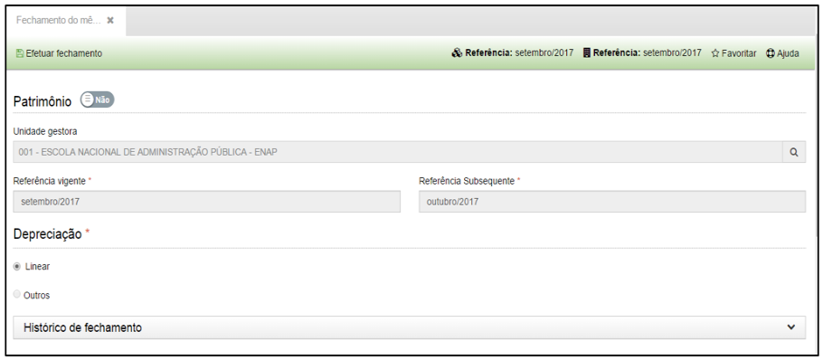
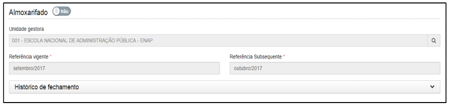

title: Fechamento do mês de referência
Description: Fechamento do mês de referência

# Fechamento do mês de referência

Como acessar
------------

Em “Administração de Materiais”, clique em “Fechamento do mês de referência” no
submenu “Financeiro”.

Como fechar
-----------

Ao clicar aparecerá a seguinte tela:

   
   
   
   
   **Figura 1 - Fechamento**

Escolha entre as opções de fechamento dos módulos e clique no botão “Efetuar
Fechamento”.

Ao clicar nesse botão e confirmar o fechamento do mês de referência não será
possível reabri-lo novamente.

Portanto, só execute essa ação quando você tiver certeza de que todos os seus
lançamentos estão corretos.

!!! tip "About"

    <b>Product/Version:</b> CITSmart | 8.00 &nbsp;&nbsp;
    <b>Updated:</b>08/16/2019 – Anna Martins
