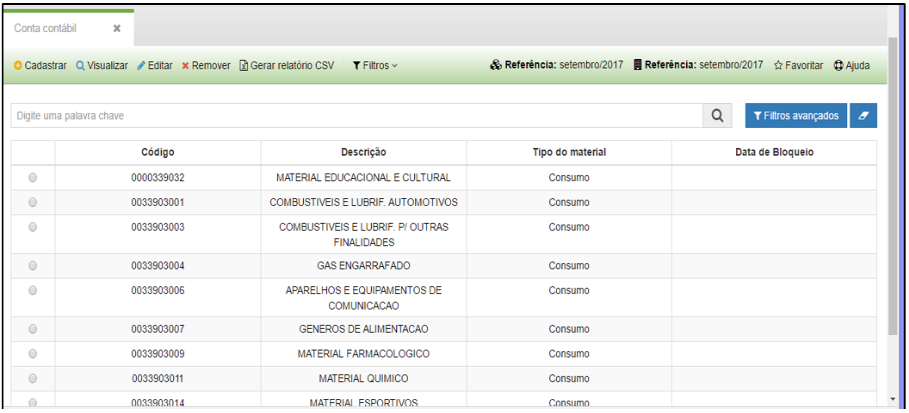
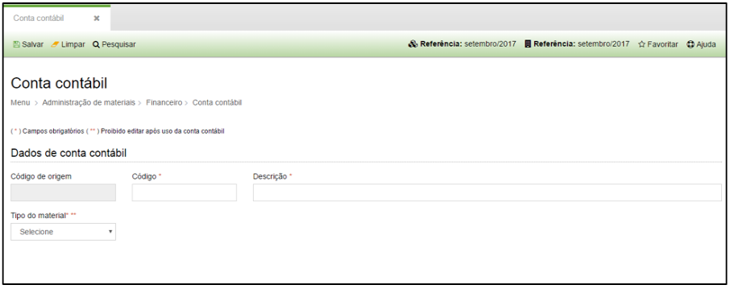

title: Cadastro e pesquisa de conta contábil
Description: Cadastro e pesquisa de conta contábil

# Cadastro e pesquisa de conta contábil

Como acessar
------------

Em “Administração de Materiais”, clique em “Conta contábil” no submenu
“Financeiro”.

Como cadastrar
--------------

Aparecerá a seguinte tela:

   
   
   **Figura 1 - Submenu Financeiro**

-   **Cadastra**r: permite cadastrar uma conta contábil.

-   **Visualizar**: permite visualizar o cadastro de uma conta contábil
    selecionada.

-   **Editar**: permite editar as informações de uma conta contábil selecionada.

-   **Remover**: permite remover um cadastro de uma conta contábil selecionada.

-   **Filtros**: permite configurar filtros específicos.

Ao clicar em cadastrar, o sistema apresentará a seguinte tela:

   
   
   
   
   **Figura 2 - Conta Contábil**

-   **Código de origem**: o sistema preencherá automaticamente este código.

-   **Código**: o código da conta contábil especificado no plano de contas
    aplicada ao setor público.

-   **Descrição**: título relacionado ao código da conta contábil.

-   **Tipo de material**: selecione o tipo de material relacionado a conta
    contábil que está cadastrando.

    -   Escolha entre “permanente” para bens móveis permanentes e “consumo” para
        materiais de consumo.

-   Ao selecionar “permanente” o sistema apresentará outros campos para serem
    preenchidos, conforme destacado a seguir:

    -   **Método**: escolha o método de dedução do valor residual do bem:
        depreciação ou amortização, e quando se tratar de contas para cessão de
        bens e transferência externa escolha o tipo de conta.

    -   Ao selecionar o método como depreciação deverão ser preenchidos os
        seguintes campos, conforme definido pelo Tesouro Nacional:

        -   Vida útil do bem (em meses);

        -   Taxa mensal de depreciação (0 a 100%);

        -   Não depreciável (0 a 100%).

!!! tip "About"

    <b>Product/Version:</b> CITSmart | 8.00 &nbsp;&nbsp;
    <b>Updated:</b>08/16/2019 – Anna Martins
