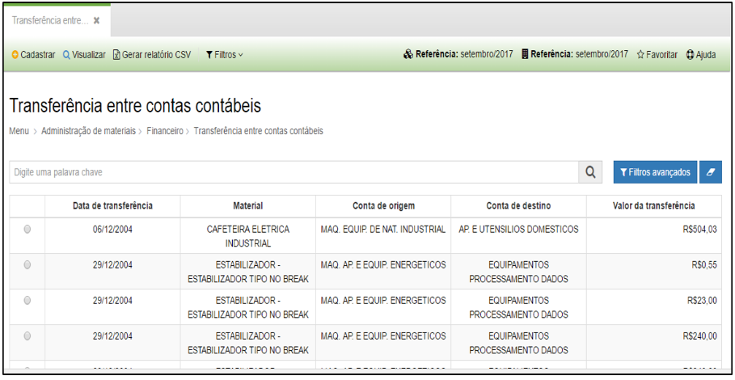
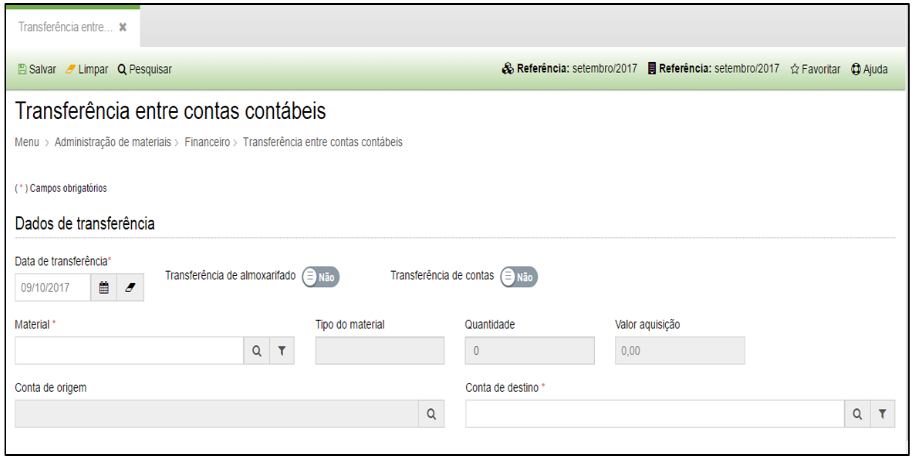

title: Transferência entre contas contábeis

Description: Transferência entre contas contábeis

# Transferência entre contas contábeis

Como acessar
------------

Em “Administração de Materiais”, clique em “Transferência entre contas
contábeis” no submenu “Financeiro”.

Como transferir
---------------

O sistema apresentará a seguinte tela:

   
   
   **Figura 1 - Listagem para Transferência**

-   **Cadastrar**: permite cadastrar uma transferência entre contas contábeis.

-   **Visualizar**: permite visualizar uma transferência entre contas contábeis
    selecionada.

-   **Filtros**: permite configurar filtros específicos.

Ao clicar em “Cadastrar”, o sistema apresentará a seguinte tela:

   

   **Figura 2 - Salvar Transferência**

-   **Data de transferência**: selecione a data da transferência entre contas a
    ser cadastrada. Lembre-se que esta data deverá estar situada dentro do mês
    de referência vigente.

    -   a opção “Transferência de almoxarifado” só deve ser definida como “Sim”
        quando for necessário realizar uma transferência entre contas do
        almoxarifado.

    -   a opção “Transferência de contas” só deve ser definida como “Sim” quando
        for necessário transferir todo o saldo de uma conta contábil para uma
        outra. Nessa opção todo o saldo será transferido.

-   Se nenhuma das opções acima for definida como “sim” o sistema permitirá que
    seja realizado a transferência de um material (a ser selecionado) de uma
    conta de origem para uma nova conta de destino.

!!! tip "About"

    <b>Product/Version:</b> CITSmart | 8.00 &nbsp;&nbsp;
    <b>Updated:</b>08/16/2019 – Anna Martins
