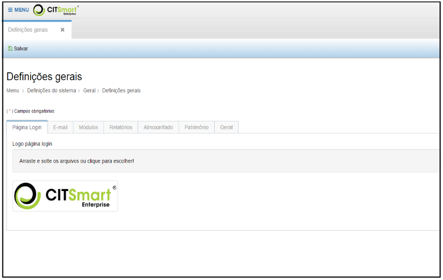
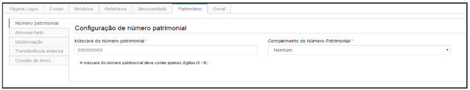

title: Definições gerais

Description: Permite efetuar configurações relacionadas a configurações gerais,
segurança (usuários e grupos), domínios e configurações de conteúdo.

# Definições gerais

O **Menu Definições** do Sistema, permite efetuar configurações relacionadas a
configurações gerais, segurança (usuários e grupos), domínios e configurações de
conteúdo.

Para acessá-lo basta clicar em **Menu** e logo após em “**Definições do
Sistema**”, conforme abaixo:

**Figura 1 - Opções do Menu Definições do Sistema**

Definições gerais
-----------------

Esta funcionalidade envolve a configuraçãoes sobre a forma como o software deve
se comportar em situações pré-estabelecidas.

Ao clicar em “**Definições Gerais**” do submenu “**Geral**”, o sistema
apresentará a seguinte tela:

-   A aba “**Página Login**” permite alterar o logotipo que aparece na página
    inicial e na barra de ferramentas superior do sistema.

    
    
    **Figura 2 - Definindo Configurações Gerais**

-   A aba “**E-mail**” permite configurar o serviço para envio de mensagens
    (e-mails) automáticas do sistema para envio de alertas e notificações. As
    configurações devem ser requisitadas para o Administrador de Infraestrutura
    do cliente.

    
    
    **Figura 3 - Aba E-mail**

-   A aba “**Módulos**” permite configurar o modo execução de cada módulo (por
    scripts, por carga inicial, por internacionalização).

-   A aba “**Relatórios**” permite configurar/alterar o cabeçalho e do logotipo
    que aparecem em todos os documentos gerados no sistema (termos e
    relatórios).

    
    
    **Figura 4 - Aba Relatórios**

-   A aba “**Geral**” permite definir a padronizaçães que podem ser usadas em
    todo o sistema.

   Campo **Máscara do número de identificação da operação**: Define (máscara)
   da numeração automática utilizada em termos, formulários e outros.

   Campo **Tempo para a gravação do rascunho em segundos**: Para as
   funcionalidades que permitem a gravação de rascunhos, define a periodicidade
   em que os rascunhos serão salvos.

   Campo **Exibir mensagem de confirmação da gravação do rascunho**: Se for
   marcada essa opção, uma mensagem será exibida na tela a cada vez que um
   rascunho for salvo.

   Campo **Confirma antes de fechar a aba**: A cada vez que uma aba for fechada
   uma mensagem será exibida exigindo a confirmação do usuário.

   Campo **Download automático dos relatórios**: A cada vez que for solicitada
   a emissão de um relatório, o sistema iniciará também automaticamente o
   download do mesmo.

   Campo **Ativar classificação de materiais**: Caso o cliente utilize o módulo
   de administração de materiais e queira utilizar a classificação de materiais
   ele deve marcar essa opção.

    
    
    **Figura 5 - Aba Geral**

-   A aba “**Almoxarifado**” permite definir configurações pertinentes a esse
    módulo.

   Campo **Tipo de avaliação monetária de estoque**: O módulo permite dois
   tipos dentre os mais usados no mercado Média móvel e FIFO.

   Campo **Unidade de Medida de Entrada**: O módulo permite escolher entre duas
   opções “Permitir múltiplas unidades de medida de entrada” ou “Considerar a
   mesma unidade de medida de armazenamento”.

   Campo **Verificar preço médio de entrada de materiais (0-100%)**: Configurar
   o percentual de diferença aceitável entre o preço de entrada de novos
   materiais e o preço atual do material.

   Campo **Conta de saída de requisição externa**: Conta contábil utilizada
   para saída de saldo na funcionalidade requisição externa de almoxarifado.

   Campo **Conta de entrada de requisição externa**: Conta contábil utilizada
   para entrada de saldo na funcionalidade requisição externa de almoxarifado.

   **Configuração de Ressuprimento**

   Campo **Tempo de aquisição (em meses)**: Período entre a emissão do pedido
   de compra e o recebimento do produto no almoxarifado.

   Campo **Intervalo de aquisição (em meses)**: Período entre duas aquisições
   normais e sucessivas.

   Campo **Estoque de segurança (0-100%)**: Quantidade mínima para atendimento
   até a próxima aquisição somada da porcentagem do estoque de segurança.

   Campo **Notificar: **Escolher o tipo de notificação, Usuário ou Grupo.

   Campo **Usuário**: Caso tenha escolhido a notificação por usuário, informar
   o usuário que deverá ser notificado.

   Campo **Notificar por e-mail**: A notificação sempre ocorrerá pelo portal do
   CITSmart GRP, mas pode também ocorrer por e-mail caso o cliente desejar.

    

    **Figura 6 - Aba Almoxarifado**

-   A aba “**Patrimônio**” permite definir configurações pertinentes a esse
    módulo.

   **Número Patrimonial**

   Campo **Máscara do número patrimonial**: Quantidade de dígitos que o número
   patrimonial pode ter.

   Campo **Complemento do número patrimonial**: Opções Nenhum, Dígito e
   Prefixo, Dígito e Sufixo, Dígito Verificado, Prefixo, Prefixo e Sufixo,
   Sufixo, Todos.

    
    
    **Figura 7 - Aba Patrimônio (Número Patrimonial)**

   **Almoxarifado**

   Campo **Conta almoxarifado**: Conta contábil para os bens que estão em
   estoque.

    
    
    **Figura 8 - Aba Patrimônio (Almoxarifado)**

   **Depreciação**

   Campo **Método de depreciação em Reavaliação/Redução**: Escolher entre
   Reiniciar depreciação e Dar entrada da depreciação acumulada.

   Campo **Método de movimentação em conta de Reavaliação/Redução**: Escolher
   entre Dar entrada/saída da diferença entre o valor antigo e novo e Dar saída
   do valor antigo e entrada do novo.

    
    
    **Figura 9 - Aba Patrimônio (Depreciação)**

   **Transferência externa**

   Campo **Tipo da transferência externa**: Escolher entre Transferência do bem
   será pelo valor bruto contábil ou Transfere apenas o valor líquido.

   Campo **Conta origem**: Conta contábil de bens em trânsito na origem.

   Campo **Conta destino**: Conta contábil de bens a receber no destino.

    
    
    **Figura 10 - Aba Patrimônio (Transferência externa)**

   **Cessão de bens**

   Campo **Conta de Cessão**: Escolher conta contábil de entrada dos bens
   cedidos por terceiros.

   Campo **Conta de saída de Cessão**: Escolher conta contábil de saída para os
   bens cedidos a terceiros.

    
    
    **Figura 11 - Aba Patrimônio (Cessão de bens)**

As alterações realizadas em “**Definições Gerais**” poderão ser salvas clicando
no botão “**Salvar**”.

!!! info "IMPORTANTE"

   As abas Almoxarifado e Patrimônio só serão exibidas caso o cliente tenha os
   módulos em questão.

!!! tip "About"

    <b>Product/Version:</b> CITSmart | 8.00 &nbsp;&nbsp;
    <b>Updated:</b>08/14/2019 – Anna Martins
