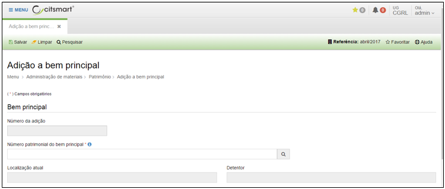
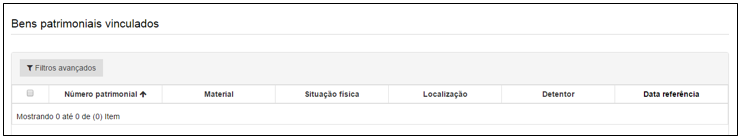

title: Adição a bem patrimonial
Description: Adição a bem patrimonial

# Adição a bem patrimonial

Como acessar
------------

Em “Administração de Materiais”, clique em “Adição a bem principal” no submenu
“Patrimônio”, para iniciar a adição a bem patrimonial.

Preenchimento dos campos cadastrais
-----------------------------------

Ao clicar em “Cadastrar”, o sistema apresentará a seguinte tela:
    
   
    
  **Figura 1 - Tela de cadastro de bens patrimoniais**
   
   

  **Figura 2 - Tela de listagem de bens patrimoniais vinculados**

Preencha os campos do formulário conforme instruções abaixo:

-   **Número da adição**: o sistema preencherá automaticamente o número da
    adição patrimonial.

-   **Número patrimonial do bem principal**: informe o número do patrimônio do
    bem principal.

-   **Localização atual**: o sistema preencherá automaticamente a localização
    atual do bem principal.

-   **Detentor**: o sistema preencherá automaticamente o detentor responsável
    pelo bem principal.

Após informar estes dados o campo “Bem patrimonial” ficará habilitado para
pesquisar e incluir o bem que será adicionado ao bem principal.

Após informar o número ou nome do bem, e teclar ENTER, o sistema inclui
automaticamente o bem informado em uma lista.

Finalizado o preenchimento dos campos obrigatórios, clique em “Salvar” para
armazenar os dados.

!!! tip "About"

    <b>Product/Version:</b> CITSmart | 8.00 &nbsp;&nbsp;
    <b>Updated:</b>08/15/2019 – Anna Martins
