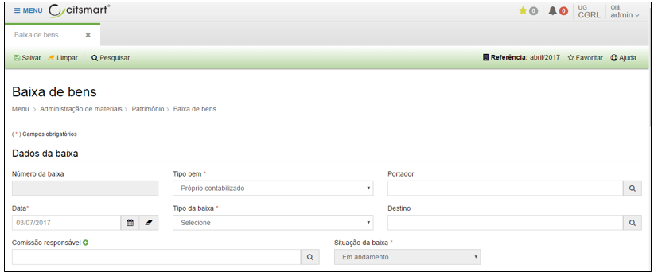
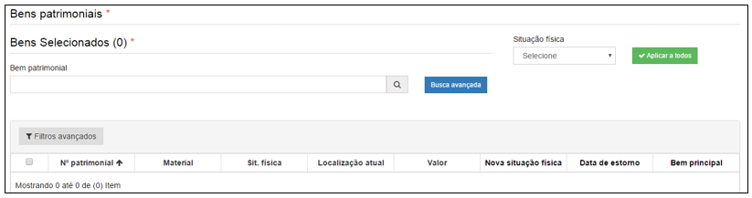

title: Baixa de bens
Description: Baixa de bens

# Baixa de bens

Como acessar
------------

Em “Administração de Materiais”, clique em “Baixa de bens” no submenu
“Patrimônio”, para iniciar o registro de baixa de bens.

Ao clicar em “Cadastrar”, o sistema apresentará a seguinte tela:

   

**Figura 1 - Tela de baixa de bens**
   
   

**Figura 2 - Tela de baixa de bens (continuação)**

Preencha os campos do formulário conforme instruções abaixo:

-   **Número da baixa**: o sistema preencherá automaticamente o número da baixa;

-   Selecione o tipo do bem.

-   Digite o nome do portador e o sistema realizará a busca no banco de dados.

-   **Data**: o sistema exibirá a data do dia da baixa

-   Selecione o tipo da baixa.

-   Selecione a situação do bem.

Após informar estes dados o campo “Bem patrimonial” ficará habilitado para
pesquisar e incluir o bem que será realizada a baixa.

Ao digitar o número ou nome do bem patrimonial no campo “Bem patrimonial”, o
sistema apresentará uma lista de bens do mesmo tipo informado.

!!! tip "About"

    <b>Product/Version:</b> CITSmart | 8.00 &nbsp;&nbsp;
    <b>Updated:</b>08/15/2019 – Anna Martins
