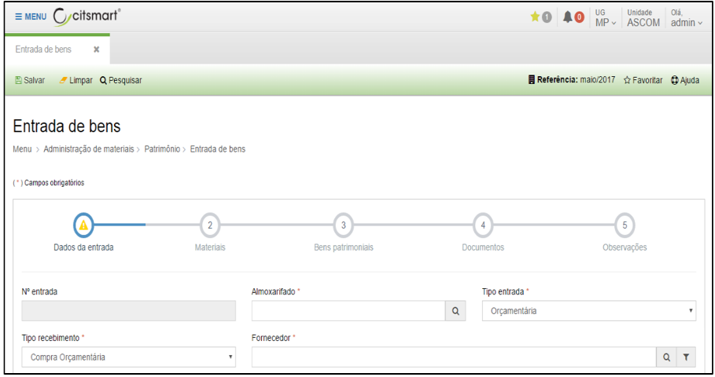

title: Entrada de bens
Description: Entrada de bens

# Entrada de bens

Como acessar
-----------

Em “Administração de Materiais”, clique em “Entrada de bens” no submenu
“Patrimônio”, para iniciar o registro de uma entrada.

Como cadastrar
------------

Serão apresentadas as seguintes opções:

-   **Cadastrar**: permite cadastrar uma nova entrada de bens.

-   **Visualizar**: permite visualizar as informações cadastradas de uma entrada
    selecionada.

-   **Editar**: permite editar dados de uma entrada de bem, desde que, a entrada
    selecionada não tenha sido contabilizada; tenha data igual ou superior ao
    mês de referência, e/ou não tenha havido movimentação de bens relacionados a
    entrada em questão.

-   **Remover**: permite remover uma entrada de bem selecionada. OBS: uma
    entrada de bem somente poderá ser removida caso não haja nenhuma
    movimentação com os bens incorporados pela entrada de bem em questão. Se a
    entrada estiver contabilizada ela só poderá ser excluída dentro do mês de
    referência.

-   **Relatório analítico**: permite gerar um relatório analítico de uma entrada
    de bem.

-   **Relatório sintético**: permite gerar um relatório sintético de uma entrada
    de bem.

-   **Filtros**: permite criar /salvar filtros específicos para utilização
    futura.

Ao clicar em “Cadastrar”, o sistema apresentará a tela abaixo. Preencha os
campos da 1ª tela do formulário “Entrada de bens” conforme instruções a seguir:

   
   
   
   
   **Figura 1 - Entrada de Bens**

Dados da entrada:

-   **Nº entrada**: o número de entrada será preenchido automaticamente pelo
    sistema.

-   **Almoxarifado**: campo busca que permite selecionar o almoxarifado que será
    utilizado para o registro da entrada. Caso exista um almoxarifado definido
    como padrão, o sistema já apresentará o campo preenchido com essa opção.

-   **Tipo de entrada**: selecione o tipo de entrada: orçamentária e
    extra-orçamentária.

-   **Tipo de recebimento**: está vinculado ao tipo de entrada. Para entradas do
    tipo “orçamentária” só estará habilitado o tipo de recebimento “compra
    orçamentária”. Para entradas do tipo “extra-orçamentária” estarão
    habilitados os seguintes tipos de recebimento: compra, doação, entrada por
    decisão judicial, produção interna, reincorporação de bens, reposição,
    restos a pagar, transferência fora do sistema. Outro tipos de recebimento
    poderão ser parametrizados conforme necessidade do órgão.

-   **Fornecedor**: campo busca que permite selecionar o fornecedor da entrada
    de bens;

-   **Data de registro**: a data de registro será a mesma do dia do registro e
    será preenchida automaticamente pelo sistema;

-   **Data de recebimento**: a data de recebimento pode ser a mesma data do
    registro. Ela deverá estar sempre dentro do mês de referência.

-   **Data de contabilização**: será informada ao final do cadastro da entrada;

Preencha os campos da 2ª tela do formulário “Entrada de bens” conforme
instruções a seguir:

   
   
   **Figura 2 - Segunda Etapa**

Materiais:

-   **Valor total da nota**: informar o valor total constante na Nota Fiscal;

-   **Valor dos materiais adicionados**: o sistema informará automaticamente
    (conforme dados dos itens adicionados);

Ao clicar em “Adicionar”, será possível informar os materiais que deverão ser
adicionados nesta entrada, conforme figura abaixo:

   
   
   **Figura 3 - Adição de Materiais**

Preencha os campos deste formulário conforme instruções abaixo:

-   **Material**: selecione o nome do bem material conforme informado na Nota
    Fiscal e conforme lista de materiais cadastrada.

-   **Quantidade**: informe a quantidade de itens/bens adquiridos;

-   **Valor total do material**: informe o valor total do item/bem conforme Nota
    Fiscal.

-   **Valor unitário**: o sistema preencherá automaticamente o valor unitário.

-   **Nº patrimonial inicial**: informe o número inicial para tombamento do bem.
    OBS: O sistema apresenta por “default” o próximo número patrimonial
    disponível no sistema.

-   **Situação física**: selecione a situação física do bem adquirido.

-   **Status**: selecione o status do bem: utilizado ou disponível. O sistema
    apresenta por “default” a opção “Disponível”.

-   **Início da garantia**: informe, se houver, a data de início da garantia.

-   **Término da garantia**: informe, se houver, a data final da garantia.

Caso nas **Definições Gerais** o sistema esteja configurado para que o número
patrimonial tenha complementos, os complementos serão exibidos na adição do
material conforme configuradoes, e não poderão ser editados.

   
   
   **Figura 4 - Adição de Materiais (Prefixo\\Sufixo\\Dígito)**

Após o preenchimento dos campos, clique em “Salvar” para incluir as informações
cadastradas.

Após inserir todos os materiais que constam da nota fiscal, clique em “Próximo”
para ir para a 3ª etapa da entrada de bens, conforme a tela abaixo:

   
   
   **Figura 5 - Terceira Etapa**

Caso seja necessário editar ou complementar os campos da 3ª tela do formulário
“Entrada de bens”, selecione o material e o sistema apresentará a lista dos bens
patrimoniais referente ao material selecionado.

Selecione um item para realizar as ações desejadas.

Se não existirem necessidades de edição, basta clicar em próximo para ir para a
4ª etapa.

   
   
   **Figura 5 - Quarta Etapa**

Preencha os campos da 4ª tela do formulário “Entrada de bens” conforme
instruções a seguir:

-   **Tipo de documento**: selecione o tipo de documento a ser associado a
    entrada;

-   **Data de emissão**: informe a data de emissão do documento conforme
    indicado no documento físico/original;

-   **Nº do documento**: informe o nº do documento conforme indicado no
    documento físico/original;

-   **Emissor**: informe o nome do emissor do documento conforme indicado no
    documento físico/original;

-   **Arquivo**: anexe o documento original digitalizado.

    !!! note "NOTA"

        Toda entrada deverá ter pelo menos um documento associado.

Após o preenchimento das telas do formulário “Entrada de bens” em “Concluir
entrada” selecione “Concluir e contabilizar” para que a entrada de bens seja
efetivada e contabilizada.

Ou selecione “Concluir” para que a entrada seja salva, exceto a data de
contabilização.

!!! info "IMPORTANTE"

    Movimentações de bens poderão ser realizadas apenas para os bens oriundos
    de entradas já contabilizadas.

!!! tip "About"

    <b>Product/Version:</b> CITSmart | 8.00 &nbsp;&nbsp;
    <b>Updated:</b>08/15/2019 – Anna Martins
