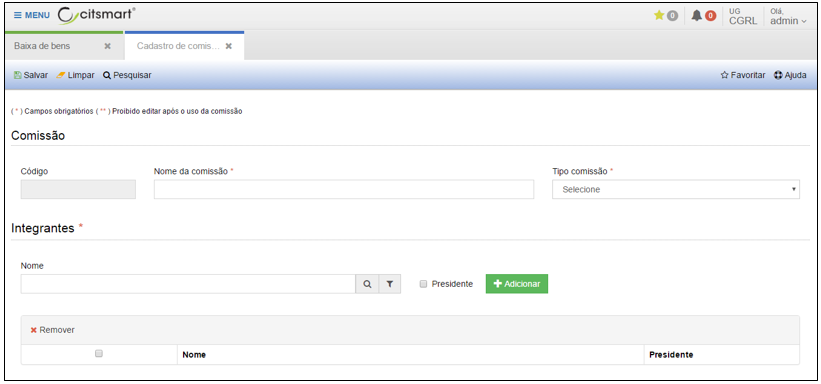

title: Inventário de bens
Description: Inventário de bens

# Inventário de bens

Antes de apresentarmos as funcionalidades de inventário, vamos aprender a
cadastrar uma comissão. Assim, siga as instruções a seguir.

Como acessar
------------

No menu principal, em “Corporativo”, clique em “Cadastro de comissões” no
submenu “Comissão. Ao clicar em “Cadastrar”, o sistema apresentará a seguinte
tela:

   
    
   **Figura 1 - Tela de cadastro de comissão**

Preencha os campos do formulário conforme instruções abaixo:

-   **Código**: o sistema preencherá automaticamente o código.

-   **Nome da comissão**: nome para a comissão a ser cadastrada.

-   **Tipo de comissão**: selecione o tipo de comissão (Desfazimento ou
    Inventário)

-   Digite o nome do integrante no campo “Nome” em seguida clique em “Adicionar”
    e o sistema incluirá o nome na lista de integrantes. Neste campo podem ser
    incluídos vários integrantes.

-   Marque a opção “Presidente” caso o integrante seja o responsável pela
    comissão e clique em “Adicionar”.

Após o preenchimento de todos os campos da tela, clique em “Salvar” para que o
sistema armazene as informações cadastradas.

Agora que já sabemos como cadastrar uma comissão de inventário, sigas as
próximas instruções para cadastrar, visualizar, editar e realizar outras
operações referentes a inventário.

Em “Administração de Materiais”, clique em “Inventário de bens” no submenu
“Inventário”.

Ao clicar em “Cadastrar”, o sistema apresentará a seguinte tela:

   
    
   **Figura 2 - Tela de cadastro de inventário**

-   Informe o nome do Inventário.

-   Adicione uma comissão. Este campo é obrigatório somente para inventários do
    tipo “Anual”. Caso não tenha nenhuma comissão cadastrada, clique no símbolo
    “+” para adicionar uma comissão responsável pelo inventário.

-   Selecione o tipo de inventário a ser realizado.

-   Selecione o objetivo do inventário.

-   Informe “Data de início” e “Data prevista fim” do inventário.

-   Após o preenchimento dessas informações, clique no botão “Carregar
    estruturas”. Selecione as estruturas ou clique em “selecionar todas” para
    incluir todas as estruturas existentes.

Clique na estrutura para mostrar os bens a se inventariar. Selecione o bem
patrimonial e clique na opção a ser realizada: inventariar:

-   visualizar inventariado;

-   editar inventariado;

-   visualizar inconsistências

-   informar novo bem patrimonial

-   relatório inventário por estrutura

Ao término das ações do inventário, clique em “Fechar inventário” para
finalizar. Relatório inventário vazio: o sistema emite um modelo de relatório
sem informações para realizar um inventário manual.

!!! tip "About"

    <b>Product/Version:</b> CITSmart | 8.00 &nbsp;&nbsp;
    <b>Updated:</b>08/15/2019 – Anna Martins
