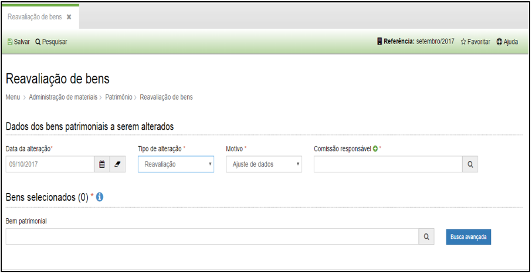

title: Reavaliação de bens

Description: Reavaliação de bens

# Reavaliação de bens

Como acessar
------------

Em “Administração de Materiais”, clique em “Reavaliação de Bens” no submenu
“Patrimônio”, para iniciar o registro de um processo de reavaliação de bens.

Como reavaliar
--------------

Ao clicar em “Cadastrar”, o sistema apresentará a seguinte tela:
    
    
    
    **Figura 1 - Reavaliação**

Preencha os campos do formulário conforme instruções abaixo:

-   **Data da alteração**: preencha com a data referente ao processo de
    reavaliação. Lembre-se que a data informada deverá estar dentro do mês de
    referência vigente;

-   **Tipo de alteração**: você poderá optar por dois tipos: reavaliação ou
    redução;

-   **Motivo**: selecione o motivo para efetuar a reavaliação do bem;

-   **Comissão Responsável**: selecione a comissão de reavaliação de bens
    responsável.

Após informar estes dados o campo “Bem patrimonial” ficará habilitado para
pesquisar e incluir o(s) bem (s) que serão incluídos no processo de reavaliação.

Ao digitar o número ou nome do bem patrimonial no campo “Bem patrimonial”, o
sistema apresentará uma lista de bens do mesmo tipo informado.

!!! tip "About"

    <b>Product/Version:</b> CITSmart | 8.00 &nbsp;&nbsp;
    <b>Updated:</b>08/15/2019 – Anna Martins
