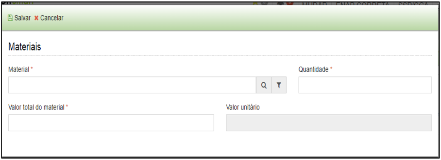

title: Entrada de cessão
Description:Entrada de cessão

# Entrada de cessão

Como acessar
------------

Em “Administração de Materiais”, clique em “Entrada de Cessão” no submenu
“Patrimônio”.

Como manter cessão
------------------

Para iniciar o registro de uma entrada. Serão apresentadas as seguintes opções:

-   **Cadastrar**: permite cadastrar uma nova entrada de cessão.

-   **Visualizar**: permite visualizar as informações cadastradas de uma entrada
    selecionada.

-   **Editar**: permite editar dados de uma entrada de cessão, desde que não
    tenha havido movimentação de bens relacionados a entrada em questão.

-   **Remover**: permite remover uma entrada de bem selecionada. OBS: uma
    entrada de cessão somente poderá ser removida caso não haja nenhuma
    movimentação.

-   **Filtros**: permite criar /salvar filtros específicos para utilização
    futura.

Ao clicar em “Cadastrar”, o sistema apresentará a tela abaixo. Preencha os
campos da 1ª tela do formulário “Entrada de Cessão” conforme instruções a
seguir:

Dados da entrada:

-   **Nº da cessão**: o número de cessão será preenchido automaticamente pelo
    sistema.

-   **Tipo de entrada**: o tipo de entrada será preenchido automaticamente pelo
    sistema como “entrada de cessão”.

-   **Almoxarifado**: selecionar o almoxarifado onde será dada a entrada de
    cessão.

-   **Origem**: selecionar o órgão de origem da entrada de cessão.

-   **Data de início da cessão**: informar a data de início da cessão de bem;

-   **Data de finalização da cessão**: informar a data fim da cessão de bem;

Preencha os campos da 2ª tela do formulário “Entrada de Cessão” conforme
instruções a seguir:

   
   
   
   
   **Figura 1 - Cessão**

Materiais:

-   **Valor total da nota**: informar o valor da nota (ou termo) dos bens em
    cessão.

-   **Valor dos materiais adicionados**: o sistema calculará automaticamente o
    valor dos materiais adicionados.

Após informar o valor total da nota, clique em “Adicionar” e será aberto uma
tela semelhante a apresentada a seguir:

   
   
   **Figura 2 - Material cedido**

-   **Material**: selecione o tipo de material que deseja realizar a entrada de
    cessão.

-   **Quantidade**: informe a quantidade do material;

-   **Valor total do material**: informe o valor total dos materiais

-   **Valor unitário**: após informar o valor total do material e a quantidade o
    sistema calculará o valor unitário do material.

Após inserir todos os materiais que compõem o termo de cessão de bens, clique na
3ª etapa da tela de entrada de cessão para continuar o preenchimento, conforme
demonstrado a seguir:

   
   
   **Figura 3 - Terceira Etapa**

Bens patrimoniais:

-   **Entrada de Item**: da lista de materiais informados anteriormente,
    selecione aquele para o qual deseja informar os números patrimoniais.

-   **Bens patrimoniais**: após selecionar o material o sistema apresentará em
    bens patrimoniais uma lista dos bens que compõem a cessão de bens para que
    você informe:

    -   **Número patrimonial**: informar o número patrimonial do bem em cessão;

    -   **Situação física**: informar a situação física do bem em cessão;

    -   **Status**: o status do bem já vem preenchido como “em cessão”;

As duas outras abas restantes são as abas de “Documentos” onde você poderá
anexar todos os documentos vinculados à entrada de cessão e incluir observações.

!!! tip "About"

    <b>Product/Version:</b> CITSmart | 8.00 &nbsp;&nbsp;
    <b>Updated:</b>08/15/2019 – Anna Martins
