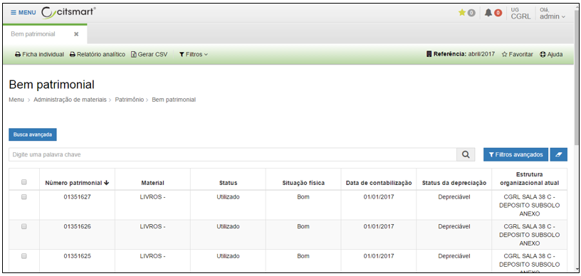
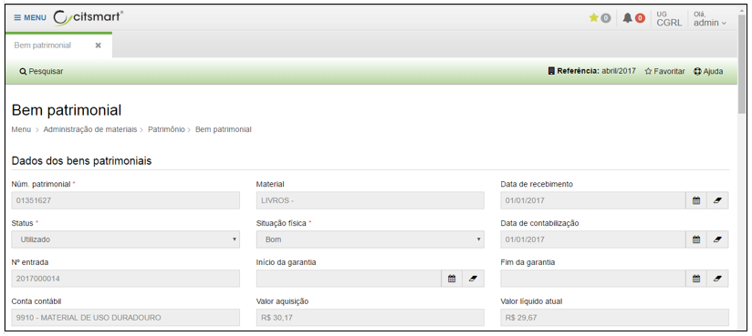
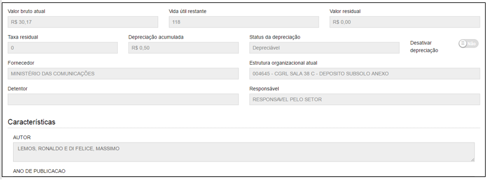

title: Consulta e alteração de bem patrimonial
Description:Consulta e alteração de bem patrimonial

# Consulta e alteração de bem patrimonial

Como acessar
------------

Clique em “Bem patrimonial” no submenu “Patrimônio”, para visualizar e/ou editar
dados referentes a bens patrimoniais, bem como visualizar fichas (individual
e/ou analítica) de bens patrimoniais.

Listagem de itens
-----------------

Para ter acesso aos dados dos bens patrimoniais basta selecionar um ou mais bens
da lista e clicar na opção “visualizar”, conforme tela abaixo:

  

 **Figura 1 - Tela de listagem de bens patrimoniais**

Após clicar em “visualizar”, você terá acesso às informações do bem patrimonial
selecionado, conforme demonstrado a seguir:

   
   
   

 **Figura 2 - Tela dados de bens patrimoniais**

Além de visualizar e editar os dados do bem patrimonial o sistema permite a
impressão da Ficha Individual e do Relatório Analítico do bem. Selecione (na
tela principal de “Bem patrimonial”) um ou mais itens (bens patrimoniais) para
gerar a ficha individual de bens. Se selecionado mais de um bem, será
apresentada, no mesmo arquivo, a ficha individual de cada bem selecionado.

Para o relatório analítico: selecione (na tela principal de “Bem patrimonial”)
um ou mais itens (bens patrimoniais) para gerar o relatório analítico de bens.

!!! warning "ATENÇÃO"

    Se selecionado mais de um bem, será apresentado, no mesmo arquivo, o
    relatório analítico para cada bem selecionado.

!!! tip "About"

    <b>Product/Version:</b> CITSmart | 8.00 &nbsp;&nbsp;
    <b>Updated:</b>08/15/2019 – Anna Martins
