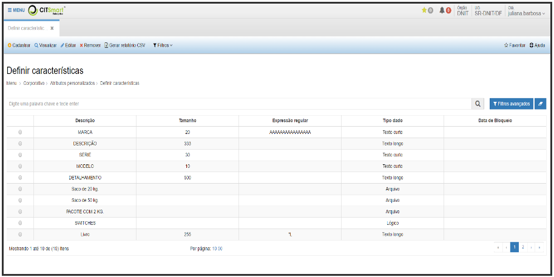
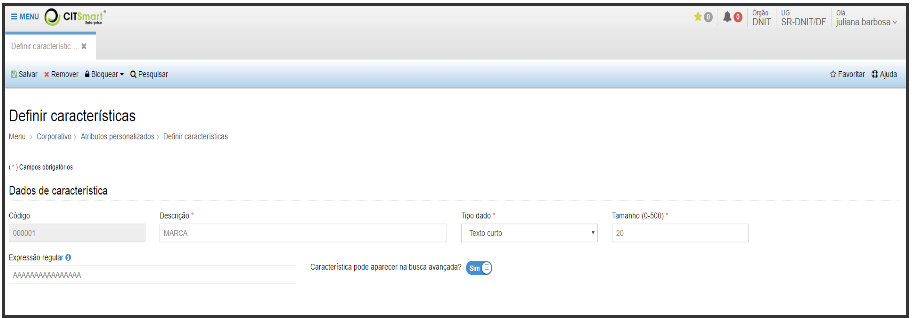
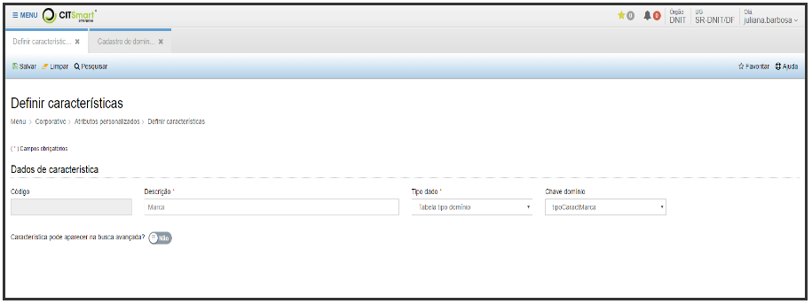

title: Definir características
Description: Definir características

# Definir características

Como acessar
------------

Em “Corporativo”, clique em “Definir características” no submenu “Atributos
personalizados”.

Como manter o cadastro de características
-----------------------------------------

A tela de lista das características já cadastradas será exibida:

  

**Figura 1 - Lista de características**

-   **Cadastrar**: permite realizar o cadastro de uma nova característica.

-   **Visualizar**: permite visualizar as informações de uma característica
    selecionada.

-   **Editar**: permite editar as informações de uma característica selecionada.

-   **Remover**: permite remover uma característica selecionada.

-   **Filtros**: permite fazer filtros específicos para a lista.

Ao clicar em “Cadastrar\\Editar\\Visualizar” o sistema apresentará a seguinte
tela:

   

 **Figura 2 - Inserção\\Edição de característica**

   

 **Figura 3 - Inserção\\Edição de característica com Tipo de dado: Tabela tipo domínio**

Preencha os campos do formulário conforme instruções abaixo:

-   **Código**: será preenchido automaticamente pelo sistema.

-   **Descrição**: descrição da característica.

-   **Tipo dado**: informar o tipo da característica entre Arquivo, Data,
    Lógico, Numérico, Tabela tipo domínio, Texto curto, Texto longo e Valor.

-   **Tamanho**: tamanho máximo do texto que será informado na característica.
    Esse campo só está disponível para os Tipos de dado: Texto curto e Texto
    longo.

-   **Expressão regular**: expressão regular que será usada para validar os
    valores informados para essa característica. Esse campo só estará disponível
    para os Tipos de dado: Numérico, Data, Texto curto, Texto longo e Valor.

-   **Característica pode aparecer na busca avançada**: escolha "Sim" para que
    essa característica esteja disponível como filtro nas buscas avançadas de
    todo o sistema.

-   **Chave domínio**: informar a chave do domínio que conterá os valores
    possíveis para a característica.

!!! tip "About"

    <b>Product/Version:</b> CITSmart | 8.00 &nbsp;&nbsp;
    <b>Updated:</b>08/15/2019 – Anna Martins
