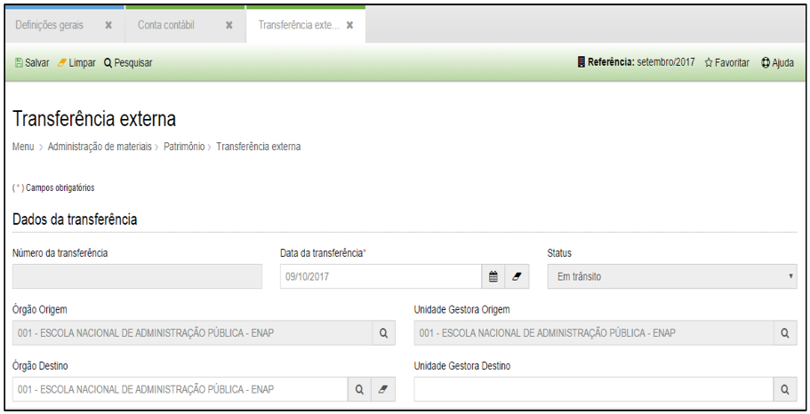
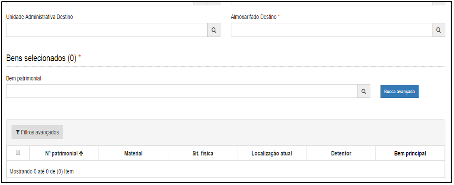
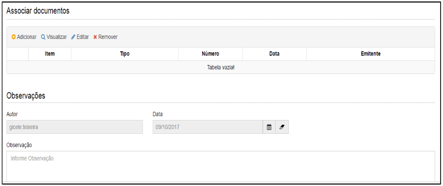

title: Transferência externa
Description: Transferência externa

# Transferência externa

Como acessar
------------

Em “Administração de Materiais”, clique em “Transferência Externa” no submenu
“Patrimônio”, para realizar uma transferência externa.

Como transferir
---------------

Ao clicar em “Cadastrar”, o sistema apresentará a seguinte tela:

 
 
 
 
 
 
 **Figura 1 - Transferência Externa**

Preencha os campos do formulário conforme instruções abaixo:

-   **Número da transferência**: o sistema preencherá automaticamente o número
    da transferência;

-   **Data da transferência**: preencha a data para a realização da
    transferência, observado que a mesma deverá estar compreendida dentro do mês
    de referência.

-   **Status**: por padrão, ao cadastrar uma transferência o sistema preencherá
    o seu status como “em trânsito”.

-   **Órgão de Origem**: por padrão, o sistema já trará como preenchido o seu
    órgão de origem;

-   **Unidade Gestora de Origem**: *por padrão o sistema tratará como
    preenchido a unidade gestora na qual o usuário está logado.

-   **Órgão Destino**: Selecione o órgão de destino para os bens incluídos na
    transferência.

-   **Unidade Gestora Destino**: após selecionar o órgão destino, defina qual a
    unidade gestora que receberá os bens.

-   **Unidade Administrativa Destino**: selecione a unidade administrativa
    destino;

-   **Almoxarifado Destino**: selecione o almoxarifado de destino.

-   **Bens selecionados**: selecione todos os bens que deverão ser transferidos
    para a unidade gestora destino.

-   **Associar documentos**: anexar os documentos inerentes à transferência
    externa.

-   **Observações**: inserir qualquer observação que você julgar necessária para
    a documentação do processo.

Após informar estes dados será possível salvar a transferência externa.

Após salva, a transferência externa será apresentada na lista de “Entradas” da
unidade gestora de destino.

!!! info "IMPORTANTE"

    Para realizar o recebimento dos bens, a unidade gestora de destino deverá
    tratar a transferência externa como uma entrada de bens e efetuar a sua
    contabilização.

!!! tip "About"

    <b>Product/Version:</b> CITSmart | 8.00 &nbsp;&nbsp;
    <b>Updated:</b>08/15/2019 – Anna Martins
