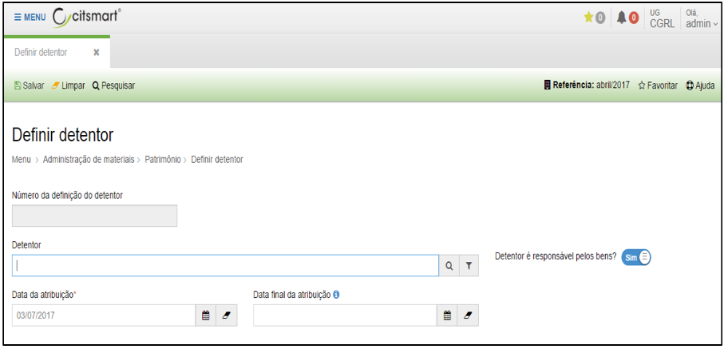
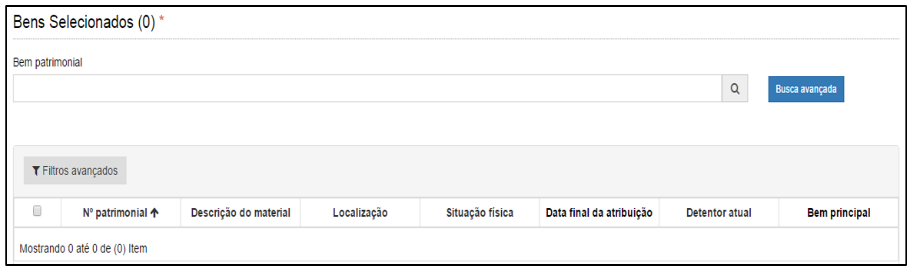

title: Definição de detentor
Description: Definição de detentor

# Definição de detentor

Como acessar
------------

Em “Administração de Materiais”, clique em “Definir Detentor” no submenu
“Patrimônio”, para definir um detentor.

Como definir
------------

Ao clicar em “Cadastrar”, o sistema apresentará a seguinte tela:

  
  
  
  
  **Figura 1 - Detentor**

Preencha os campos do formulário conforme instruções abaixo:

-   **Detentor:** responsável pelo bem.

-   **Data da atribuição**: este campo vem preenchido conforme data do registro
    da atribuição do bem a um detentor.

-   **Data final da atribuição**: data final em que o detentor será responsável
    pelo bem informado.

Após informar estes dados o campo “Bem patrimonial” ficará habilitado para
pesquisar e incluir o bem que ficará na responsabilidade do detentor.

Ao digitar o número ou nome do bem patrimonial no campo “Bem patrimonial”, o
sistema apresentará uma lista de bens do mesmo tipo informado.

Ao informar o número ou nome do bem, e teclar ENTER, o sistema incluirá
automaticamente o bem informado em uma lista.

Depois de preencher os campos clique em “Salvar” para armazenar a definição de
detentor cadastrada.

Após salvar o cadastro será possível emitir o termo de detentor.

!!! tip "About"

    <b>Product/Version:</b> CITSmart | 8.00 &nbsp;&nbsp;
    <b>Updated:</b>08/15/2019 – Anna Martins
