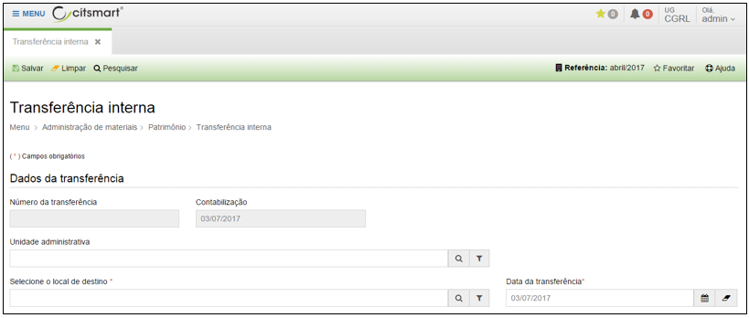
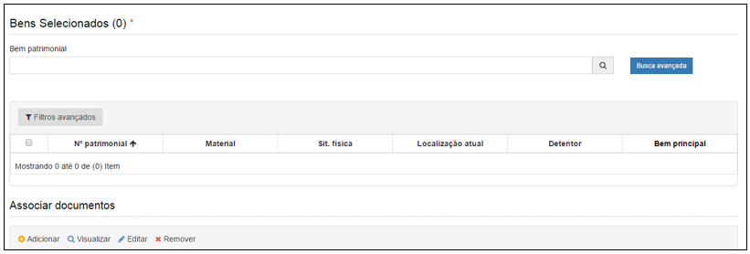

title: Transferência interna
Description: Transferência interna

# Transferência interna

Como acessar
------------

Em “Administração de Materiais”, clique em “Transferência interna” no submenu
“Patrimônio”, para iniciar o registro de uma transferência interna.

Ao clicar em “Cadastrar”, o sistema apresentará a seguinte tela:

   
   
 **Figura 1 - Tela de transferência interna**

   
   
 **Figura 2 - Tela de bens patrimoniais**

Preencha os campos do formulário conforme instruções abaixo:

-   O número da transferência e contabilização são preenchidos automaticamente
    pelo sistema.

-   Selecione o “Local de destino”;

-   Informe a “Data da transferência” (por padrão o sistema informa/sugere a
    data de “hoje”);

-   Digite o nome do bem ou o número patrimonial do bem no campo “Bem
    patrimonial” e o sistema exibirá uma listagem do tipo de bem informado ou o
    bem cujo o número patrimonial foi informado.

-   Clique em “Busca avançada” para localizar e selecionar bens por: situação;
    status; conta contábil; por uma seleção de bens previamente cadastrada; nº
    patrimonial inicial e final; fornecedor; material; detentor; informações
    referentes a localização; referentes a movimentações (entradas,
    transferências, etc); por características.

-   Após realizar a seleção, clicar em “Adicionar selecionados” e fechar

Após o preenchimento de todos os campos da tela, clique em “Salvar” para que a
transferência de bens seja efetivada.

!!! tip "About"

    <b>Product/Version:</b> CITSmart | 8.00 &nbsp;&nbsp;
    <b>Updated:</b>08/15/2019 – Anna Martins
