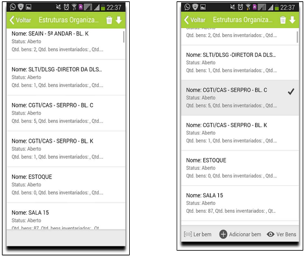

title: Inventário mobile

Description: Desenvolvido para auxiliar no levantamento dos bens para a realização do inventário, disponibilizando terá três formas de leitura: leitor
de código de barras, câmera do celular e manual, conforme detalhado a seguir.

# Inventário mobile

O Inventário Mobile do CITSmart GRP foi desenvolvido para auxiliar no
levantamento dos bens para a realização do inventário, disponibilizando terá
três formas de leitura: leitor de código de barras, câmera do celular e manual,
conforme detalhado a seguir.

Acessando o mobile
------------------

Para acessar o Inventário Mobile o usuário deve estar cadastrado no CITSmart GRP
e ativar uma senha para realizar o login no aplicativo. A ativação da senha deve
ser realizada pelo administrador do sistema.

    
    
    **Figura 1 - Mobile**

Na tela apresentada na figura acima insira o seu login e sua senha, clique no
botão logar e aguarde o carregamento do sistema e dos inventários cadastrados no
CITSmart GRP, conforme demonstrada na figura apresentada a seguir.

    
**Figura 2 - Carregamento**

Selecionando um inventário no mobile
------------------------------------

Após realizar o login, o aplicativo aguardará a seleção do inventário que deve
ser iniciado. Ao clicar em “ Inventário   ” o aplicativo abrirá uma lista com
todos os inventários cadastrados no sistema. Selecione aquele que deseja iniciar
e clique em “Iniciar Inventário à”, conforme demonstrados nas figuras abaixo.

    
    
    **Figura 3 - Iniciar Inventário**

Caso seja a primeira vez que o inventário seja iniciado, o aplicativo irá
sincronizar com o CITSmart GRP, realizando o carregamento das estruturas
organizacionais e seus respectivos bens patrimoniais.

Por isso recomendamos que o primeiro login com o carregamento do inventário
desejado seja realizado com o celular conectado em uma rede **wifi**.

Aguarde o carregamento de todas as estruturas organizacionais para só então
iniciar o inventário. O tempo de carregamento dependerá da rede onde os
celulares estarão conectados e da quantidade de bens.

O aplicativo só liberará o botão “Iniciar Inventário ****” após o carregamento
completo das estruturas do inventário.

As figuras a seguir apresentarão as estruturas organizacionais disponíveis no
inventário selecionado.

Ao escolher uma das estruturas, o aplicativo permitirá 03 ações: ler bem,
adicionar bem e ver bens.

**Figura 4 - Estruturas Disponíveis**

Lendo dados de bens pelo mobile
-------------------------------

Para iniciar a leitura dos bens da estrutura organizacional selecionada cliquem
em “Ler Bem” e escolhas uma das formas de leituras (leitor, manual, câmera,
RFID).

Caso seja necessário incluir um bem na estrutura organizacional que está sendo
inventariada, basta clicar na opção “+ Adicionar Bens” e o aplicativo abrirá a
tela apresentada na figura a seguir:

    
    
    **Figura 5 - Leitura**

Ao iniciar a leitura, o aplicativo armazenará todos os bens lidos. Caso alguns
dos bens constantes na estrutura organizacional não sejam encontrados será
apresentada a seguinte tela de alerta, conforme figura, independentemente do
tipo de leitura selecionado.

    
    
    **Figura 6 - Erro de Leitura**

Após finalizar a leitura dos bens da estrutura organizacional escolhida é
possível visualizar todos os bens coletados.

Para isto, clique na opção Ver Bens e serão apresentadas 03 opções: previstos,
lidos/incluídos e não lidos, conforme figuras a seguir.

    
    
    **Figura 7 - Ver Bens**

A figura a seguir apresenta a visualização de todos os bens previstos para a
estrutura organizacional selecionada.

As figuras a seguir apresentam as visões para os bens não lidos e
lidos/incluídos, respectivamente.

    
    
    **Figura 8 - Bens não lidos**

!!! info "IMPORTANTE"

    Ao finalizar a leitura de uma estrutura organizacional, clique na seta de
    retornar à lista de estrutura organizacionais e selecione a próxima a ser
    coletada. O aplicativo não alterna automaticamente entre as estruturas
    organizacionais

Sincronizando dados do mobile para web
--------------------------------------

Ao finalizar a coleta é necessário sincronizar os dados coletados com o CITSmart
GRP.

Recomendamos que a sincronização seja realizada quando o celular estiver
conectado a uma rede wifi, com o intuito de otimizar o tempo gasto.

A figura a seguir demonstra como deve ser enviado os dados coletados.

Para sincronizar os dados clique em “Enviar Inventários”:

**Figura 9 - Sincronização**

!!! tip "About"

    <b>Product/Version:</b> CITSmart | 8.00 &nbsp;&nbsp;
    <b>Updated:</b>08/14/2019 – Anna Martins
