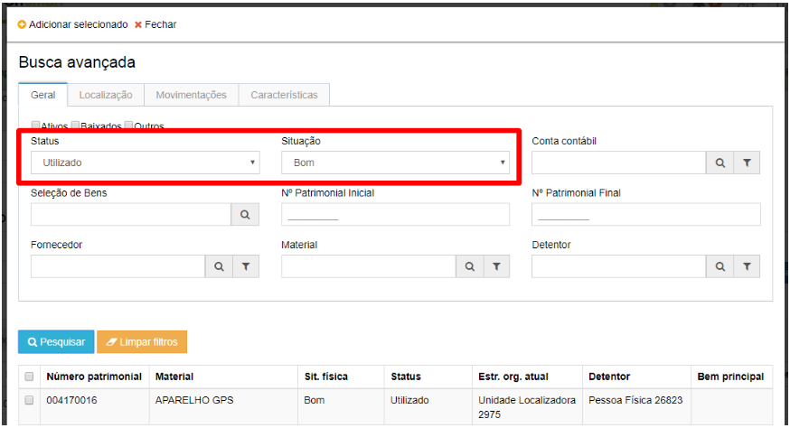

title: Seleção de bem patrimonial
Description:Seleçao de bem patrimonial

# Seleção de bem patrimonial

Como acessar
------------

Em “Administração de Materiais”, clique em “Seleção de bem patrimonial” no
submenu “Patrimônio” para cadastrar, visualizar, editar e/ou remover uma seleção
de bens patrimoniais.

Como manter os bens patrimoniais
--------------------------------

Para “Cadastrar” uma seleção de bem patrimonial siga as instruções a seguir:

-   Informe os “Dados da seleção de bens patrimoniais”:

-   O **“Número da seleção”** e **“Data da seleção”** são preenchidos
    automaticamente pelo sistema.

-   **Objetivo**: preencha o objetivo/finalidade da seleção cadastrada.

    -   Por exemplo: Seleção de itens para baixa; Seleção de itens para
        transferência de área; Seleção de todos os bens extraviados para
        abertura de sindicância.

-   Informe os “Bens Selecionados”

-   **Bem patrimonial:** permite localizar e selecionar bens individualmente,
    por número patrimonial ou tipo de bem.

-   **Busca avançada:** permite localizar e selecionar bens em massa/lote
    conforme orientações a seguir:
   
   
   
   **Figura 1 - Seleção**

   !!! info "IMPORTANTE"

   O filtro será aplicado considerando todas as opções informadas/selecionadas,
   inclusive considerando seleções/indicações realizadas em abas distintas
   (Geral, Localização, Movimentações e Características).

   No exemplo a seguir, foi disponibilizado para seleção, os bens que se
   enquadraram nas duas opções selecionadas (Situação: “Bom” e Status:
   “Utilizado).

   Clique em “Salvar” para cadastrar/armazenar a seleção de bem patrimonial.

   Clique em “Limpar” para limpar o formulário. Ou clique em “Pesquisar” para
   voltar a tela anterior.

!!! tip "About"

    <b>Product/Version:</b> CITSmart | 8.00 &nbsp;&nbsp;
    <b>Updated:</b>08/15/2019 – Anna Martins
