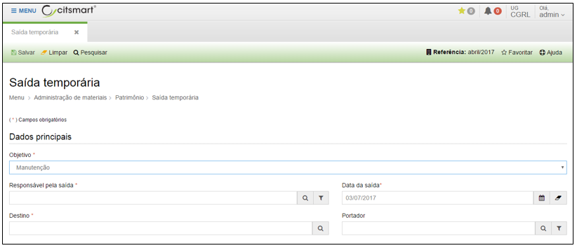
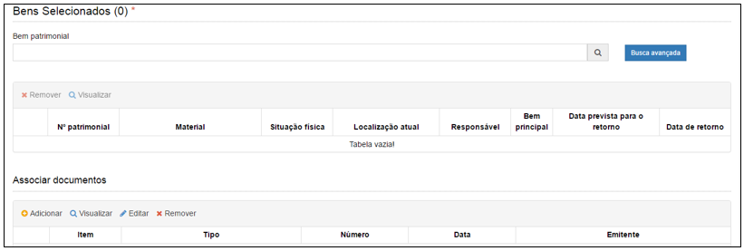

title: Saída temporária
Description: Saída temporária

# Saída temporária

Como acessar
------------

Em “Administração de Materiais”, clique em “Saída temporária” no submenu
“Patrimônio”, para iniciar o registro de uma saída temporária de material.

Ao clicar em “Cadastrar”, o sistema apresentará a seguinte tela:

   
   
   **Figura 1 - Tela de cadastro de materiais**
   
   
   
   **Figura 2 -** **Tela de cadastro de materiais (continuação)**

Preencha os campos do formulário conforme instruções abaixo:

-   **Responsável pela saída**: nome do responsável pela saída do bem do setor
    de origem.

-   **Data da saída**: data da saída do bem do setor de origem.

-   **Destino**: local de destino do bem.

-   **Data prevista para o retorno**: data de retorno do bem ao setor de origem.

-   **Portador**: nome do responsável pelo bem do destino.

Informe o objetivo da saída temporária do bem.

Após informar estes dados o campo “Bem patrimonial” ficará habilitado para
pesquisar e incluir o bem que terá a saída temporária do setor.

Ao digitar o número ou nome do bem patrimonial no campo “Bem patrimonial”, o
sistema apresentará uma lista de bens do mesmo tipo informado.

Após informar o número ou nome do bem, e teclar ENTER, o sistema incluirá
automaticamente o bem informado em uma lista.

Após o preenchimento de todos os campos da tela, clique em “Salvar” para que o
sistema armazene as informações cadastradas e permita emitir o termo de saída
temporária.

!!! tip "About"

    <b>Product/Version:</b> CITSmart | 8.00 &nbsp;&nbsp;
    <b>Updated:</b>08/15/2019 – Anna Martins

