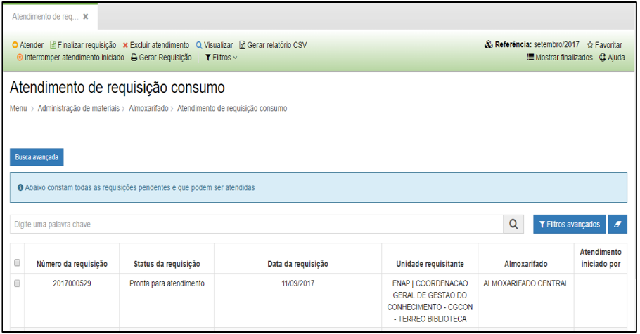
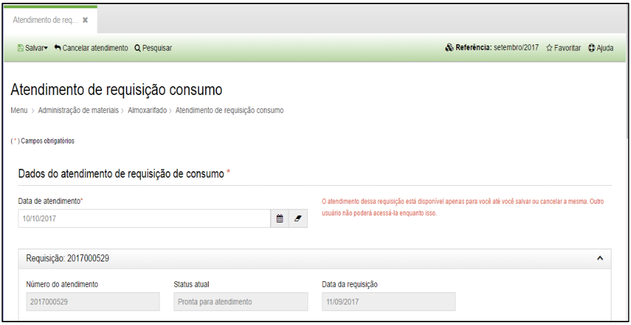
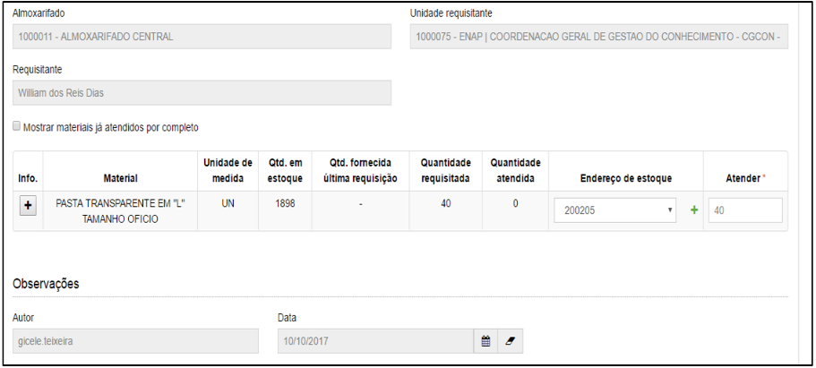
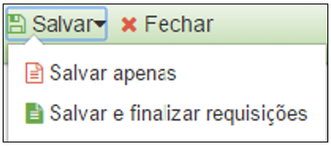

title: Atendimento de requisição de consumo
Description: Atendimento de requisição de consumo

# Atendimento de requisição de consumo

Como acessar
------------

Em “Administração de Materiais”, clique em “Atendimento de requisição consumo”
no submenu “Almoxarifado” para iniciar o atendimento de uma requisição de
consumo.

Como registrar
--------------

Ao clicar em “Atendimento de Requisição de Consumo”, a seguinte tela será
apresentada:

   
   
   **Figura 1 - Lista de Atendimentos**

Para que o usuário possa efetuar o atendimento de uma requisição de material,
basta selecionar um registro e clicar em .

O sistema apresentará a tela abaixo:

   
   
   
   
   **Figura 2 - Detalhes do Atendimento**

Nesta tela o usuário deverá preencher os seguintes campos:

-   **Data de atendimento**: data em que o atendimento será realizado.

-   **Número do atendimento**: o sistema irá preencher este campo
    automaticamente.

No campo “Info.” o usuário poderá clicar no botão  , expandir as informações do
material e da unidade requisitante.

Após preencher todos esses campos, o usuário deverá clicar em  , onde o sistema
apresentará as opções ilustradas abaixo:

**Figura 3 - Opções para salvar**

!!! tip "About"

    <b>Product/Version:</b> CITSmart | 8.00 &nbsp;&nbsp;
    <b>Updated:</b>08/16/2019 – Anna Martins
