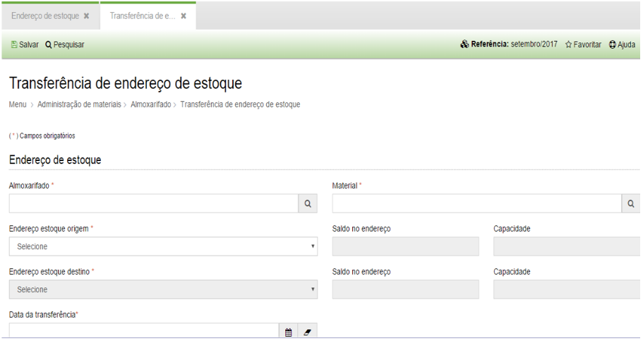

title: Transferência de endereço de estoque
Description: Transferência de endereço de estoque

# Transferência de endereço de estoque

Como acessar
------------

Em “Administração de Materiais”, almoxarifado clique em “Transferência de
Endereço de Estoque”, serão exibidos todos os endereços de estoque cadastrados
no sistema.

Como transferir
---------------

Ao clicar em “Cadastrar” será apresentada a seguinte tela:

  
  
  **Figura 1 - Transferência**

Para cadastrar uma transferência de endereço de estoque, preencha os campos
conforme orientações abaixo:

-   **Almoxarifado**: escolha o almoxarifado para o qual deseja cadastrar a
    transferência;

-   **Material**: selecione o material para o qual deseja fazer a transferência;

-   **Endereço de estoque de origem**: após selecionar o material, defina qual o
    endereço de origem.

    -   Ao selecionar o endereço o sistema apresentará o saldo no endereço e sua
        capacidade.

-   **Endereço de estoque destino**: selecione o endereço de estoque de destino.

-   **Data da Transferência**: preencher a data da realização da transferência.

!!! tip "About"

    <b>Product/Version:</b> CITSmart | 8.00 &nbsp;&nbsp;
    <b>Updated:</b>08/15/2019 – Anna Martins
