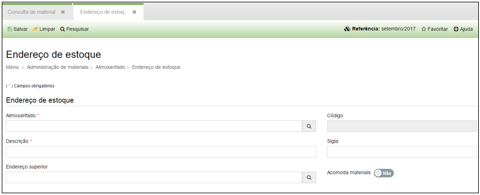

title: Endereço de estoque
Description: Endereço de estoque

# Endereço de estoque

Como acessar
------------

Em “Administração de Materiais”, almoxarifado clique em “Endereço de Estoque”,
serão exibidos todos os endereços de estoque cadastrados no sistema.

Como cadastrar
--------------

Ao clicar em “Cadastrar” será apresentada a seguinte tela:

  

  **Figura 1 - Tela de cadastro de endereço de estoque**

Preencha os campos acima para cadastrar um novo endereço de estoque:

-   **Almoxarifado**: Local do estoque.

-   **Descrição**: Descrição do endereço do estoque.

-   **Endereço superior**: Endereço principal.

-   **Sigla**: Sigla do endereço.

-   **Acomoda materiais**: Selecione sim ou não.
