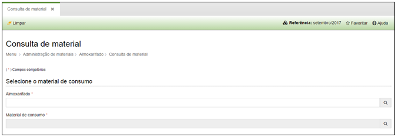

title: Consulta de material
Description: Consulta de material

# Consulta de material

Como acessar
------------

Em “Administração de Materiais”, Almoxarifado clique em “consulta de material”,
para consultar um material em específico.

Como consultar
--------------

A tela abaixo será exibida.

Preencha o nome do almoxarifado ou local de estoque.

   

   **Figura 1 - Consulta de Material**

Preencha o nome do material que deseja consultar.

Navegue pelas abas para saber informações sobre o material, conforme a imagem:

**Figura 2 - Detalhes sobre o Material**

!!! tip "About"

    <b>Product/Version:</b> CITSmart | 8.00 &nbsp;&nbsp;
    <b>Updated:</b>08/15/2019 – Anna Martins
