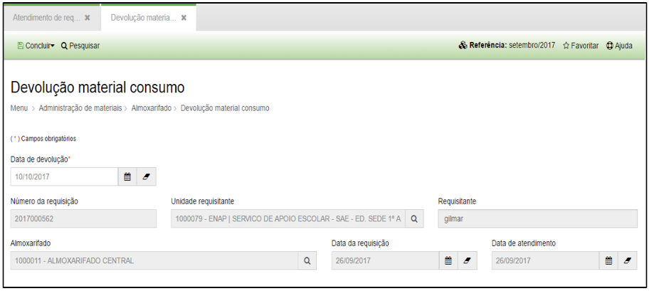
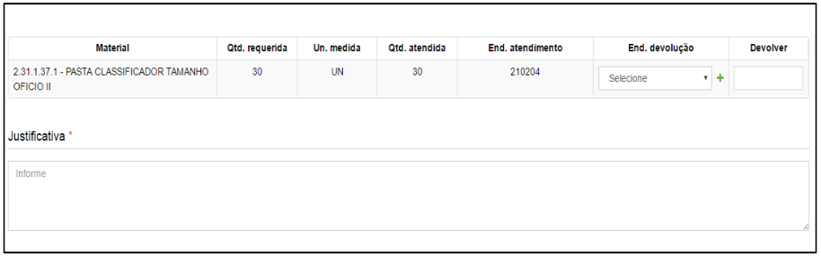
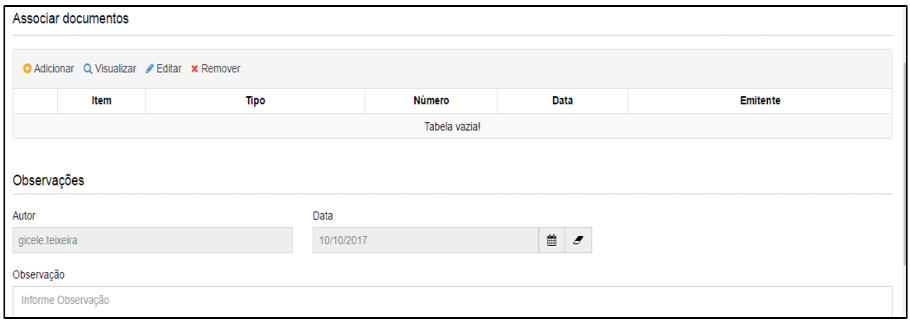
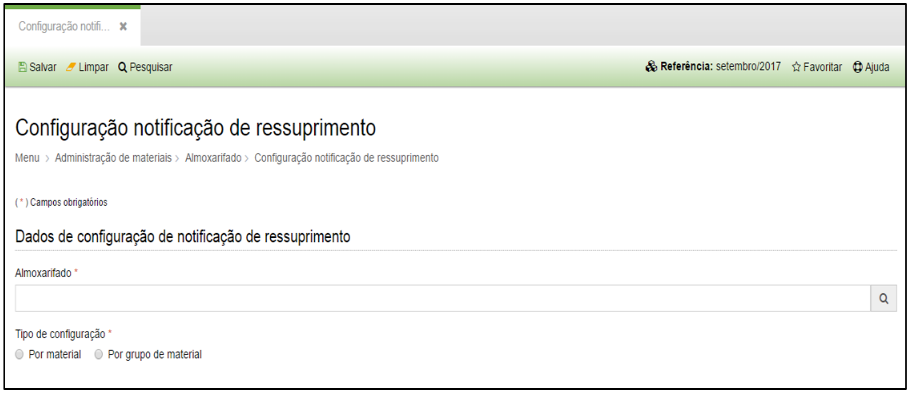
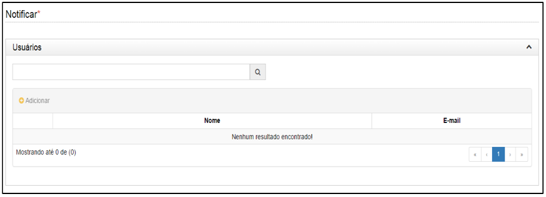
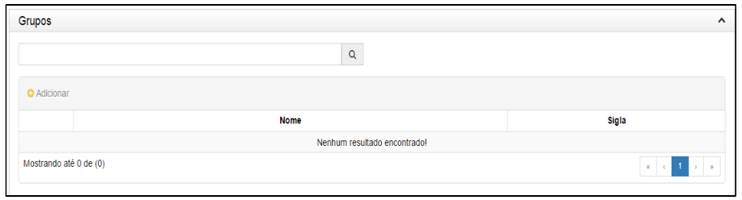

title: Catálogo de materiais
Description: Catálogo de materiais

# Catálogo de materiais

Como acessar
------------

Em “Administração de Materiais”, clique em “Catálogo de Materiais” no submenu
“Almoxarifado”.

Como manter o catálogo
----------------------

A seguir aparecerá a seguinte tela:

   
   
   
   
   

   **Figura 1 - Lista de Devoluções**

-   **Cadastrar**: permite realizar o cadastro de um novo catálogo de material.

-   **Visualizar**: permite visualizar as informações do catálogo de material
    selecionado.

-   **Editar**: permite editar as informações de um catálogo de material
    selecionado.

-   **Remover**: permite remover o registro de um catálogo de material
    selecionado.

-   **Filtros**: permite fazer filtros específicos.

Ao clicar em “Cadastrar” o sistema apresentará a seguinte tela:

   
   
   
   
   

   **Figura 2 - Cadastro de Devolução**

Preencha os campos do formulário conforme instruções abaixo:

-   **Nome**: nome do catálogo a ser cadastrado.

-   **Data início**: data do cadastro do catálogo.

-   **Data fim**: data final de validade do catálogo.

-   **Unidade Requisitante**: nome da unidade requisitante do material. Você
    poderá incluir mais de uma unidade para acessar o catálogo.

-   **Materiais de consumo**: digite o nome do material a ser incluído no
    catálogo. Você poderá incluir quantos materiais desejar.
