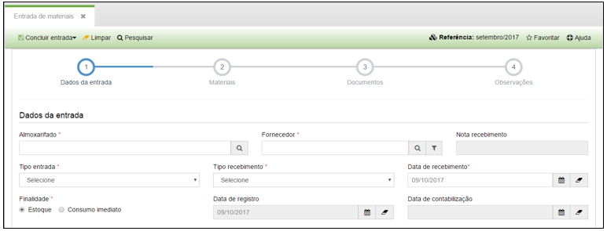
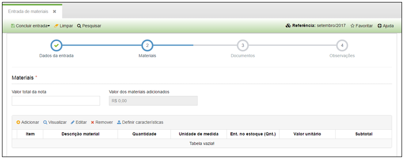
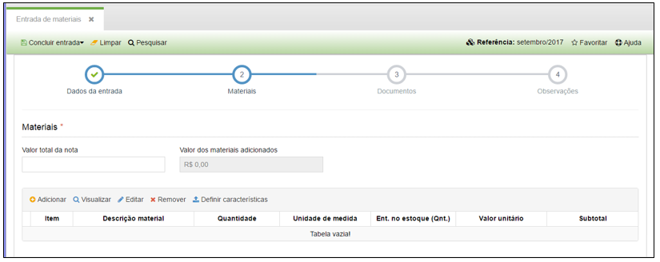
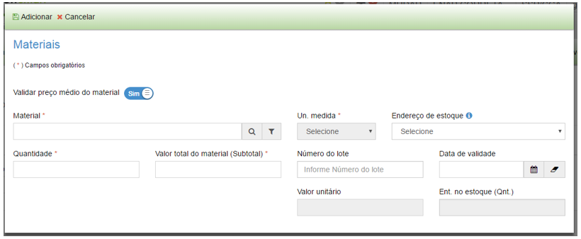

title: Entrada de materiais

Description: Entrada de materiais

# Entrada de materiais

Como acessar
------------

Em “Administração de Materiais”, clique em “Entrada de bens” no submenu
“Almoxarifado”, para iniciar o registro de uma entrada.

Serão apresentadas as seguintes opções:

-   **Cadastrar**: permite cadastrar uma nova entrada de materiais.

-   **Visualizar**: permite visualizar as informações cadastradas de uma entrada
    selecionada.

-   **Editar**: permite editar dados de uma entrada de materais, desde que, a
    entrada selecionada não tenha sido contabilizada; tenha data igual ou
    superior ao mês de referência.

-   **Remover**: permite remover uma entrada de bem selecionada.

    -   OBS: uma entrada de bem somente poderá ser removida caso não haja
        nenhuma movimentação com os bens incorporados pela entrada de bem em
        questão. Se a entrada estiver contabilizada ela só poderá ser excluída
        dentro do mês de referência.

-   **Relatório analítico**: permite gerar um relatório analítico de uma entrada
    de bem.

-   **Relatório sintético**: permite gerar um relatório sintético de uma entrada
    de bem.

-   **Filtros**: permite criar /salvar filtros específicos para utilização
    futura.

Como cadastrar
--------------

Ao clicar em “Cadastrar”, o sistema apresentará a tela abaixo.

Preencha os campos da 1ª tela do formulário “Entrada de bens” conforme
instruções a seguir:

   
   
   **Figura 1 - Tela de cadastro - Etapa 1**

Dados da entrada
----------------

-   **Almoxarifado**: preencha com o almoxarifado que será utilizado para a
    entrada de materiais;

-   **Fornecedor**: informa o nome do fornecedor responsável pelo fornecimento
    dos materiais;

-   **Nota de recebimento**: o sistema preencherá este campo automaticamente;

-   **Tipo de entrada**: escolha entre os tipos orçamentária e
    extraorçamentária;

-   **Tipo de recebimento**: após a escolha do tipo de entrada, escolha o tipo
    de recebimento que se adequa à entrada em questão.

-   **Data de recebimento**: informe a data de recebimento dos materiais;

-   **Finalidade**: defina se os materiais serão para estoque ou consumo
    imediato;

-   **Data de Registro**: será preenchida pelo sistema com a data atual;

-   **Data de Contabilização**: será preenchida ao final do processo de entrada
    de matérias. Lembrando que essa data deverá estar dentro do mês de
    referência vigente.

   
   
   **Figura 2 - Tela de cadastro - Etapa 2**

-   Preencha os campos da 2ª tela do formulário “Entrada de bens” conforme
    instruções a seguir:

**Figura 3 - Tela de cadastro - Etapa 2 (continuação)**

Dados materiais
---------------

-   **Valor total da nota**: informar o valor total constante na Nota Fiscal;

-   **Valor dos materiais adicionados**: o sistema informará automaticamente
    (conforme dados dos itens adicionados);

Ao clicar em “Adicionar”, será possível informar os materiais que deverão ser
adicionados nesta entrada, conforme figura abaixo:

   
   
   **Figura 4 - Tela de cadastro de materiais**

Ao adicionar os materiais deverá ser definido:

-   **Validar pelo preço médio do material:** ao selecionar “sim” nessa opção o
    sistema validará o preço unitário do material de acordo com a variação
    permitida para o preço médio.

    -   Se o valor do material ultrapassar a variação determinada o sistema
        emitirá uma mensagem de alerta e um novo valor deverá ser informado.

-   **Material:** selecione o material desejado.

-   **Unidade de medida**: o sistema preencherá esse campo de acordo com o
    material escolhido.

-   **Endereço de estoque**: ao selecionar o material o endereço de estoque
    vinculado a esse material será apresentado.

    -   Caso exista mais de um endereço para o material o sistema permitirá que
        você selecione o endereço desejado.

-   **Quantidade**: informe a quantidade do material;

-   **Valor total do material**: informe o valor total do material;

-   **Número do lote**: informe o número do lote do material;

-   **Data de validade**: informe a data de validade do material;

-   **Valor unitário**: será calculado automaticamente pelo sistema;

-   **Ent. no estoque**: quantidade que foi dado entrada no estoque, esse campo
    só é preenchido quando a opção de estoque for selecionada na primeira tela
    do processo de entrada.

!!! warning "ATENÇÃO"

    Após adicionar todos os materiais que deverão compor a entrada, é possível
    anexar os documentos inerentes ao processo bem como inserir observações que
    vocês julgar importante.

Ao finalizar o processo de entrada você terá duas opções para “concluir a
entrada”: concluir e concluir e contabilizar.

!!! note "NOTA"

    Ao concluir a entrada será salva mas o materiais não estão disponíveis
    para movimentação, apenas após concluir e contabilizar os materiais, eles
    poderão ser distribuídos.

    A contabilização deverá ocorrer dentro do mês de referência vigente.

!!! tip "About"

    <b>Product/Version:</b> CITSmart | 8.00 &nbsp;&nbsp;
    <b>Updated:</b>08/16/2019 – Anna Martins
